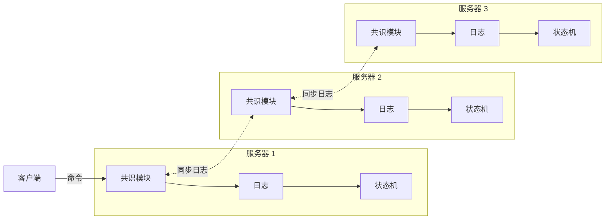

# 共识与复制状态机

> **一句话定义**：让一组机器就「**操作的顺序**」达成一致，使它们各自执行同一串命令、得到同一个状态——从而在部分成员宕机时，整体仍然表现得像一台不会宕机的机器。

## 为什么需要它

单台机器会宕机、磁盘会坏、机房会断电。要提高可用性就得做多副本，而**一旦有了多个副本，就有了「它们能不能保持一致」的问题**。

朴素的复制方案在异步网络里都会出问题：

- **主从异步复制**：主库确认写入后、同步到从库之前宕机，这次写入就丢了；
- **让客户端同时写所有副本**：任何一个副本不可用就无法写入，可用性反而比单机更差；
- **各副本各自接受写入**：并发写入的顺序在不同副本上可能不同，状态就此分叉。

问题的本质是：**在异步网络里，你无法区分「一台机器宕机了」与「它只是很慢 / 网络断了」。** 共识算法要在这个前提下，仍然保证所有副本对「发生了什么、以什么顺序发生」达成一致。

### 复制状态机模型

这是把共识用起来的标准框架：

每台服务器存一份**日志**（一串命令），其状态机按序执行。核心假设是：

> **状态机是确定性的**——同样的初始状态 + 同样的命令序列 = 同样的最终状态和同样的输出序列。

因此只要保证**每份日志包含相同的命令、相同的顺序**，各副本的状态就必然一致。共识算法的全部工作就是**维护这份复制日志的一致性**。

这个模型的价值在于它把问题**转化**了：「让多台机器保持状态一致」这个模糊的目标，变成了「让多份日志保持相同」这个精确的目标。而后者是可以用一个算法解决的。

**注意确定性这个前提是硬约束**：状态机里不能有 `random()`、`now()`、依赖本地文件系统状态或迭代顺序不确定的哈希表遍历。这些是实际系统里状态分叉的常见来源——命令被正确复制了，但各副本执行出了不同结果。

### 实际系统对共识算法的四条要求

1. **安全性**：在所有非拜占庭条件下（网络延迟、分区、丢包、重复、乱序）**绝不返回错误结果**。
2. **可用性**：只要**任意多数派**成员在运行且能互相通信、能与客户端通信，系统就完全可用。
3. **不依赖时序保证一致性**：错误的时钟与极端的消息延迟**最多导致可用性问题**，绝不导致不一致。
4. **常规情况下的效率**：一条命令可以在多数派对**单轮 RPC** 响应后完成；少数慢成员不拖累整体。

第 3 条是最容易被忽视、也最重要的一条：**时序只影响「能不能推进」，不影响「推进得对不对」**。任何把正确性建立在超时值上的设计都是可疑的。

## 它是怎么工作的

### 多数派 quorum：为什么 $2f+1$ 个节点能容忍 $f$ 个故障

这是整个领域的数学地基，推导只有两步。

设集群有 $N = 2f+1$ 个节点，**多数派**定义为 $\lceil (N+1)/2 \rceil = f+1$ 个节点。

**第一步：可用性。** 任意 $f$ 个节点故障后，仍有 $2f+1-f = f+1$ 个存活，恰好构成一个多数派。因此系统仍能推进。

**第二步：安全性——任意两个多数派必然相交。** 设有两个多数派 $Q_1, Q_2$，各含至少 $f+1$ 个节点。若它们不相交，则总节点数至少为

$$|Q_1| + |Q_2| \geq (f+1) + (f+1) = 2f+2 > 2f+1 = N$$

矛盾。因此 $Q_1 \cap Q_2 \neq \emptyset$——**任意两个多数派至少共享一个节点**。

**这个交集就是「不丢已提交条目」的全部原因**：

- 一条条目被「提交」意味着它已经复制到了某个多数派 $Q_1$；
- 任何未来的决定（选举新 leader、提交新条目）都需要另一个多数派 $Q_2$ 的参与；
- $Q_1 \cap Q_2$ 中的那个节点**同时见证了旧决定、又参与了新决定**，它会把已提交的条目带进新的决定中。

> **这是分布式安全性论证的通用工具**：想验证「这个操作安全吗」，就去找那个**既见证了旧决定、又参与了新决定**的节点。找不到，说明设计有洞。

**推论**：3 节点容忍 1 个故障，5 节点容忍 2 个，7 节点容忍 3 个。**偶数个节点没有额外收益**——4 个节点的多数派是 3，仍然只能容忍 1 个故障，却多了一台机器的成本和一份复制开销。这就是为什么生产集群几乎总是 3 或 5 个节点。

### leader-based 方案的三个组成部分

多数实用共识算法（Raft、VR、Zab）都先选出一个 leader，再由它主导。这样做之后，问题干净地分成三块：

| 子问题 | 职责 | 核心机制 |
| --- | --- | --- |
| **Leader 选举** | 现有 leader 失效时选出新的 | 逻辑时钟（term/epoch）+ 多数派投票 + 随机化超时 |
| **日志复制** | leader 接受命令并推给所有 follower | 一致性检查 + 强制 follower 复制 leader 的日志 |
| **安全性** | 保证不同副本不会在同一位置应用不同命令 | 对「谁能当选」加限制：日志不够新的不能当 leader |

**为什么先有 leader 能让问题变简单**：一旦确定「日志只从 leader 流向 follower」，「谁来决定日志内容」这个问题就消失了——leader 说了算。剩下的只是「怎么选 leader」和「怎么把 leader 的日志推出去」，两者可以分开理解。

**逻辑时钟（term）**是把这三块粘起来的关键。它是一个单调递增的整数，同时承担三项职责：

- **识别过期信息**：拒绝携带更小 term 的请求；
- **触发角色退位**：任何角色见到更大的 term 都无条件退回 follower；
- **保证一个 term 至多一个 leader**：每个节点每 term 只投一票 + 多数派规则 + quorum 相交。

一个整数承担三项职责而不显得拥挤，是因为它们其实是同一个问题的不同侧面——**「谁的信息更新」**。

### 提交（commit）的精确含义

这是最容易出错的地方：

> **「复制到多数派」是「已提交」的必要条件，不是充分条件。**

缺的那一半是：**必须有一个当前任期的 leader 为这次复制背书**。

原因是这样的：一条来自**前任 leader** 的条目即使已经在多数派上，仍可能被未来的 leader 覆盖——因为投票规则比较的是日志的「新旧」（先比最后条目的 term，再比长度），而某些节点可能持有 term 更大但不含该条目的日志，从而选出一个不含它的新 leader。

**标准解法**：只通过计数副本来提交**当前任期**的条目；当前任期的某条目一旦提交，**所有更早的条目凭日志匹配性质被间接提交**。

**实践推论**：新 leader 当选后应尽快提交一条自己任期的条目（通常是一条空的 no-op），以便把前任遗留的条目一并间接提交。

### 成员变更：为什么不能直接切换

配置（成员集合）**不可能在所有节点上原子地同时切换**，因此转换期间集群可能分裂成**两个独立的多数派**。

例：集群从 3 台扩到 5 台。若部分节点已用新配置、部分还用旧配置，则可能出现「2 票在旧配置里过半」与「3 票在新配置里过半」**同时成立**——同一任期两个 leader。

**解法必须是两阶段的**。一种做法是先禁用旧配置再启用新配置（VR）；另一种是引入一个**过渡配置**，规定**任何决定都必须同时在新旧两个配置里各自过半**（joint consensus）。后者的好处是配置变更期间集群仍能正常服务。

另一种更简单的方案是**每次只增减一个节点**——此时新旧配置的多数派必然相交，无需过渡配置。这是多数生产实现的实际选择。

### leader-based 与 leaderless 的取舍

| | leader-based（Raft / VR / Zab） | leaderless（Paxos / EPaxos） |
| --- | --- | --- |
| **谁能提议** | 只有 leader | 任何节点 |
| **常规路径延迟** | 客户端 → leader → 多数派，一轮 RPC | 无冲突时可能更少跳数（客户端就近提交） |
| **吞吐瓶颈** | **所有请求经过单个 leader** | 无单点瓶颈，可利用全部节点 |
| **跨地域部署** | 远离 leader 的客户端延迟高 | 可就近提交，广域场景有优势 |
| **冲突处理** | leader 天然定序，无冲突 | 需要额外机制处理并发提议的定序 |
| **理解与实现难度** | **低**——单向数据流，状态空间小 | **高**——并发提议的交互情况多 |
| **leader 故障** | 需要选举，期间不可用（约一个选举超时） | 无需选举，但故障恢复逻辑更复杂 |

**核心取舍**：leader-based 用「集中决策」换「简单性」——把所有并发和定序问题消灭在单点上。代价是 leader 成为吞吐瓶颈和延迟中心。leaderless 反之。

实践中 leader-based 压倒性地占优，原因不在性能而在**可实现性**：一个能被正确实现的次优算法，胜过一个难以正确实现的最优算法。

## 关键性质与代价

| 收益 | 代价 |
| --- | --- |
| 部分成员故障时系统整体仍然可用（$2f+1$ 容忍 $f$） | 每次写入至少一轮到多数派的 RPC + 持久化，延迟高于单机 |
| 已提交的数据不会丢失，且顺序在所有副本上一致 | 需要 $2f+1$ 台机器和 $2f+1$ 份数据副本的成本 |
| 提供了构建线性一致系统的基础 | **写吞吐不随节点数增长**——加节点提高容错，不提高吞吐（leader-based 下反而下降） |
| 安全性不依赖时钟正确性 | 可用性依赖时序：leader 故障后约一个选举超时的窗口内不可用 |
| 成员可以在线变更 | 状态机必须严格确定性，限制了应用的写法 |
| 故障模型清晰（fail-stop + 异步网络） | **不防拜占庭故障**——恶意或数据损坏的节点会破坏保证 |

### 延迟的构成

一次写入的延迟至少包含：

1. 客户端 → leader 的网络往返；
2. leader 本地**持久化**日志条目（fsync）；
3. leader → follower 的网络往返，**且 follower 也要持久化**；
4. 等待多数派确认。

注意第 2、3 步的 fsync——**共识的延迟常常由磁盘而非网络支配**。这也是为什么把这类系统放在慢磁盘上会导致频繁的 leader 更替（心跳来不及发出，触发不必要的选举）。

## 常见误解

- **误解**：共识 = 强一致性读 → **实际**：共识保证的是**写入的顺序与持久性**。**读取的线性一致性需要额外机制**——一个已被网络分区隔离的旧 leader 仍以为自己是 leader，直接读它的本地状态会返回过期数据。正确做法是 ReadIndex（读前向多数派确认自己仍是 leader）或 lease read（依赖时钟假设，更快但把时序引入了正确性）。**这是生产实现里 bug 的高发区。**
- **误解**：多数节点存活就一定能读到最新值 → **实际**：存活只保证系统**能推进**，不保证你读到的那个节点是最新的。follower 的日志可能落后，旧 leader 可能已被取代。要读到最新值必须走上一条所说的机制。
- **误解**：Raft 比 Paxos 快 → **实际**：两者在稳态复制路径上**都是一轮 RPC 到多数派，性能本质相同**。Raft 论文说的是性能「相似」（similar to），并且**没有做过任何 Raft vs Paxos 的性能实验**。这个误传的来源是 Raft 论文性能一节里漂亮的选举耗时数字——那测的是**故障恢复速度**，不是稳态吞吐。
- **误解**：复制到多数派 = 已提交 → **实际**：这只是必要条件。还需要**当前任期的 leader 为这次复制背书**，否则该条目仍可能被未来的 leader 覆盖。这是共识算法里最微妙的一点。
- **误解**：节点越多越可靠 → **实际**：节点越多**容错能力越强，但写延迟越高、吞吐越低**（要等更大的多数派确认）。而且**偶数个节点没有额外收益**——4 节点与 3 节点都只能容忍 1 个故障。生产上几乎总是 3 或 5 个。
- **误解**：加节点能提高写吞吐 → **实际**：恰好相反。所有写入都要经过 leader 并复制到多数派，**加节点只增加复制负担**。共识用于扩展**可用性**，不用于扩展**吞吐**。要扩吞吐需要分片（多个独立的共识组）。
- **误解**：共识算法能防止一切故障 → **实际**：标准共识只处理**非拜占庭**故障（节点停止、消息丢失/延迟/乱序/重复）。它**不防**恶意节点、内存/磁盘静默损坏、以及违反确定性假设的状态机。后者尤其常见——命令被正确复制了，但各副本因为 `random()` 或迭代顺序不确定而执行出了不同结果。
- **误解**：安全性依赖于超时值设对 → **实际**：正确设计的共识算法里，**安全性完全不依赖时序**——时钟错乱和极端延迟最多导致选不出 leader（可用性问题），绝不会导致两个副本状态分叉。超时值只影响故障检测的快慢。

## 出现在哪些论文里

- [Raft（USENIX ATC'14）](../topics/distributed-systems/2014-raft/README.md) —— leader-based 共识最完整、最易读的实例，本页的机制细节大量取自该文。它把共识分解为 **leader 选举、日志复制、安全性**三个子问题，用 **term 作为逻辑时钟**，用**随机化选举超时**化解分裂投票，用 **joint consensus** 做成员变更。
    - 几个带条件的数字：**43 名学生**的对照实验中，33 人的 Raft 测验成绩高于 Paxos，满分 60 分下均值 25.7 vs 20.8（论文主动披露 15 人有 Paxos 先验经验、Paxos 讲座视频长 14%）；作者实现约 **2000 行 C++**，论文发表时已有约 25 个第三方实现；**选举实测**（5 台服务器、广播时间约 15ms、构造最坏情况）：无随机化时选举一直超过 10 秒，加 5ms 随机化后中位停机 **287ms**，推荐选举超时 **150–300ms**。
    - 界定证据边界：论文的**性能实测只覆盖 leader 选举**，日志复制的吞吐从未被系统评估；TLA+ 的机械化证明依赖一些未经检查的不变量。

## 延伸阅读

- Paxos Made Simple（Lamport, 2001）· Paxos Made Moderately Complex（van Renesse, 2012）—— 另一条路线，读完 Raft 再回头看会清楚很多。
- Paxos Made Live（Chandra et al., PODC'07）—— Chubby 实现者写的工程报告，讲「论文到系统」之间的鸿沟。
- Viewstamped Replication Revisited（Liskov & Cowling, 2012）—— 与 Raft 最接近的前作，同样是 leader-based。
- ZooKeeper / Zab —— 另一个被广泛部署的 leader-based 实现。
- EPaxos（SOSP'13）—— leaderless 方向，针对强 leader 的吞吐瓶颈。
- Implementing Fault-Tolerant Services Using the State Machine Approach（Schneider, 1990）—— 复制状态机模型的经典综述。
- Jepsen 的各类分布式系统分析报告 —— 实际实现在故障注入下的表现，是形式化证明之外的另一类证据。
- [缓存亲和性与负载均衡的取舍](cache-affinity-vs-load-balance.md)
