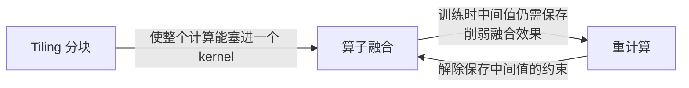

# IO-aware 算法设计

> **一句话定义**：在设计与评价算法时，把**数据在存储层次之间的搬运量**当作一等指标来核算，而不是只数浮点运算次数——因为在现代硬件上，决定墙钟时间的常常是前者。

## 为什么需要它

渐进复杂度是一个**刻意抹掉硬件的抽象**。$O(n^2)$、$O(n\log n)$ 数的是算术操作，隐含假设是「取一个数」与「算一次乘法」代价相当。这个假设在存储层次扁平的年代大致成立，今天已经不成立了。

**算力增长长期快过访存带宽**。一个典型的 GPU 上，片上 SRAM 的带宽比片外 HBM 高一个数量级，容量却小好几个数量级；而算力相对访存带宽还在继续拉开。结果是：**大量算子的时间不花在算，而花在等数据**。

由此产生两类系统性的错误判断：

- **优化错了目标**。为降低 FLOPs 而设计的算法，实际跑起来可能不快甚至更慢——因为它改变了访存模式，或者引入了更差的数据局部性。「复杂度降了一个量级但没有墙钟加速」是这类工作的典型症状。
- **看不见真正的瓶颈**。峰值显存、中间结果的物化、跨层级的重复搬运，这些开销在渐进复杂度里**完全不可见**，却经常是「跑不起来」而不只是「跑得慢」的直接原因。

### 判据：算术强度

区分一个算子属于哪一类，标准工具是**算术强度**（arithmetic intensity）——每字节访存对应多少次算术操作。

- **Compute-bound（算力受限）**：时间由算术操作数决定，访存时间相对小。典型是内维度大的矩阵乘、通道数多的卷积。
- **Memory-bound（访存受限）**：时间由访存次数决定，计算时间相对小。**其余大多数算子**属于这一类——逐元素操作（激活、dropout、加法）与归约（sum、softmax、layernorm、batchnorm）。

把算术强度与硬件的「算力/带宽比」相比，就能判断算子落在哪一侧。**IO-aware 的全部方法论只对访存受限的算子有意义**；对算力受限的算子，减少访存不会改善墙钟时间。

## 它是怎么工作的

三种通用手段，可以组合使用。

### 手段一：Tiling（分块）

把大的输入切成能装进快速存储（SRAM / cache / 寄存器）的块，载入一次，在块内完成尽可能多的计算，再写回。核心收益是**提高数据复用率**——同一份数据从慢存储搬上来一次，被用很多次。

分块的难点通常不在矩阵乘（天然可分块），而在**归约**：归约的结果依赖全部输入，看起来必须先看到所有数据。

关键判据是：**这个归约是否代数可分解**（algebraic aggregation）——能否只维护少量额外统计量，就把「两段各自的部分结果」精确合并成「整体结果」。

- 求和、最大值：平凡可分解。
- **softmax**：可分解，但需要额外维护「当前最大值」与「当前归一化因子」两个统计量，合并时用两者之差做指数缩放。这是最有代表性的例子——看似必须先看到整行，实际可以一块一块地做且结果**精确**。
- 中位数、精确去重计数：不可分解（或需要与数据量同阶的状态）。

遇到「必须看到全部数据」的归约时，先检查它有没有这个性质，往往有。

### 手段二：算子融合（kernel fusion）

多个操作作用于同一份数据时，只从慢存储载入一次，在快速存储里连续做完所有操作，再写回。逐元素操作链（矩阵乘 → 加偏置 → 激活 → dropout）是最典型的融合对象——不融合的话，每一步都要完整地读一遍写一遍。

**一个重要的局限**：在训练场景下，朴素融合的效果会打折，因为**中间值仍然要写回慢存储以备反向传播**。这正是下一个手段要解除的约束。

### 手段三：重计算换访存（recomputation）

不保存中间结果，需要时重新算一遍。

传统认知里这是 **gradient checkpointing**——拿速度换显存。但在访存受限的场景下，这个取舍可以被打破：

> 重算的代价是**片上的算术操作**；保存并读回的代价是**慢存储的往返访问**。当两者的价格差足够大（带宽紧缺、算力过剩）时，**重算比搬运便宜**——不仅省了显存，还更快。

这是 IO-aware 视角下最反直觉、也最有价值的一条结论。判断它是否成立，仍然回到算术强度：算子越是访存受限，重计算越划算。

### 三者的关系

它们不是并列的可选项，而常常互相依赖：

典型的组合是：**分块让计算能在片上完成 → 融合成单个 kernel 避免往返 → 重计算解除「必须保存中间值」的枷锁**。缺任何一环，另外两环的收益都会打折。

## 关键性质与代价

| 收益 | 代价 |
| --- | --- |
| 墙钟时间大幅下降（访存受限算子上可达数倍） | 需要手写底层 kernel，工程量远大于高级语言实现 |
| 峰值显存下降（中间结果不再物化） | 实现常常与具体硬件参数（快速存储容量）绑定，不跨架构可移植 |
| 结果可以是**精确**的（分块归约不是近似） | 每种算子变体都要单独实现，组合爆炸 |
| 能突破「跑不起来」的显存墙，而非只是提速 | 分析框架依赖简化的存储层次模型，常数因子难以刻画 |
| 给出可分析的复杂度与调参依据（块大小） | 增加的算术操作在算力受限场景下会变成净亏损 |

### 块大小的典型曲线

分块参数不是越大越好，实践中会经历三个阶段：

1. **访存受限区**：块越大，对慢存储的遍历次数越少，越快；
2. **算力受限区**：访存不再是瓶颈后，时间由算术操作决定，继续增大块不再有收益；
3. **容量硬墙**：块大到装不进快速存储，方案失效。

调参要找的是第 1 到第 2 阶段的**拐点**，而不是容量允许的最大值。

## 常见误解

- **误解**：降低 FLOPs 就等于加速 → **实际**：FLOP 数与墙钟时间未必相关。在访存受限的算子上，一个 FLOPs **更多**但访存更少的实现可以显著更快。看到「复杂度降了但没有墙钟数据」的工作，先问访存模式。
- **误解**：省显存必然要牺牲速度 → **实际**：这只在「省显存的手段是重算、且算子算力受限」时成立。访存受限时，不保存中间结果反而更快，因为省下的搬运超过多出的计算。
- **误解**：IO-aware 是普适的优化方法论 → **实际**：它只对**访存受限**的算子有意义。对内维度大的矩阵乘这类算力受限算子，减少访存不改善时间，重计算换访存的账还会反过来算亏。判据是算术强度。
- **误解**：分块计算意味着近似 → **实际**：只要归约是代数可分解的，分块得到的结果与一次性计算**逐位等价**，没有任何近似。分块与近似是两件独立的事。
- **误解**：IO 复杂度是算法的固有性质 → **实际**：它是**硬件相关**的分析——复杂度式子里通常含有快速存储容量这个硬件参数。为一代硬件调好的块大小换一代就不对了，「最优」的适用范围比字面窄。
- **误解**：IO 复杂度相同就性能相同 → **实际**：该框架只数搬了多少字节，不刻画并行度、占用率、指令级效率。同样的 IO 复杂度下，通过改进并行划分再快一倍是常见的事，这说明框架本身不完备。
- **误解**：编译器会自动做好这些 → **实际**：编译器能自动融合许多逐元素操作，但涉及归约重构、分块策略选择、以及跨越反向传播边界的重计算决策时，目前仍需人工设计。高级框架的接口通常也不提供细粒度的访存控制。

## 出现在哪些论文里

- [FlashAttention（NeurIPS'22）](../topics/foundations/2022-flashattention/README.md) —— 这个方法论最完整的示范，也是「IO-aware」这个提法的来源。它把注意力的 HBM 访问量从 $\Theta(Nd+N^2)$ 降到 $\Theta(N^2d^2M^{-1})$（$M$ 为 SRAM 容量），三种手段全部用上：分块 online softmax、融合进单个 CUDA kernel、反向靠重计算而非保存 $N\times N$ 中间矩阵。最有说服力的证据是它自己的一组数字（GPT-2 medium，序列长 1024、head dim 64、16 头、batch 64，A100，前向+反向）：**FLOPs 从 66.6 涨到 75.2 GFLOPs，HBM 读写从 40.3 GB 降到 4.4 GB，时间从 41.7 ms 降到 7.3 ms**——多算 13% 的 FLOPs，少花 82% 的时间。它同时给出了下界，并在 §5 坦承了「须为每个变体手写 kernel、不跨架构可移植、仅对单卡最优」三条局限。
- [vLLM / PagedAttention（SOSP'23）](../topics/llm-serving/2023-vllm-pagedattention/README.md) —— 同样是访存视角，但作用在**另一个层次**：它不改变一次计算搬多少数据，而是改变 KV Cache 在显存里的**摆放方式**（定长块 + 间接寻址），消除碎片与过量预留。两者正交且常叠加使用，见 [分页式 KV 管理](paged-kv-memory.md)。

## 延伸阅读

- Online normalizer calculation for softmax（Milakov & Gimelshein, 2018）—— 分块 softmax 的直接前作，代数可分解性的经典例子。
- Roofline 模型 —— 用算术强度与硬件的算力/带宽比判断算子落在哪一侧的标准工具。
- Halide —— 图像处理领域「算法与调度分离」的尝试，常被引为「高级语言编译出 IO-aware 实现」的方向参照。
- Triton —— 在这个方向上的实际进展：用接近 Python 的语言写出接近手写 CUDA 性能的 kernel。
- [Self-Attention](self-attention.md) · [分页式 KV 管理](paged-kv-memory.md) · [KV Cache](kv-cache.md)
