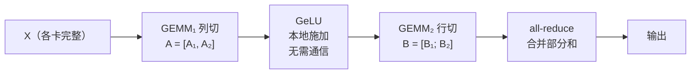

# 张量并行

> **一句话定义**：把**单个算子内部**的权重矩阵按行或按列切到多张卡上，每张卡只算这个算子的一部分，靠少量集合通信把结果拼回来——从而让单层大到一张卡装不下的模型也能跑起来。

## 为什么需要它

数据并行（把 minibatch 切给多个 worker）能提高吞吐，但有一个**根本限制：模型必须完整装进一个 worker**。当单层的权重就超过单卡显存时，无论加多少张卡都无济于事。

绕开这个限制的办法各有代价：

- **参数共享**能省显存，但**限制了模型的总容量**；
- **激活检查点**只省激活，不省参数；
- **流水并行**（切层）能装下整个模型，但**单层仍必须装进一张卡**，且引入流水气泡；
- **张量并行**（切算子内部）——本页的主题，它让「单层装不下」这个问题本身消失。

三者解决的是不同层次的问题，不是替代关系。

## 它是怎么工作的

核心原则只有一条：

> **切分方式应当服从非线性算子的位置**——先找出哪些算子不能在部分和上正确施加，再倒推数据该怎么分布。沿着非线性算子**不跨越**的维度切。

### 两种基本切法

对 $Y = XA$：

- **列切（column-parallel）**：$A=[A_1,A_2]$。每张卡得到输出的**完整的若干列**，即 $[Y_1,Y_2]=[XA_1, XA_2]$。要求输入 $X$ 在每张卡上完整。
- **行切（row-parallel）**：$A=\begin{bmatrix}A_1\\A_2\end{bmatrix}$，输入按列切 $X=[X_1,X_2]$。得到 $Y = X_1A_1 + X_2A_2$，每张卡拿到的是**部分和**，需要 all-reduce 才能得到正确结果。

关键区别：**列切的输出是「完整的一部分」，行切的输出是「部分的全部」**。逐元素的非线性函数可以在前者上直接施加，在后者上不行。

### MLP：列切 → 行切

MLP 是 $X \to \mathrm{GEMM}_1 \to$ 非线性（如 GeLU）$\to \mathrm{GEMM}_2$。

**若第一个 GEMM 行切**：每卡只有部分和 $X_1A_1$、$X_2A_2$。因为 $\mathrm{GeLU}(X_1A_1+X_2A_2)\neq\mathrm{GeLU}(X_1A_1)+\mathrm{GeLU}(X_2A_2)$，**必须先 all-reduce 才能施加 GeLU**——多一个同步点。

**若第一个 GEMM 列切**：$[Y_1,Y_2]=[\mathrm{GeLU}(XA_1),\mathrm{GeLU}(XA_2)]$，非线性可在每个分区上**独立施加**，同步点消失。

**第二个 GEMM 则必须行切**：卡 $i$ 手里是 $Y_i$（列块），行切的 $B$ 恰好要求输入按列切分，于是 $Z = Y_1B_1+Y_2B_2$，卡 $i$ 直接本地算 $Y_iB_i$，**中间不需要任何通信**，只在最后 all-reduce 一次。

可迁移的一般形式：**让第一个算子的输出分布，恰好等于第二个算子所需的输入分布，中间的通信就消失了。**

### 注意力：按 head 维度切

多头注意力的 $h$ 个头在计算上**完全独立**，头与头之间没有任何数据交换。这条性质直接指定了切分方案：

1. $Q,K,V$ 的投影 GEMM **按列切**，使每个头的参数与计算完整落在一张卡上；
2. 每张卡本地完成自己那几个头的注意力——**包括 softmax**。这是关键：softmax 在头**内部**跨位置耦合，但**不跨头**，所以一个头完整地在一张卡上时，softmax 不需要任何通信；
3. 输出线性层**按行切**，直接吃下并行注意力的输出，最后一次 all-reduce。

这与 MLP 是同一条原则的两个实例：MLP 的非线性是逐元素的 GeLU（不跨任何维度耦合），沿输出维度切即可；注意力的非线性是 softmax（头内跨位置耦合、头间独立），所以**必须沿头维度切**——那是唯一一个 softmax 不跨越的维度。

**重要推论：张量并行度不能超过头数**，且最好整除。

### 通信：每层 4 次 all-reduce

上述两个块各贡献前向 1 次、反向 1 次，一个 Transformer 层共 **4 次 all-reduce**。实现只需一对互为共轭的算子：

| 算子 | 位置 | 前向 | 反向 |
| --- | --- | --- | --- |
| $f$ | 模型并行区域**入口** | 恒等 | all-reduce |
| $g$ | 模型并行区域**出口** | all-reduce | 恒等 |

用 PyTorch autograd 表达只有几行：$f$ 前向直接返回输入，反向对梯度做 all-reduce；$g$ 反之。

### 不切的部分

**LayerNorm、dropout、残差：复制计算，不切。** 理由是它们的计算量相对 GEMM 微不足道，而切开就要为一个廉价算子付一次昂贵的同步。

> **判据**：当算子的计算成本远低于同步成本时，**复制比切分便宜**。

代价是每张卡都存了一份重复的参数与**激活**——这正是序列并行后来要回收的那部分显存。

**一个隐性成本**：既然多张卡在算同一件事，就必须保证它们**真的算出同一个结果**。dropout 因此需要两套随机数生成器——模型并行区域**外**的 dropout 各卡用**相同**种子（保证一致），区域**内**的 dropout 各卡用**不同**种子（保证随机性）。

**embedding：切，但要特殊处理。** 词表维度可达数万，参数量巨大，值得切。但输出层若做完并行 GEMM 再 all-gather，通信量是 $b\times s\times v$（$v$ 是词表大小），极其昂贵。做法是**把并行 GEMM 与交叉熵损失融合**，把通信维度降到 $b\times s$——传标量损失而不是 logits。

**为什么 embedding 能切而 LayerNorm 不能**：判据不是算子类型，而是**「参数量与计算量」对「同步代价」的比值**。

## 关键性质与代价

| 收益 | 代价 |
| --- | --- |
| 让单层装不下的模型能跑起来（数据并行做不到） | 通信**频繁且阻塞**——每层 4 次，下一步计算必须等 all-reduce 完成 |
| 显存与计算同时被分摊，不牺牲模型容量 | 单次通信量 $\propto b\cdot s\cdot H$，与并行度无关；而每卡计算量降为 $1/p$，**计算/通信比随并行度恶化** |
| 实现代价极低——几行 autograd，不需编译器、不改优化器 | 并行度受**注意力头数**与**单机 GPU 数**双重限制 |
| 与数据并行、流水并行完全正交，可自由组合 | LayerNorm/dropout/残差区域的激活在每卡重复存储 |
| 不引入流水气泡，也不改变优化语义 | 词表、头数等维度必须能被并行度整除，配置约束琐碎 |

### 为什么它只能留在单机内

张量并行的通信有三个特点，共同决定了它的适用范围：

- **频率高**：每层 4 次；
- **阻塞**：没有可以重叠的独立工作，下一步必须等结果；
- **量大**：每次 $b\cdot s\cdot H$。

而机内互联（NVLink/NVSwitch）与机间互联（InfiniBand/以太网）通常有数倍带宽差与更大的延迟差。跨机做张量并行，通信会直接吃掉全部收益。

对比三种并行的通信特性：

| | 通信频率 | 单次通信量 | 能否与计算重叠 | 适合的域 |
| --- | --- | --- | --- | --- |
| **张量并行** | 每层 4 次 | $b\cdot s\cdot H$ | **否**（阻塞） | **机内高带宽域** |
| **流水并行** | 每个 stage 边界 | $b\cdot s\cdot H$（点对点） | 是（与其他 microbatch 重叠） | 跨机可接受 |
| **数据并行** | 每步 1 次 | 参数量 | 是（与反向逐层重叠） | **跨机** |

**经验法则**：张量并行度 ≤ 单机 GPU 数（通常 8），超出的规模靠流水并行跨机，再靠数据并行扩吞吐。

## 与其他并行维度的关系

四个维度切的是**不同的东西**，因此可以自由组合：

| 维度 | 切什么 | 解决什么 | 主要代价 |
| --- | --- | --- | --- |
| **数据并行** | batch | 提高吞吐 | 每 worker 需放下完整模型；大 batch 损害收敛 |
| **张量并行** | 单个算子内部的矩阵 | 让**单层**装得下 | 通信频繁且阻塞，只能在高带宽域内 |
| **流水并行** | 层 | 让**整个模型**装得下 | 流水气泡；单层仍须装进一张卡 |
| **序列并行** | 序列长度维度 | 回收张量并行中**被复制的激活** | 增加 all-gather / reduce-scatter |

### 组合时的约束

1. **总 GPU 数 = 数据并行度 × 张量并行度 × 流水并行度**。这是硬约束，集群规模不能任意取。
2. **张量并行度 ≤ 单机 GPU 数**（通信特性所限），且 **≤ 注意力头数**（切分粒度所限），最好都能整除。
3. **词表、hidden size、头数**都要能被张量并行度整除；实践中还常要求每卡词表是 128 的倍数以获得高效 GEMM，因此词表往往需要 padding。
4. **数据并行度受优化约束而非系统约束**：全局 batch = 每卡 microbatch × 数据并行度 × 梯度累积步数，而过大的 batch 会损害收敛。**这条约束来自优化理论，不是通信瓶颈。**
5. **流水并行度受层数限制**，气泡比例正比于 $(p-1)/m$（$m$ 为 microbatch 数），需要足够多的 microbatch 摊薄。
6. **序列并行通常与张量并行绑定使用**——它切的正是张量并行留下的复制区域，两者共享同一组通信域。

### 典型的组合顺序

先用张量并行填满机内 → 再用流水并行跨机把模型装下 → 最后用数据并行扩吞吐 → 序列并行回收激活显存。这个顺序的依据就是上表的通信特性。

## 常见误解

- **误解**：张量并行和数据并行是二选一 → **实际**：两者完全正交，实践中总是组合使用。同机内若干卡组成一个模型并行组共同持有一份模型，各组中位置相同的卡组成数据并行组。总卡数是两者的乘积。
- **误解**：张量并行度越高越好 → **实际**：每卡计算量降为 $1/p$ 而单次通信量基本不变，**计算/通信比随并行度线性恶化**。固定模型做强扩展时，8 卡的实际加速通常只有 3× 左右。它的首要价值是「让装不下的模型能跑」，而不是加速。
- **误解**：切分是任意的，行切列切随便选 → **实际**：切法由**非线性算子的位置**决定。第一个 GEMM 若行切，就必须在非线性之前加一次同步；列切→行切的组合能把每块的通信压到一次，这是可能方案里最少的。
- **误解**：所有算子都应该切 → **实际**：LayerNorm、dropout、残差这些计算量小的算子**复制比切分便宜**——为廉价算子付昂贵同步是净亏损。判据是「参数量与计算量」对「同步代价」的比值。
- **误解**：张量并行可以跨机器用 → **实际**：它的通信频繁、阻塞、且量大，跨机带宽与延迟会吃掉全部收益。这是它与数据并行最本质的区别，也是「张量并行度 ≤ 单机卡数」这条经验法则的由来。
- **误解**：它只用于训练 → **实际**：推理侧同样依赖它——单卡装不下的模型在推理时一样装不下。推理引擎里说的「TP2」「TP8」就是这里的张量并行度。
- **误解**：并行度可以任意设 → **实际**：受注意力头数限制（不能超过头数，最好整除）。今天的 GQA/MQA 让 KV 头数远少于 Q 头数，给切分带来了新的约束——KV 头不够切时只能复制或改用别的切法。

## 出现在哪些论文里

- [Megatron-LM（arXiv 2019）](../topics/llm-training/2019-megatron-lm/README.md) —— **出处**。本页的机制细节均来自该文：MLP 的列切→行切组合、注意力按头切分、$f$/$g$ 共轭算子、LayerNorm 复制计算、embedding 与交叉熵融合。实验条件：GPT-2、512 张 Tesla V100 SXM3 32GB（32 台 DGX-2H，机内 NVSwitch 300 GB/s、机间 InfiniBand 100 GB/s），混合精度。结果：8.3B 模型用 8 路张量并行达到线性扩展的 **77%**；配合 64 路数据并行用满 512 卡时为 **74%**，全应用维持 **15.1 PetaFLOPs**。
    - 界定收益边界的两组数字同样重要：**强扩展**（固定 1.2B、固定 batch size 8）下 2 卡 1.64×、4 卡 2.34×、8 卡仅 **2.98×**，作者归因于「单卡计算量下降后访存带宽与通信开销开始主导」；**头数影响效率**——8.3B/8 路并行下头数 16→24→32 时效率 82%→80%→**77%**。
- [vLLM / PagedAttention（SOSP'23）](../topics/llm-serving/2023-vllm-pagedattention/README.md) —— 推理侧复用同一套张量并行（§4.6 明确说支持 Megatron-LM 式的张量并行）。一处值得注意的差别：vLLM 把 KV Cache 的**内存管理决策集中在单点**、每步随控制消息一次性下发，使各 worker **不需要就显存分配达成一致**——即张量并行组内的 worker 只在张量数据上通信，管理决策不参与。
- [Orca（OSDI'22）](../topics/llm-serving/2022-orca/README.md) —— 同样直接复用（称为 intra-layer parallelism），并明确表示「略过这个策略如何切分每个矩阵乘的细节」。它的贡献在多 worker 的控制流编排，而非切分本身。

## 延伸阅读

- Efficient Large-Scale Language Model Training on GPU Clusters（SC'21）—— Megatron 第二篇，张量+流水+数据 3D 并行，给出了流水气泡的解析模型。
- Reducing Activation Recomputation in Large Transformer Models（2022）—— 序列并行的出处，回收「复制计算」策略留下的激活显存。
- ZeRO / DeepSpeed —— 从优化器状态切分的角度解决显存问题，与张量并行正交。
- GPipe（NeurIPS'19）· Mesh-TensorFlow（NeurIPS'18）—— 同期的流水并行与通用分布式张量计算方案。
- [Multi-Head Attention](multi-head-attention.md) · [残差连接与 Layer Normalization](residual-and-layer-norm.md) · [分页式 KV 管理](paged-kv-memory.md)
