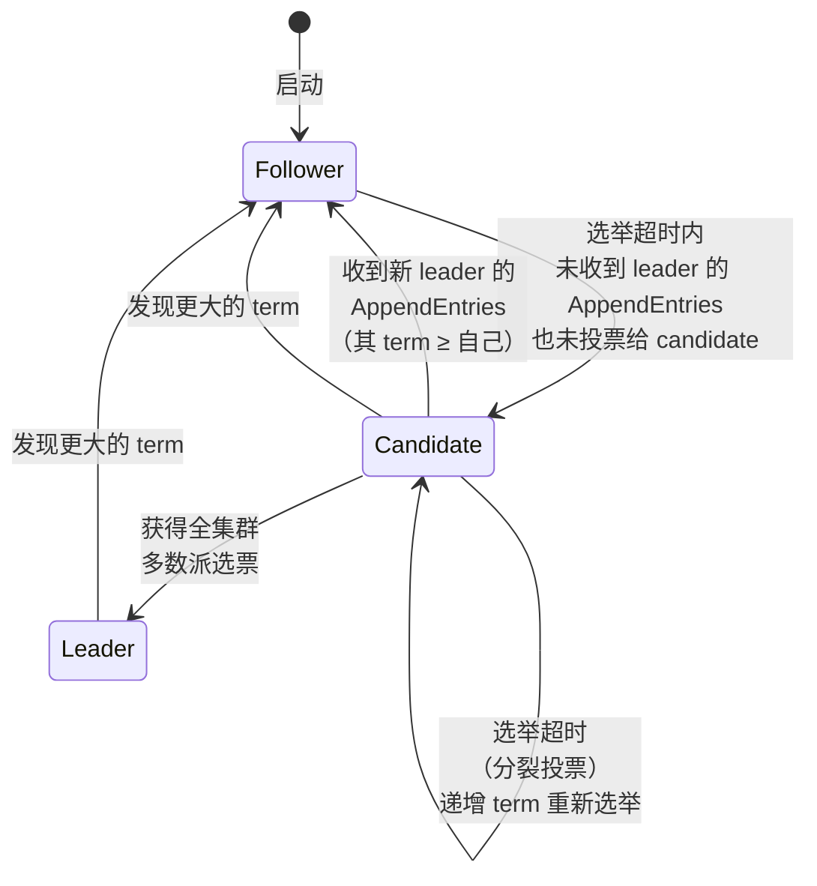

# In Search of an Understandable Consensus Algorithm（Raft）

> **一句话结论**：把「可理解性」当作第一设计目标而非副产品——先选出一个 leader，再把共识拆成 leader 选举、日志复制、安全性三个可独立理解的子问题，并用随机化超时把选举冲突这个难题化解成「随便选一个，无所谓」。代价是放弃了一些理论上的灵活性，换来的是 25 个第三方实现和整个工业界的采用。

---

## 1. 元信息

| 项目 | 内容 |
| --- | --- |
| 作者 / 机构 | Diego Ongaro, John Ousterhout · Stanford University |
| 发表 | **USENIX ATC 2014**（2014 USENIX Annual Technical Conference, pp. 305–319，共 16 页） |
| 原文 | [raft.github.io](https://raft.github.io/) · 本地 [paper.pdf](paper.pdf)（**ATC'14 会议版，本笔记以此为准**） |
| 扩展版 | 本地 [paper-extended.pdf](paper-extended.pdf)（18 页，含 §7 Log compaction、§8 Client interaction 的完整内容） |
| 版本说明 | 另有 Ongaro 的博士论文 *Consensus: Bridging Theory and Practice*（约 250 页），内容更全。**本笔记引用的一切均出自会议版**，涉及其他版本处会显式标注 |
| 关键词 | 共识 · 复制状态机 · 强 leader · 随机化选举超时 · joint consensus |
| 前置知识 | [共识与复制状态机](../../../concepts/consensus-and-replication.md) |
| 代码 | LogCabin（作者实现，约 2000 行 C++）· 论文发表时已有约 25 个第三方开源实现 |

---

## 2. 摘要速览（5 分钟版）

### 2.1 要解决的问题

论文要解决的**不是**「共识算法不存在」——Paxos 早已存在、被证明正确、且在常规情况下高效。要解决的是**Paxos 太难懂，因而难以正确实现**。

论文对 Paxos 提了两条批评：

**第一，极难理解。** 论文的措辞相当直白：完整解释「出了名的晦涩，很少有人能理解它，且都要付出巨大努力」。作者自陈**「我们自己也在 Paxos 上挣扎；直到读了好几份简化解释、并自己设计了一个替代协议之后才理解完整协议，这个过程花了将近一年」**。他们在 NSDI 2012 的非正式调查发现，即便在资深研究者中，也很少有人对 Paxos 感到自如。

论文的诊断很具体：**Paxos 的晦涩源自它选择 single-decree Paxos 作为地基**。单决议 Paxos 被分成两个阶段，这两个阶段「没有简单直观的解释，也无法独立理解」，因此难以形成「它为什么正确」的直觉；而 multi-Paxos 的组合规则又叠加了额外的复杂度。

**第二，不适合作为实际系统的地基。** 三条理由：

- **没有公认的 multi-Paxos 算法**。Lamport 的描述主要针对单决议，multi-Paxos 只有草图，很多细节缺失；后续的补全工作（Mazières、van Renesse、Kirsch & Amir）彼此不同，也与 Lamport 的草图不同。
- **架构本身不适合**。独立地为一批日志条目达成决议、再把它们拼成顺序日志，「收益很小，只是增加复杂度」；围绕日志设计、按受约束的顺序追加条目要简单高效得多。
- **核心是对称的点对点**（虽然最终建议了一种弱形式的 leader 作为性能优化）。这在只做一个决议的简化世界里说得通，但**很少有实际系统这么做**——要做一系列决议，先选出 leader 再由它协调，更简单也更快。

结果是：**每个实现都从 Paxos 出发，发现实现困难，然后演化出一个显著不同的架构**。论文引用了 Chubby 实现者的一句话作为佐证：

> Paxos 算法的描述与真实系统的需求之间存在显著鸿沟……最终的系统将建立在一个未经证明的协议之上。

论文由此得出结论：**Paxos 的形式化也许适合证明定理，但真实实现与它差别太大，那些证明价值有限。**

### 2.2 核心方法

**把可理解性当作首要设计目标。** 论文明确说这是「最重要的目标，也是最难的挑战」。在每个有多种方案可选的设计点上，评判标准是「解释每个方案有多难（状态空间多复杂？有没有微妙的隐含意义？），读者要完全理解它有多容易」。

作者承认这种分析「主观性很强」，但用了两个通用技术：

1. **问题分解**：尽可能把问题切成能独立求解、独立解释、独立理解的部分。Raft 分出了 **leader 选举、日志复制、安全性、成员变更**。
2. **缩小状态空间**：减少需要考虑的状态数，提高系统的一致性（coherency），尽可能消除不确定性。具体做法包括**不允许日志有空洞**、限制日志之间可能出现的不一致方式。

有一个反直觉的例外，论文特意点出：**有些情况下不确定性反而提升可理解性**。随机化引入了不确定性，但它「倾向于通过用相似的方式处理所有可能选择来缩小状态空间（『随便选一个，无所谓』）」。Raft 用随机化简化了 leader 选举。

**算法本身**：先选出一个 leader，赋予它管理复制日志的**完全责任**——leader 接受客户端条目、复制到其他服务器、并告知何时可以安全地应用到状态机。有了 leader 之后，共识问题分解为三个相对独立的子问题：leader 选举、日志复制、安全性。

**三个新颖之处**（论文自列）：

- **强 leader**：比其他共识算法更强的 leader 形式——**日志条目只从 leader 流向其他服务器**；
- **leader 选举**：用随机化定时器选举，只在任何共识算法都需要的心跳之上增加了很少的机制，却简单快速地化解了冲突；
- **成员变更**：**joint consensus**，转换期间两个配置的多数派彼此重叠，使集群在配置变更期间仍能正常服务。

### 2.3 主要结果

论文用三个标准评估：可理解性、正确性、性能。

**可理解性（§8.1）**——这是全文最有争议也最有特色的部分。在 Stanford 高级操作系统课与 UC Berkeley 分布式计算课上做了对照实验：录制 Raft 与 Paxos 的视频讲座各一份、配套测验各一份；每个学生看一个视频做一次测验，再看另一个视频做另一次测验；约一半学生先做 Paxos、另一半先做 Raft，以抵消个体差异与先后顺序的影响。

**结果**：43 名参与者中，**33 人的 Raft 测验成绩高于 Paxos**。满分 60 分，Raft 平均 25.7、Paxos 平均 20.8，**平均高 4.9 分**。配对 t 检验：95% 置信度下 Raft 分布的均值至少比 Paxos 高 2.5 分。

论文还建了一个线性回归模型（考虑测验类型、Paxos 先验经验、学习顺序三个因素），预测**测验类型本身带来 12.5 分的差异**，远高于观测到的 4.9 分——因为许多学生有 Paxos 先验经验，这对 Paxos 帮助很大。

**论文主动列出了两处对 Paxos 有利的偏差**：43 人中 **15 人报告有 Paxos 先验经验**，且 **Paxos 视频比 Raft 视频长 14%**。论文用 Table 1 逐条列出了防偏差措施（同一讲师、Paxos 讲座基于多所大学既有材料改进、题目按难度配对、按评分标准随机顺序交替评分），并公开了全部材料。

另有一份主观调查：41 人中 **33 人认为 Raft 更容易实现**、33 人认为更容易解释。但论文自己提醒**「这些自述感受可能不如测验分数可靠，且参与者可能因知晓我们的假设而产生偏差」**。

**正确性（§8.2）**：用 TLA+ 写了约 400 行的形式化规格；用 TLA 证明系统**机械化地证明了 Log Completeness 性质**。但论文诚实地说明：**这个证明依赖一些未经机械检查的不变量**（例如没有证明规格的类型安全）。此外还有一份约 3500 词的 State Machine Safety 非形式化证明，它是完整的（只依赖规格）且相对精确。

**性能（§8.3）**：论文称 Raft 性能与 Paxos 等算法相似，最重要的情形（已建立的 leader 复制新条目）用了**最少的消息数**——从 leader 到半个集群的一次往返。

实测**只覆盖了 leader 选举**（5 台服务器，广播时间约 15ms，反复 crash leader）：

- **随机化的必要性**：完全没有随机化时，选举**一直超过 10 秒**（大量分裂投票）。只加 **5ms** 随机化就把中位停机降到 **287ms**；加 50ms 随机化后，1000 次试验的最坏完成时间为 **513ms**。
- **超时下限**：选举超时 12–24ms 时平均 **35ms** 选出 leader（最长一次 152ms）。但再往下就会违反 Raft 的时序要求（leader 来不及在别人发起选举前广播心跳），导致不必要的 leader 更替。**论文推荐保守的 150–300ms**。

**实现规模**：作者的 Raft 实现约 **2000 行 C++**（不含测试、注释、空行），用于 RAMCloud 的配置信息复制状态机。论文发表时已有约 **25 个独立的第三方开源实现**。

### 2.4 我的评价

这篇论文最值得学的地方，是它**把一个通常被当作主观品味的东西（可理解性）当作了工程目标，并试图为它建立可测量的证据**。这在系统论文里非常罕见——大多数论文会说「我们的设计更简洁」，然后就此打住。Ongaro 和 Ousterhout 去录了视频、做了测验、找了 43 个学生、跑了配对 t 检验和回归模型。

这套方法学本身有明显的可攻击面（见 §6.2），但**尝试本身的价值高于结论的强度**。而且历史给出了比论文更有力的证据：十年后 etcd、Consul、TiKV、CockroachDB、RedPanda 全都用 Raft，而不是 Paxos。**论文没能证明的东西，采用曲线证明了。**

技术上，Raft 的每一个设计选择几乎都是**用理论灵活性换确定性**：日志不允许空洞、条目只从 leader 流向 follower、不提交前任 term 的条目（即使有时安全）、成员变更走两阶段。这些约束让状态空间小到能在脑子里装下。论文自己在 §5.4.2 承认「有些情况下 leader 可以安全地断定旧条目已提交……**但 Raft 为了简单起见采取了更保守的做法**」——这句话是整篇论文设计哲学的缩影。

评分 ⭐⭐⭐⭐⭐。作为分布式系统的入门第一篇非常合适：它是少数能让人**边读边在脑子里跑一遍算法**的共识论文。但要清楚它的评测是不完整的——性能一节只测了选举，日志复制的吞吐**从未被系统评估过**（见 §6.2）。

---

## 3. 细读

> 章节编号与 **ATC'14 会议版**一致（正文 10 节）。注意会议版的 §7 把「客户端交互」与「日志压缩」合并并**因篇幅省略了内容**，指向扩展版；扩展版把它们拆成了 §7、§8，因而后续编号不同。

### 3.1 Introduction

开篇立论：共识算法让一组机器能作为一个连贯的整体工作、并在部分成员故障时继续运转，因此是构建可靠大规模系统的关键。过去十年 Paxos 主导了讨论——多数实现基于它或受它影响，它也是教学共识的主要载体。

然后是那句关键的自述：**「在我们自己也与 Paxos 挣扎之后，我们着手寻找一个能为系统构建与教育提供更好基础的新共识算法。我们的做法不同寻常之处在于，我们的首要目标是可理解性。」**

论文明确了目标的双重性：不仅要算法能工作，**还要让「它为什么能工作」是显然的**（obvious why it works）。

### 3.2 Replicated state machines

共识算法通常出现在**复制状态机**的语境里：一组服务器上的状态机计算同一状态的相同副本，即使部分服务器宕机也能继续运转。

典型架构（Figure 1）：每台服务器存一份包含一系列命令的**日志**，其状态机按序执行这些命令。每份日志包含相同的命令、相同的顺序，**因为状态机是确定性的**，所以每台计算出相同的状态与相同的输出序列。共识算法的工作就是**保持这份复制日志一致**。

论文列出实际系统对共识算法的四条要求，每条都值得记住：

1. **安全性**：在所有非拜占庭条件下（网络延迟、分区、丢包、重复、乱序）**绝不返回错误结果**。
2. **可用性**：只要**任意多数派**服务器还在运行且能相互通信、能与客户端通信，系统就完全可用。**5 台服务器的典型集群可以容忍任意 2 台故障。** 服务器假定为停止型故障（fail-stop），之后可以从稳定存储恢复并重新加入。
3. **不依赖时序保证一致性**：错误的时钟与极端的消息延迟**最多导致可用性问题**，不会导致不一致。
4. **常规情况下的效率**：一条命令可以在集群的多数派对**单轮 RPC** 作出响应后就完成，少数慢服务器不影响整体性能。

论文举了实际例子：GFS、HDFS、RAMCloud 这类有单一集群 leader 的大规模系统，通常用一个独立的复制状态机来管理 leader 选举、存储必须在 leader 崩溃后存活的配置信息；Chubby 与 ZooKeeper 就是复制状态机的例子。

> **批注**：那四条要求是读任何共识算法时的检查清单，尤其是第 3 条——**安全性不依赖时序，时序只影响可用性**。这条分界线是所有异步系统设计的基石，也是 Raft 在 §5.6 反复回到的地方。把它记牢，后面看到「随机化超时」时就不会误以为 Raft 的正确性依赖于超时值选得对。

### 3.3 What's wrong with Paxos?

见 §2.1。这一节的写法本身值得注意：它**不是**在说 Paxos 错了——论文明确承认 Paxos 保证安全性与活性、支持成员变更、正确性已被证明、常规情况下高效。它攻击的是两个**工程属性**：可理解性与「作为实现地基的适用性」。

> **批注**：这一节是全文最有争议、也最有勇气的部分。用一整节论证「一个被广泛接受的算法难以理解」，在学术写作里需要相当的底气，而作者用的是**自陈的挫败**（花了将近一年）与**第三方证据**（Chubby 实现者的引言、NSDI 2012 的非正式调查）。
>
> 但要看清这一节的论证边界：**它论证的是「Paxos 难懂」，不是「Raft 更好」**。这两件事之间还差一个 §8.1 的用户研究，而那个研究本身有方法学问题（见 §6.2）。另外，「实际系统与 Paxos 差别太大，所以那些证明价值有限」这个论断，对 Raft 自己同样适用——Raft 的实现同样会偏离论文形式，§8.2 的 TLA+ 证明覆盖的也是规格而非实现。

### 3.4 Designing for understandability

见 §2.2。三个设计目标：完整实用的地基、所有条件下安全且常规条件下可用、常规操作高效。**但最重要也最难的是可理解性。**

论文承认「这种分析主观性很强」，然后给出两个通用技术：**问题分解**与**缩小状态空间**。以及那个反直觉的例外——**随机化虽然引入不确定性，却因为「随便选一个，无所谓」而缩小了需要考虑的状态空间**。

> **批注**：「随机化提升可理解性」这个观察是全文最精妙的一处。直觉上确定性算法应该更好推理，但 Raft 的经验相反：确定性的方案（如后面 §5.2 提到的排名系统）需要你为每一种排名组合推演一遍，状态空间是组合爆炸的；随机化则把所有情况折叠成一句「谁先超时谁当选，冲突了就再来一次」。
>
> **可迁移的判断：当一个机制的所有分支都要单独推理时，用随机化把它们折叠成同一个分支，往往比精心设计的确定性规则更容易理解。** 这与「减少状态数」是同一个目标的两种手段。

### 3.5 The Raft consensus algorithm

#### Figure 2 与 Figure 3：算法的完整规格

论文的 Figure 2 是全文最有复用价值的部分——它把整个算法压缩成一页。完整转写如下。

**服务器状态**

| 类别 | 字段 | 说明 |
| --- | --- | --- |
| **所有服务器上的持久化状态**（响应 RPC **之前**必须更新到稳定存储） | `currentTerm` | 服务器见过的最新 term（首次启动初始化为 0，单调递增） |
| | `votedFor` | 当前 term 内收到选票的 candidateId（无则为 null） |
| | `log[]` | 日志条目；每条包含状态机命令、以及**该条目被 leader 接收时的 term**（首个索引为 1） |
| **所有服务器上的易失状态** | `commitIndex` | 已知已提交的最高日志条目索引（初始 0，单调递增） |
| | `lastApplied` | 已应用到状态机的最高日志条目索引（初始 0，单调递增） |
| **leader 上的易失状态**（**选举后重新初始化**） | `nextIndex[]` | 对每台服务器，下一个要发送给它的日志条目索引（初始化为 leader 最后日志索引 + 1） |
| | `matchIndex[]` | 对每台服务器，已知已复制到该服务器的最高日志条目索引（初始 0，单调递增） |

**RequestVote RPC** —— 由 candidate 发起以收集选票（§5.2）

| | 字段 | 说明 |
| --- | --- | --- |
| **参数** | `term` | candidate 的 term |
| | `candidateId` | 请求投票的 candidate |
| | `lastLogIndex` | candidate 最后一条日志的索引（§5.4） |
| | `lastLogTerm` | candidate 最后一条日志的 term（§5.4） |
| **返回** | `term` | `currentTerm`，供 candidate 更新自己 |
| | `voteGranted` | true 表示 candidate 获得该选票 |

**接收方实现**：

1. 若 `term < currentTerm`，返回 false（§5.1）。
2. 若 `votedFor` 为 null 或等于 `candidateId`，**且** candidate 的日志至少与接收方的一样新，则投票（§5.2、§5.4）。

**AppendEntries RPC** —— 由 leader 发起以复制日志条目（§5.3）；也用作心跳（§5.2）

| | 字段 | 说明 |
| --- | --- | --- |
| **参数** | `term` | leader 的 term |
| | `leaderId` | 便于 follower 重定向客户端 |
| | `prevLogIndex` | 紧接新条目之前那条日志的索引 |
| | `prevLogTerm` | `prevLogIndex` 那条条目的 term |
| | `entries[]` | 要存储的日志条目（心跳时为空；为提高效率可发送多条） |
| | `leaderCommit` | leader 的 `commitIndex` |
| **返回** | `term` | `currentTerm`，供 leader 更新自己 |
| | `success` | 若 follower 含有匹配 `prevLogIndex` 与 `prevLogTerm` 的条目则为 true |

**接收方实现**：

1. 若 `term < currentTerm`，返回 false（§5.1）。
2. 若日志中 `prevLogIndex` 处不存在 term 匹配 `prevLogTerm` 的条目，返回 false（§5.3）。
3. 若已有条目与新条目冲突（**索引相同但 term 不同**），**删除该条目及其之后的所有条目**（§5.3）。
4. 追加所有尚未在日志中的新条目。
5. 若 `leaderCommit > commitIndex`，令 `commitIndex = min(leaderCommit, 最后一条新条目的索引)`。

**服务器规则**

*所有服务器*：

- 若 `commitIndex > lastApplied`：递增 `lastApplied`，把 `log[lastApplied]` 应用到状态机（§5.3）。
- 若 RPC 请求或响应中包含 term `T > currentTerm`：令 `currentTerm = T`，**转为 follower**（§5.1）。

*Followers*（§5.2）：

- 响应来自 candidate 与 leader 的 RPC。
- 若选举超时内没有收到当前 leader 的 AppendEntries、也没有给 candidate 投票：**转为 candidate**。

*Candidates*（§5.2）：

- 转为 candidate 时开始选举：递增 `currentTerm` → 给自己投票 → 重置选举定时器 → 向所有其他服务器发送 RequestVote RPC。
- 若收到多数派服务器的选票：**成为 leader**。
- 若收到新 leader 的 AppendEntries RPC：**转为 follower**。
- 若选举超时：开始新一轮选举。

*Leaders*：

- 当选后：向每台服务器发送初始的空 AppendEntries（心跳）；空闲期间重复发送以阻止选举超时（§5.2）。
- 收到客户端命令：追加到本地日志，**在条目被应用到状态机之后**才响应（§5.3）。
- 若某 follower 的最后日志索引 ≥ `nextIndex`：从 `nextIndex` 开始发送 AppendEntries RPC。
    - 成功：更新该 follower 的 `nextIndex` 与 `matchIndex`（§5.3）。
    - **因日志不一致而失败：递减 `nextIndex` 并重试**（§5.3）。
- 若存在 `N` 使得 `N > commitIndex`、多数派的 `matchIndex[i] ≥ N`、**且 `log[N].term == currentTerm`**：令 `commitIndex = N`（§5.3、§5.4）。

**Figure 3：Raft 保证始终成立的五条性质**

| 性质 | 内容 | 章节 |
| --- | --- | --- |
| **Election Safety** | 一个给定 term 内**至多**选出一个 leader | §5.2 |
| **Leader Append-Only** | leader 从不覆盖或删除自己日志中的条目，**只追加** | §5.3 |
| **Log Matching** | 若两份日志含有**索引与 term 都相同**的条目，则两份日志在该索引及之前**完全相同** | §5.3 |
| **Leader Completeness** | 若某条目在某个 term 被提交，则它必然出现在**所有更高编号 term 的 leader** 的日志中 | §5.4 |
| **State Machine Safety** | 若某服务器已把某索引处的条目应用到状态机，则**其他服务器绝不会在同一索引应用不同的条目** | §5.4.3 |

> **批注**：Figure 2 之所以是这篇论文最有价值的产出，在于它做到了一件很难的事——**把一个分布式算法压缩成一页、且这一页足以指导实现**。注意它的组织方式：状态、两个 RPC 的参数/返回/接收方实现、以及按角色分组的「独立且重复触发的规则」。这种「规则集」而非「流程图」的表达方式，恰恰对应了分布式系统的真实语义——没有全局的执行顺序，每个规则在条件满足时独立触发。
>
> 有一处极易被忽略但至关重要：**「所有服务器」规则里那条「见到更大的 term 就转 follower」**。它是全文最强的一条不变量，是 term 作为逻辑时钟能起作用的根本原因，也是为什么 Raft 不需要复杂的角色协商——**任何角色在任何时刻看到更大的 term 都无条件退位**。

**角色状态转换**（Figure 4）：

#### 5.1 Raft basics

一个 Raft 集群含若干服务器，**5 台是典型数量，可容忍 2 台故障**。任意时刻每台服务器处于三种状态之一：**leader、follower、candidate**。正常运行时恰有一个 leader，其余全是 follower。

- **follower 是被动的**：自己不发起任何请求，只响应 leader 与 candidate 的请求。
- **leader 处理所有客户端请求**（若客户端联系了 follower，follower 把它重定向到 leader）。
- **candidate** 用于选举新 leader。

**term 是 Raft 的逻辑时钟**。时间被划分成任意长度的 **term**，用连续整数编号。每个 term 以一次选举开始；若某 candidate 赢得选举，它在该 term 剩余时间里担任 leader。有些选举会出现**分裂投票**，此时该 term **以没有 leader 结束**，很快开始一个新 term（新选举）。**Raft 保证一个给定 term 内至多一个 leader。**

不同服务器可能在不同时刻观察到 term 转换，某些情况下一台服务器可能**完全错过一次选举甚至整个 term**。term 的作用机制：

- 每台服务器存一个单调递增的当前 term 号；
- **服务器通信时总是交换 term**；若一方的 term 较小，就更新到较大的值；
- **candidate 或 leader 发现自己的 term 过期，立即退回 follower**；
- 服务器收到带过期 term 的请求，**拒绝该请求**。

整个算法**只需要两种 RPC**：RequestVote（candidate 在选举时发起）与 AppendEntries（leader 发起以复制日志并充当心跳）。RPC 无响应时重试，并行发出以获得最佳性能。

> **批注**：「term 作为逻辑时钟」是 Raft 里最经济的一个设计。它用一个单调递增的整数同时解决了三件事：**识别过期信息**（拒绝小 term 的请求）、**触发角色退位**（见到大 term 就转 follower）、**保证一个 term 至多一个 leader**（每台服务器每 term 只投一票 + 多数派规则）。
>
> 一个整数承担三项职责而不显得拥挤，是因为这三项其实是同一个问题的不同侧面——**「谁的信息更新」**。这也是为什么 Raft 只需要两种 RPC：角色协商的复杂性被完全吸收进了 term 的比较规则里。

#### 5.2 Leader election

**触发机制是心跳**。服务器启动时都是 follower，只要持续收到 leader 或 candidate 的有效 RPC 就保持 follower。leader 周期性地发送心跳（**不携带日志条目的 AppendEntries RPC**）以维持权威。若 follower 在一段称为**选举超时**的时间内没有收到任何通信，它就认为没有可用的 leader，开始一次选举。

**选举流程**：follower 递增自己的 `currentTerm`、转为 candidate、**给自己投票**，然后并行地向其他所有服务器发送 RequestVote RPC。candidate 保持该状态直到发生三件事之一：

**(a) 赢得选举**。candidate 收到**全集群多数派**在**同一 term** 的选票即当选。每台服务器在给定 term 内**至多投给一个 candidate，先到先服务**（§5.4 会再加一条限制）。**多数派规则保证一个特定 term 至多一个 candidate 能赢**——这就是 Election Safety。当选后立即发送心跳建立权威、阻止新的选举。

**(b) 另一台服务器确立为 leader**。等待选票期间收到自称 leader 的 AppendEntries RPC：若该 leader 的 term **不小于**自己的当前 term，则承认其合法性并**退回 follower**；若 RPC 中的 term 更小，则拒绝该 RPC 并继续保持 candidate。

**(c) 一段时间过去没有赢家**。若许多 follower 同时变成 candidate，选票可能被分散，无人获得多数。此时每个 candidate 会超时，递增 term 开始新一轮选举。**但如果没有额外措施，分裂投票可能无限重复。**

**随机化选举超时**是 Raft 对 (c) 的回答，用在两个地方：

1. **预防分裂投票**：选举超时从一个固定区间内随机选取（例如 **150–300ms**）。这把各服务器错开，多数情况下**只有一台会超时**——它赢得选举并在其他服务器超时之前发出心跳。
2. **化解已发生的分裂投票**：每个 candidate 在选举开始时**重启自己的随机化超时**，等它走完才开始下一轮选举，从而降低再次分裂的概率。

**一段珍贵的设计弯路记录**。论文特意记下了一个被放弃的方案：

> 最初我们计划使用**排名系统**：每个 candidate 被赋予唯一排名，用于在竞争的 candidate 之间做选择。若某 candidate 发现另一个排名更高的 candidate，它就退回 follower 状态，好让排名更高者更容易赢下一次选举。我们发现这个做法**在可用性上产生了微妙的问题**（排名较低的服务器在排名较高者故障时可能需要超时并重新成为 candidate，但如果它这么做得太早，就会重置选举 leader 的进度）。我们**多次调整算法，但每次调整之后都会冒出新的边角情况**。最终我们得出结论：随机化重试的做法更显然、更易理解。

> **批注**：这段弯路记录是整篇论文最有教育价值的一段，因为它展示了「可理解性作为设计目标」在实践中长什么样——**不是选一个更简单的方案，而是在一个功能上可行的方案反复冒出边角情况时，认定这本身就是设计缺陷并推倒重来**。
>
> 排名系统在功能上是能工作的（调整几次之后总能修好），但「每次修完又冒新的 corner case」这个现象说明它的状态空间过于复杂。**把「边角情况层出不穷」当作设计信号而非实现困难，是这篇论文方法论的精髓。**

#### 5.3 Log replication

**正常流程**：leader 当选后开始服务客户端。每个客户端请求含一条要被复制状态机执行的命令。leader 把命令作为新条目追加到自己的日志，然后**并行地**向其他服务器发 AppendEntries RPC 复制它。条目被安全复制后，leader 把它应用到自己的状态机并把执行结果返回客户端。若 follower 崩溃、运行缓慢或丢包，**leader 无限重试 AppendEntries（即使已经响应了客户端）**，直到所有 follower 最终存下所有条目。

**日志结构**（Figure 6）：每条日志条目存储一条状态机命令 + **该条目被 leader 接收时的 term 号**，以及一个标识其位置的整数索引。term 号用于检测日志间的不一致。

**提交（commit）的定义**：

> 一条日志条目在**创建它的那个 leader 把它复制到多数派服务器上**之后即为已提交。**这同时也提交了 leader 日志中所有在它之前的条目，包括前任 leader 创建的条目。**

leader 跟踪已知已提交的最高索引，并把它放进后续的 AppendEntries（含心跳）中，使其他服务器最终得知。follower 得知某条目已提交后，就按日志顺序把它应用到本地状态机。

**Log Matching 性质**由两条子性质构成：

- 若不同日志中的两条条目有**相同的索引和 term**，则它们**存储相同的命令**；
- 若不同日志中的两条条目有**相同的索引和 term**，则两份日志在**之前的所有条目上完全相同**。

**第一条**成立是因为：leader 在一个给定 term 内**至多创建一条给定索引的条目**，且日志条目**永不改变自己在日志中的位置**。

**第二条**由 AppendEntries 的**一致性检查**保证：leader 发送 AppendEntries 时，附上自己日志中紧邻新条目之前那条的**索引与 term**（`prevLogIndex`、`prevLogTerm`）。若 follower 在自己日志里找不到相同索引与 term 的条目，就**拒绝**新条目。

论文对这个机制的刻画很精准：

> 一致性检查起到了**归纳步骤**的作用：日志的初始空状态满足 Log Matching 性质，而一致性检查在日志每次被扩展时保持该性质。因此，只要 AppendEntries 成功返回，leader 就知道 follower 的日志与自己的日志**直到新条目为止完全相同**。

**处理不一致**。leader 崩溃会留下不一致的日志（旧 leader 可能没有完全复制自己日志里的所有条目），且不一致会在一系列崩溃中累积。Figure 7 展示了 follower 日志可能与新 leader 不同的各种情形：**缺少条目（a–b）、多出未提交的条目（c–d）、或两者兼有（e–f）**。

论文给了 (f) 的成因，很能说明问题的复杂度：*该服务器曾是 term 2 的 leader，向日志加了几条，在提交任何一条之前崩溃；它快速重启，成为 term 3 的 leader，又加了几条；在 term 2 和 term 3 的条目都还没提交时再次崩溃，并且宕机了好几个 term。*

**Raft 的解法**：**leader 强制 follower 的日志复制自己的**——follower 日志中冲突的条目会被 leader 的条目覆盖。

具体机制：leader 为每个 follower 维护一个 `nextIndex`（下一条要发给它的日志索引）。leader 刚上任时把所有 `nextIndex` 初始化为**自己最后一条日志之后的位置**。若某 follower 的日志与 leader 不一致，下一次 AppendEntries 的一致性检查就会失败；**被拒绝后 leader 递减 `nextIndex` 并重试**。最终 `nextIndex` 会降到 leader 与该 follower 日志匹配的位置，此时 AppendEntries 成功——它会**删除 follower 日志中所有冲突条目并追加 leader 的条目**。此后该 follower 的日志在这个 term 剩余时间里都与 leader 一致。

论文提到该协议可以优化以减少被拒绝的 AppendEntries 次数，细节在扩展版中。

这个机制有一个很好的性质：

> **leader 上任时不需要采取任何特殊行动来恢复日志一致性。** 它只是开始正常运行，日志就会在 AppendEntries 一致性检查失败的驱动下自动收敛。leader 从不覆盖或删除自己日志中的条目（Leader Append-Only 性质）。

> **批注**：「leader 上任不需要特殊的日志恢复阶段」是 Raft 相对 VR、ZooKeeper 的一处实质简化（§9 会展开）。别的算法在 leader 变更时要传输整份日志或做专门的协商，Raft 把这件事完全折叠进了**正常路径**——一致性检查每次都在跑，恢复只是它失败时的自然结果。
>
> **把异常路径消解进正常路径，是减少状态空间最有效的手法之一**：不需要单独的恢复协议，也就不需要为「恢复期间又崩溃了」设计另一套逻辑。代价是逐条递减 `nextIndex` 在最坏情况下很慢（Figure 7(f) 那种要退很多条），这也是论文提到「可以优化」的原因。

#### 5.4 Safety

前面的机制**还不足以**保证每个状态机以相同顺序执行相同命令。论文给了具体的反例：一个 follower 可能在 leader 提交若干条目期间不可用，随后**它被选为 leader 并用新条目覆盖了那些已提交的条目**——结果不同状态机执行了不同的命令序列。

这一节通过给「谁能被选为 leader」加一条限制来补上这个缺口。

##### 5.4.1 Election restriction

**问题的一般形式**：任何基于 leader 的共识算法里，leader 最终都必须存有所有已提交的条目。有些算法（如 Viewstamped Replication）允许**不含全部已提交条目的服务器当选**，然后用额外机制找出缺失条目并传给新 leader——但这带来了「可观的额外机制与复杂度」。

**Raft 的做法更简单**：保证**每个新 leader 从当选那一刻起就含有前任 term 的所有已提交条目**，无需任何条目传输。由此，**日志条目只朝一个方向流动——从 leader 到 follower，且 leader 永不覆盖自己日志中的既有条目**。

**怎么做到的：把限制放进投票过程。**

推理链条如下（这是全文最漂亮的一段论证）：

1. candidate 必须联系集群的**多数派**才能当选；
2. 每一条已提交的条目都存在于**至少一个多数派成员**上（提交的定义就是复制到了多数派，而两个多数派必然相交）；
3. 因此，只要 candidate 的日志**至少和那个多数派中任何一份日志一样新**，它就必然持有所有已提交条目。

RequestVote RPC 实现了这条限制：RPC 携带 candidate 的日志信息（`lastLogIndex`、`lastLogTerm`），**投票者若发现自己的日志比 candidate 的更新，就拒绝投票**。

**「更新」（up-to-date）的精确定义**——比较两份日志最后条目的索引与 term：

- 若最后条目的 **term 不同**，**term 更大的那份更新**；
- 若最后条目的 **term 相同**，**更长的那份更新**。

##### 5.4.2 Committing entries from previous terms

这是全文最微妙的一点。

如 §5.3 所述，leader 知道**自己当前 term** 的条目一旦存到多数派就已提交。但是——

> **leader 不能仅凭「存到了多数派」就断定一条来自前任 term 的条目已提交。**

**Figure 8 的完整场景**（这个反例必须讲清楚）：

- **(a)** S1 是 leader，把索引 2 处的条目（term 2）**部分复制**出去。
- **(b)** S1 崩溃。**S5 凭借 S3、S4 和自己的选票当选 term 3 的 leader**，并在索引 2 处接受了一条**不同的**条目（term 3）。
- **(c)** S5 崩溃。S1 重启并再次当选，继续复制。**此时那条来自 term 2 的条目已经复制到了多数派服务器上——但它并未被提交。**
- **(d)** 如果 S1 此时崩溃，**S5 可以凭 S2、S3、S4 的选票当选**，并用自己 term 3 的条目**覆盖**索引 2 处那条已经在多数派上的条目。
- **(e)** 但如果 S1 在崩溃前**先把一条自己当前 term 的条目复制到多数派**，那么这条新条目就是已提交的（此时 **S5 无法赢得选举**），并且**此时索引 2 处那条旧条目也随之被间接提交**。

**Raft 的规则**：

> Raft **绝不通过计算副本数来提交前任 term 的日志条目**。只有 leader **当前 term** 的条目才通过计数副本提交；一旦当前 term 的某条目以这种方式提交，**所有更早的条目就凭 Log Matching 性质被间接提交**。

这正是 Figure 2 里那条 `log[N].term == currentTerm` 的由来。

论文诚实地补了一句：

> 有些情况下 leader 可以安全地断定一条更老的条目已提交（例如该条目存在于**每一台**服务器上），**但 Raft 为了简单起见采取了更保守的做法。**

**为什么会有这个额外复杂度**：因为 **Raft 的日志条目在被新 leader 复制时保留原来的 term 号**。其他共识算法里，新 leader 重新复制前任的条目时必须用**自己的新 term 号**。Raft 的做法让日志条目更容易推理（它们跨时间、跨日志保持同一个 term 号），而且**新 leader 需要发送的前任条目更少**（其他算法必须发送冗余条目来给它们重新编号才能提交）。

> **批注**：Figure 8 是全篇最需要慢读的一张图，而它揭示的教训超出 Raft 本身：**「复制到多数派」并不等价于「已提交」**。多数派复制只是提交的**必要**条件。缺的那一半是——**必须有一个当前 term 的 leader 为这次复制「背书」**，因为只有当前 term 的多数派才能阻止未来的 leader 推翻它。
>
> 这条也是 [共识与复制状态机](../../../concepts/consensus-and-replication.md) 里最容易被误解的一点，值得反复回看。

##### 5.4.3 Safety argument

论文用反证法证明 Leader Completeness 性质。假设它不成立：设 term T 的 leader（$leader_T$）提交了一条本 term 的条目，但该条目没有被某个未来 term 的 leader 存储。取**最小的** $U > T$，其 leader（$leader_U$）不含该条目。

1. 该已提交条目在 $leader_U$ **当选之时**必然不在其日志中（leader 从不删除或覆盖条目）。
2. $leader_T$ 把该条目复制到了集群的多数派，而 $leader_U$ 收到了集群多数派的选票。**因此至少存在一台服务器（称为「投票者」）既接受了 $leader_T$ 的条目、又投票给了 $leader_U$**（Figure 9）。**这个投票者是矛盾的关键。**
3. 投票者必然是**先**接受了 $leader_T$ 的条目，**才**投票给 $leader_U$——否则它会拒绝 $leader_T$ 的 AppendEntries 请求（因为它的当前 term 会高于 T）。
4. 投票者在给 $leader_U$ 投票时**仍然存有**该条目，因为：中间的每个 leader 都含有该条目（由 $U$ 的最小性假设）、leader 从不移除条目、且 follower 只在与 leader 冲突时才移除条目。
5. 投票者把票投给了 $leader_U$，所以 **$leader_U$ 的日志必须至少和投票者的一样新**。这导向两个矛盾之一。
6. **其一**：若投票者与 $leader_U$ 的最后日志 term **相同**，则 $leader_U$ 的日志至少与投票者的一样长，因而包含投票者日志中的每一条。**矛盾**——投票者含有那条已提交条目，而 $leader_U$ 被假设为不含。
7. **其二**：否则 $leader_U$ 的最后日志 term 必然**大于**投票者的。而且它大于 T，因为投票者的最后日志 term 至少是 T（它含有 term T 的那条已提交条目）。创建 $leader_U$ 最后那条日志的**更早的 leader** 必然含有那条已提交条目（由假设）。于是**由 Log Matching 性质**，$leader_U$ 的日志也必然含有该条目。**矛盾**。
8. 矛盾完成。因此所有大于 T 的 term 的 leader 都必然含有 term T 中在 term T 提交的所有条目。
9. Log Matching 性质保证未来的 leader 也含有**间接提交**的条目，例如 Figure 8(d) 中的索引 2。

有了 Leader Completeness，State Machine Safety 与「所有状态机以相同顺序应用相同条目」就容易证明了。

> **批注**：这个证明的核心是第 2 步的**「投票者」构造**——两个多数派必然相交，所以一定存在一台服务器同时参与了「提交」与「选举」两件事。**quorum 相交是所有共识算法的数学地基**，Raft 只是把它用得特别显式：整个安全性论证就挂在这一台服务器上。
>
> 记住这个构造比记住证明细节有用得多：**任何时候你想知道「这个操作安全吗」，就去找那台既见证了旧决定、又参与了新决定的服务器。**

#### 5.5 Follower and candidate crashes

比 leader 崩溃简单得多，且两者处理方式相同：**无限重试**。若 follower 或 candidate 崩溃，发给它的 RequestVote 与 AppendEntries 会失败；崩溃的服务器重启后 RPC 就会成功。

一个重要细节：若服务器在**完成 RPC 之后、响应之前**崩溃，重启后会再次收到同一个 RPC。**Raft 的 RPC 是幂等的**，所以无害——例如 follower 收到含有自己日志中已有条目的 AppendEntries，就忽略新请求里的那些条目。

#### 5.6 Timing and availability

论文重申一条要求：**安全性绝不能依赖时序**——系统不能仅仅因为某个事件比预期快或慢就产生错误结果。但**可用性必然依赖时序**。

**时序要求**：

$$\text{broadcastTime} \ll \text{electionTimeout} \ll \text{MTBF}$$

- **broadcastTime**：一台服务器并行地向集群所有服务器发 RPC 并收到响应的平均时间；
- **electionTimeout**：§5.2 的选举超时；
- **MTBF**：单台服务器的平均故障间隔。

**为什么是这两个不等号**：

- broadcastTime 应比 electionTimeout **小一个数量级**，这样 leader 才能可靠地发出心跳阻止 follower 发起选举；配合随机化超时，这个不等式也让分裂投票变得不太可能。
- electionTimeout 应比 MTBF **小几个数量级**，这样系统才能稳定推进。leader 崩溃时系统大约会有一个选举超时的时长不可用，我们希望这只占总时间的很小一部分。

**实际数值**：broadcastTime 与 MTBF 是底层系统的属性，electionTimeout 是我们要选的。**Raft 的 RPC 通常要求接收方把信息持久化到稳定存储**，所以 broadcastTime 视存储技术而定在 **0.5ms 到 20ms** 之间；因此 electionTimeout 大概应在 **10ms 到 500ms** 之间。典型服务器的 MTBF 是几个月甚至更长，很容易满足要求。

> **批注**：这个不等式是理解 Raft 工程调优的全部依据，而 broadcastTime 里那句「**RPC 通常要求接收方持久化到稳定存储**」是最容易被忽略的一环——它意味着广播时间受磁盘 fsync 支配，而不只是网络延迟。这解释了为什么 Raft 集群对存储介质如此敏感，也解释了为什么把 etcd 放在慢磁盘上会导致频繁的 leader 更替。

### 3.6 Cluster membership changes

**为什么不能直接切换**：配置不可能在所有服务器上**原子地**同时切换，所以转换期间集群可能**分裂成两个独立的多数派**。Figure 10 给的例子是集群从 3 台增长到 5 台：存在一个时间点，**两个不同的 leader 可能在同一 term 当选**——一个靠 $C_{old}$ 的多数派，另一个靠 $C_{new}$ 的多数派。

**因此配置变更必须用两阶段**。Raft 的两阶段叫 **joint consensus**（联合共识）：集群先切换到一个过渡配置 $C_{old,new}$，等它被提交后再切换到 $C_{new}$。联合共识同时结合两个配置：

- 日志条目复制到**两个配置中的所有服务器**；
- **任一配置**中的任何服务器都可以担任 leader；
- **达成一致（选举与条目提交）需要来自新旧两个配置的、各自独立的多数派**。

第三条是安全性的来源：既然每个决定都要同时得到 $C_{old}$ 的多数派和 $C_{new}$ 的多数派，两个配置就不可能各自独立地做决定。

**流程**（Figure 11）：配置以**特殊的日志条目**形式存储和传播。

1. leader 收到从 $C_{old}$ 变到 $C_{new}$ 的请求，把 $C_{old,new}$ 作为一条日志条目存下并复制。
2. **服务器一旦把新配置条目加入日志，就立即用该配置做后续所有决定**（**总是用日志中最新的配置，无论它是否已提交**）。因此 leader 会用 $C_{old,new}$ 的规则来判断 $C_{old,new}$ 这条日志何时提交。
3. 若 leader 此时崩溃，新 leader 可能在 $C_{old}$ 或 $C_{old,new}$ 下选出，取决于获胜的 candidate 是否收到了 $C_{old,new}$。**无论哪种情况，$C_{new}$ 都不能单方面做决定。**
4. $C_{old,new}$ 提交后，$C_{old}$ 与 $C_{new}$ 都无法在没有对方批准的情况下做决定，且 Leader Completeness 保证**只有含 $C_{old,new}$ 条目的服务器能当选 leader**。此时 leader 可以安全地创建描述 $C_{new}$ 的日志条目并复制出去。
5. $C_{new}$ 在 $C_{new}$ 的规则下提交后，旧配置就无关紧要了，不在新配置中的服务器可以关闭。

**三个额外问题**（都是实践中会咬人的）：

**第一，新服务器初始没有任何日志条目**。直接加入会需要相当长时间追赶，期间可能无法提交新条目。**Raft 引入一个额外阶段**：新服务器先作为**非投票成员**加入（leader 向它们复制日志，但**不计入多数派**）；追上之后再进行正式的配置变更。

**第二，集群 leader 可能不在新配置中**。此时 leader 在**提交 $C_{new}$ 条目之后**退回 follower 状态。这意味着有一段时间（提交 $C_{new}$ 期间）**leader 在管理一个不包含自己的集群**——它复制日志条目但**不把自己计入多数派**。之所以在 $C_{new}$ 提交时才交接，是因为这是新配置第一次能够独立运作的时刻（此后总能从 $C_{new}$ 中选出 leader）；在此之前，可能只有 $C_{old}$ 中的服务器才能当选。

**第三，被移除的服务器会扰乱集群**。它们收不到心跳，于是超时、发起新选举、带着**更大的 term 号**发 RequestVote，导致当前 leader 退回 follower。新 leader 最终会选出来，但被移除的服务器会再次超时，如此循环，**造成很差的可用性**。

**解法**：**服务器在相信当前 leader 存在时，忽略 RequestVote RPC**。具体地，若一台服务器在**距离上次收到当前 leader 消息不足最小选举超时**的时间内收到 RequestVote，它**既不更新自己的 term 也不投票**。这不影响正常选举（正常情况下每台服务器在发起选举前至少等一个最小选举超时），但能避免被移除服务器的干扰——**只要 leader 能把心跳送达集群，它就不会被更大的 term 号赶下台**。

> **批注**：第三个问题的解法是 Raft 里唯一一处**违背「见到更大 term 就退位」这条铁律**的地方，而且它对正确性至关重要——没有它，任何一台掉队的服务器都能靠反复递增 term 把整个集群搞瘫。这也说明那条铁律并非绝对：**Raft 在这里用「最小选举超时内的 leader 租约」为它开了一个口子。**
>
> 这个模式在实践中被进一步发展成了 **PreVote**（candidate 先探询能否赢得选举，再真正递增 term），后来成了几乎所有生产实现的标配。论文的会议版没有 PreVote，它出现在 Ongaro 的博士论文里。〔版本说明：PreVote 不在 ATC'14 会议版中〕

### 3.7 Clients and log compaction

**这一节在会议版中因篇幅限制被完全省略**，只留了一段指引：内容在扩展版中，描述客户端如何与 Raft 交互（包括客户端如何找到集群 leader、Raft 如何支持**线性一致性**语义）以及如何用**快照**回收复制日志的空间。论文补了一句：「这些问题适用于所有基于共识的系统，Raft 的解法与其他系统类似。」

> **批注**：把「客户端交互」和「日志压缩」砍掉，是会议版最大的信息损失，而这两块恰恰是**从算法走向可用系统时最麻烦的部分**。尤其是线性一致性读——朴素实现里，一个旧 leader 在网络分区后仍以为自己是 leader，会返回过期数据。要正确处理需要 ReadIndex 或 lease read 机制。**读这篇论文时最容易产生的错觉就是「Raft 的读很简单」，而这个错觉正是由这一节被砍掉造成的。** 需要实现时必须去看扩展版或博士论文。

### 3.8 Implementation and evaluation

实现：作为 RAMCloud 的一部分，用于存储配置信息并协助 RAMCloud coordinator 的故障切换。**约 2000 行 C++**（不含测试、注释、空行），源码公开（LogCabin）。论文发表时已有**约 25 个第三方开源实现**，多家公司在部署基于 Raft 的系统。

#### 8.1 Understandability

见 §2.3。这里补充实验设计的细节：

- 参与者是 Stanford 高级操作系统课与 UC Berkeley 分布式计算课的高年级本科生与研究生；
- **Paxos 讲座覆盖的材料足以构建一个等价的复制状态机**，包括单决议 Paxos、多决议 Paxos、重配置、以及实践中需要的若干优化（如 leader 选举）——即论文努力让对比公平；
- 测验既考基本理解，也要求学生推理边角情况；
- 每人看一个视频做对应测验，再看第二个视频做第二个测验；**约一半人先做 Paxos**，以抵消个体差异与「从第一部分获得的经验」。

**Table 1 的防偏差措施**（论文主动列出）：

| 顾虑 | 采取的措施 |
| --- | --- |
| 讲座质量对等 | 同一讲师主讲两者；Paxos 讲座基于并改进自多所大学在用的既有材料；**Paxos 讲座长 14%** |
| 测验难度对等 | 题目按难度分组并在两份试卷间配对 |
| 评分公平 | 使用评分标准（rubric）；**随机顺序评分，在两份试卷间交替** |

结果见 §2.3。论文还提到回归模型的一个「奇怪」发现：**已经做过 Paxos 测验的人，Raft 分数会低 6.3 分**——「虽然我们不知道为什么，但这看起来在统计上是显著的」。

> **批注**：这一节最值得称道的是**论文自己把对自己不利的信息全部列了出来**：15/43 的参与者有 Paxos 经验、Paxos 视频更长、自述调查可能被实验假设污染、以及那个无法解释的 6.3 分异常。这种自我披露的密度在系统论文里相当罕见。
>
> 但披露不等于消解——方法学的根本问题依然在（见 §6.2）。**「我知道并列出了我的偏差」与「我的结论不受偏差影响」是两回事**，论文有时会让读者混淆这两者。

#### 8.2 Correctness

形式化规格用 **TLA+** 写成，约 **400 行**，让 Figure 2 的信息完全精确，本身对实现者也有用。用 **TLA 证明系统机械化地证明了 Log Completeness 性质**。

论文的自我限定非常明确：

> 然而，**这个证明依赖一些尚未被机械检查的不变量**（例如，我们没有证明规格的类型安全）。

此外还有一份 **State Machine Safety 的非形式化证明**，约 3500 词，它是完整的（只依赖规格）且相对精确。

#### 8.3 Performance

论文称 Raft 性能与 Paxos 等算法相似。最重要的情形——**已建立的 leader 复制新条目**——Raft 用了**最少的消息数**（从 leader 到半个集群的一次往返）。论文还说 Raft 容易支持批处理与流水线以获得更高吞吐和更低延迟，但把这些优化**留给了未来工作**。

**实测部分只测了 leader 选举**，回答两个问题：选举过程收敛得快吗？leader 崩溃后能达到的最小停机时间是多少？

**实验设置**（必须记住这些条件）：5 台服务器的集群，**广播时间约 15ms**。反复 crash leader 并计时「检测崩溃 + 选出新 leader」的耗时。为构造**最坏情况**：

- 每次试验中各服务器**日志长度不同**，因此有些 candidate 没有当选资格；
- 为**鼓励分裂投票**，测试脚本在终止 leader 进程前触发一次**同步的心跳广播**（近似 leader 在崩溃前复制新日志条目的行为）；
- leader 在其心跳间隔内被**均匀随机**地 crash，心跳间隔是最小选举超时的一半。因此**可能的最小停机约为最小选举超时的一半**。

**结果（Figure 14）**：

*上图（改变随机化幅度）*：

| 选举超时区间 | 结果 |
| --- | --- |
| 150–150ms（**无随机化**） | 选举**一直超过 10 秒**（大量分裂投票，仅 100 次试验） |
| 150–155ms（5ms 随机） | 中位停机 **287ms** |
| 150–200ms（50ms 随机） | 1000 次试验中**最坏 513ms** |

*下图（降低最小选举超时）*：选举超时 **12–24ms** 时平均 **35ms** 选出 leader，最长一次 **152ms**。但论文警告：**再往下就违反了 Raft 的时序要求**——leader 难以在其他服务器发起新选举之前广播心跳，会导致不必要的 leader 更替、降低整体可用性。

**论文的建议**：使用保守的选举超时，如 **150–300ms**——不太可能引起不必要的 leader 更替，同时仍提供良好的可用性。

> **批注**：「无随机化时选举一直超过 10 秒」这个数字是随机化必要性最有力的证据，它把一个看似锦上添花的技巧变成了必需品。**从 10 秒降到 287ms 只用了 5ms 的随机化**——投入产出比之高，正好印证了 §4 里「随机化既缩小状态空间又简单有效」的判断。
>
> 但这一节的问题也很明显：**它只测了选举**。§2 列出的四条要求里，「常规情况下一轮 RPC 完成命令」这条从未被实测过。见 §6.2。

### 3.9 Related work

论文把相关工作分成五类：Lamport 的原始 Paxos 及其解释尝试、Paxos 的细化实现、实现了共识的系统（Chubby、ZooKeeper、Spanner）、Paxos 的性能优化、以及 Oki & Liskov 的 **Viewstamped Replication (VR)**。

**与 Paxos 的最大差别：强 leader**。

> Raft 把 leader 选举作为共识协议的**必要组成部分**，并尽可能多地把功能集中在 leader 上。这带来了更简单、更易理解的算法。在 Paxos 中，**leader 选举与基本共识协议是正交的**：它只作为性能优化，并非达成共识所必需。但这导致了额外的机制——Paxos 既包含一个用于基本共识的两阶段协议，又包含一套独立的 leader 选举机制。**Raft 把 leader 选举直接并入共识算法，作为共识两阶段中的第一阶段，因此机制比 Paxos 更少。**

**与 VR、ZooKeeper 的差别**：三者都是基于 leader 的，因此共享 Raft 相对 Paxos 的许多优势。但**Raft 的机制更少，因为它最小化了非 leader 节点的功能**：

- **日志条目在 Raft 中只朝一个方向流动**——从 leader 经 AppendEntries 向外。**在 VR 中日志条目双向流动**（leader 可以在选举过程中接收日志条目），这带来了额外的机制与复杂度。ZooKeeper 已发表的描述也是双向传输，但其实现显然更像 Raft。
- **消息类型数**：论文声称 Raft 的消息类型比它所知的任何基于共识的日志复制算法都少——**VR 与 ZooKeeper 各定义 10 种消息类型，Raft 只有 4 种**（两个 RPC 请求及其响应）。Raft 的消息更密集一些，但整体更简单。
- VR 与 ZooKeeper 的描述里，**leader 变更时要传输整份日志**；要让这些机制变得实用还需要额外的消息类型。

**成员变更方案的对比**：Raft 选 joint consensus 是因为它**复用了共识协议的其余部分**，只需很少的额外机制。Lamport 基于 $\alpha$ 的方案对 Raft 不适用，因为它假设无需 leader 就能达成共识。相比 VR 与 SMART，**Raft 的重配置算法的优势是成员变更期间不必限制正常请求的处理**——VR 在配置变更期间**停止所有正常处理**，SMART 则对未完成请求数施加了 $\alpha$ 式的限制。

> **批注**：「4 种消息类型 vs 10 种」是这一节最有力的量化论据，也是少数不依赖用户研究的可理解性证据。但要注意它是**论文的自我声明**（"that we are aware of"），且论文自己承认「Raft 的消息更密集一些」——**把复杂度从消息种类挪进了消息字段**，这个 trade-off 的净收益并没有被量化。
>
> 另外值得记住的是对 Paxos 的那句判断：**Paxos 里 leader 选举是可选的性能优化，Raft 里它是共识的第一阶段**。这一句解释了两者所有结构差异的根源。

### 3.10 Conclusion

论文的结尾把整篇的立场说得最清楚：

> 算法通常以正确性、效率和/或简洁性为首要目标。虽然这些都是有价值的目标，但**我们相信可理解性同样重要**。在开发者把算法变成实际实现之前，其他目标都无法达成，而**实际实现必然会偏离并扩展已发表的形式**。除非开发者对算法有深刻理解并能建立起直觉，否则他们很难在自己的实现中保持算法的理想性质。

并总结了方法：以可理解性为首要设计目标改变了他们设计 Raft 的方式；设计推进过程中他们反复复用了少数几个技术——**分解问题**与**简化状态空间**。这些技术不仅提升了可理解性，**也让他们更容易说服自己算法是正确的**。

---

## 4. 关键问题解析

### Q1: Raft 把共识问题分解成哪三个子问题？这个分解为什么能提升可理解性？

**三个子问题**（§5）：

1. **Leader 选举**：现有 leader 失效时必须选出新 leader（§5.2）。
2. **日志复制**：leader 必须接受客户端的日志条目并复制到整个集群，**强制其他日志与自己的一致**（§5.3）。
3. **安全性**：核心是 **State Machine Safety** 性质——若某服务器已把某索引的条目应用到状态机，则其他服务器绝不会在同一索引应用不同条目（§5.4）。

（§6 的**成员变更**是第四块，但它建立在前三者之上。）

**为什么这个分解有效**，有三层原因：

**第一，分解的前提是「先有 leader」。** 注意论文的措辞：「**Given the leader approach**, Raft decomposes the consensus problem into three relatively independent subproblems」。**是「强 leader」这个决定使得分解成为可能**。因为一旦确定「日志只从 leader 流向 follower」，「谁来决定日志内容」这个问题就消失了——leader 说了算。剩下的就只是「怎么选出 leader」和「怎么把 leader 的日志推出去」两件事，它们可以分开理解。

对比 Paxos：它的核心是**对称的点对点**，每个决议独立达成，没有一个中心权威。因此「谁提议什么」「多个提议怎么排序」「怎么把独立的决议拼成日志」这些问题彼此纠缠，**无法干净地切开**。论文对 Paxos 的诊断正是「单决议这个地基导致两个阶段无法独立理解」。

**第二，每个子问题都能独立地解释和验证。** 你可以先完全理解 leader 选举（term + 随机化超时 + 多数派投票），完全不涉及日志内容；再理解日志复制（一致性检查 + nextIndex 回退），假设 leader 已经存在且合法。这种可以「一次装一块进脑子」的性质，正是可理解性的操作定义。

**第三，安全性作为独立的第三块，恰恰是分解不彻底的地方——论文对此很诚实。** §5.4 开篇就说「前面描述的机制**还不足以**保证安全」，然后加了一条**回过头去修改 leader 选举**的限制（election restriction）。所以三个子问题并非完全正交：**安全性是一个横切关注点**。论文的处理方式是先把选举和复制讲完（此时它们是简单的），再用单独一节引入那条限制并解释为什么需要它。

> **可迁移的判断**：分解不需要完美正交才有价值。**把横切关注点推迟到最后单独处理**，比一开始就把所有约束混在一起讲，可理解性高得多。

**补充一层历史证据**：这个分解好到什么程度？论文发表时已有**约 25 个第三方实现**，而 Paxos 十年来「每个实现都要从头演化出一个显著不同的架构」。

### Q2: 选举安全性如何保证同一 term 至多一个 leader？随机化选举超时解决了什么问题？

这是**两个独立的问题**，容易混淆——前者关乎**安全性**，后者关乎**活性/可用性**。

**Election Safety（同一 term 至多一个 leader）靠两条规则，与随机化无关：**

1. **每台服务器在给定 term 内至多投一票**（先到先服务）。这由持久化状态 `votedFor` 保证——注意它是**持久化**的，所以服务器重启后不会重复投票。
2. **当选需要全集群的多数派选票。**

由此：假设同一 term 有两个 leader，各自都获得了多数派选票。但**两个多数派必然相交**，交集中的服务器就在同一 term 投了两票——与规则 1 矛盾。

**关键点：这个论证完全不依赖时序。** 无论超时值怎么设、时钟怎么漂移、消息延迟多久，Election Safety 都成立。这正是 §2 第 3 条要求（不依赖时序保证一致性）的体现。

**随机化选举超时解决的是完全不同的问题：分裂投票导致的活性缺失。**

问题是这样产生的：若多个 follower 同时超时、同时变成 candidate，选票会被分散，**无人获得多数**。此时每个 candidate 超时后递增 term 重新选举——但如果它们**又同时超时**，就会再次分裂。**没有额外措施，分裂投票可能无限重复。** 注意这不违反安全性（没有产生两个 leader），但集群**永远选不出 leader**，完全不可用。

**随机化的两处作用**：

1. **预防分裂投票**：选举超时从固定区间随机选取（如 150–300ms），把服务器错开，**多数情况下只有一台会超时**——它赢得选举并在别人超时前发出心跳。
2. **化解已发生的分裂投票**：每个 candidate 在选举开始时**重启自己的随机化超时**，等它走完才开始下一轮，降低再次分裂的概率。

**实测证据（§8.3，5 台服务器、广播时间约 15ms、构造了最坏情况）**：

| 随机化幅度 | 结果 |
| --- | --- |
| 无（150–150ms） | 选举**一直超过 10 秒** |
| 5ms（150–155ms） | 中位停机 **287ms** |
| 50ms（150–200ms） | 1000 次试验最坏 **513ms** |

**为什么随机化比确定性方案更好**，论文给了亲身经历（§5.2）：他们最初设计了**排名系统**——每个 candidate 有唯一排名，发现更高排名者就退位。这在功能上可行，但**在可用性上产生微妙问题**（低排名服务器在高排名者故障时需要重新参选，但如果太早就会重置选举进度），而且**每次调整之后都会冒出新的边角情况**。

这印证了 §4 那个反直觉的观察：**随机化虽然引入不确定性，却因为把所有情况折叠成「随便选一个，无所谓」而缩小了需要推理的状态空间。**

### Q3: Log Matching 性质是什么？leader 如何让 follower 的日志收敛到自己的？

**Log Matching 性质**（Figure 3）：若两份日志含有**索引与 term 都相同**的条目，则两份日志在**该索引及之前的所有条目上完全相同**。

它由两条子性质构成：

- **(a)** 若不同日志中两条条目有相同的索引和 term，则它们**存储相同的命令**；
- **(b)** 若不同日志中两条条目有相同的索引和 term，则两份日志在**之前所有条目**上完全相同。

**(a) 为什么成立**：leader 在一个给定 term 内**至多创建一条给定索引的条目**，且日志条目**永不改变自己在日志中的位置**。所以 (索引, term) 这个二元组唯一确定了一条条目。

**(b) 为什么成立**：靠 AppendEntries 的**一致性检查**。leader 发送 AppendEntries 时附上紧邻新条目之前那条的索引与 term（`prevLogIndex`、`prevLogTerm`）；follower 若在自己日志中找不到相同索引与 term 的条目，就**拒绝**新条目。

论文对这个机制的刻画是全文最精准的一句：

> 一致性检查起到了**归纳步骤**的作用：日志的初始空状态满足 Log Matching 性质，而一致性检查在日志每次被扩展时保持该性质。

即：**空日志是归纳基础，一致性检查是归纳步骤**。因此只要 AppendEntries 成功返回，leader 就知道 follower 的日志与自己直到新条目为止完全相同。

**收敛机制：nextIndex 回退。**

leader 崩溃会留下不一致的日志。Figure 7 展示了 follower 可能的偏差：**缺少条目（a–b）、多出未提交条目（c–d）、或两者兼有（e–f）**。

Raft 的处理方式是**leader 强制 follower 复制自己的日志**——冲突条目被 leader 的覆盖。具体步骤：

1. leader 为每个 follower 维护 `nextIndex`（下一条要发给它的日志索引）；
2. leader 刚上任时把所有 `nextIndex` 初始化为**自己最后一条日志之后**（Figure 7 中是 11）；
3. 若该 follower 日志不一致，下一次 AppendEntries 的一致性检查失败；
4. **被拒绝后 leader 递减 `nextIndex` 并重试**；
5. 最终 `nextIndex` 降到两者日志匹配处，AppendEntries 成功——它会**删除 follower 日志中所有冲突条目**（AppendEntries 接收方实现第 3 条）**并追加 leader 的条目**；
6. 此后该 follower 的日志在这个 term 剩余时间里保持与 leader 一致。

**这个设计最漂亮的性质**：

> **leader 上任时不需要采取任何特殊行动来恢复日志一致性。** 它只是开始正常运行，日志就会在一致性检查失败的驱动下自动收敛。

**为什么这很重要**：VR 和 ZooKeeper 在 leader 变更时需要**传输整份日志**或做专门的协商（§9）。Raft 把恢复完全折叠进了**正常路径**——一致性检查本来每次都在跑，恢复只是它失败时的自然结果。**不需要单独的恢复协议，也就不需要为「恢复期间又崩溃了」设计另一套逻辑。**

**代价**：逐条递减 `nextIndex` 在最坏情况下很慢（Figure 7(f) 那种要退很多条）。论文提到「协议可以优化以减少被拒绝的 AppendEntries 次数」，细节在扩展版中（做法是让 follower 在拒绝时返回冲突条目的 term 和该 term 的第一个索引，使 leader 能一次跳过整个 term）。〔优化细节出自扩展版，非会议版〕

另外注意 **Leader Append-Only 性质**：leader **从不覆盖或删除自己日志中的条目**，只追加。这条与「强制 follower 复制自己」配对——**单向的日志流动 = leader 的日志是唯一真相**。

### Q4: 为什么 leader 不能直接提交前任 term 的日志条目？

**核心结论**：「复制到多数派」**不等于**「已提交」。多数派复制只是**必要**条件。

**Figure 8 的完整场景**（5 台服务器 S1–S5）：

- **(a)** S1 是 leader（term 2），把索引 2 处的条目（term 2）**部分复制**出去——只到了 S1、S2。
- **(b)** S1 崩溃。**S5 靠 S3、S4 和自己的选票当选 term 3 的 leader**（注意 S3、S4 的日志里没有那条 term 2 的条目，所以它们愿意投票），S5 在索引 2 处接受了一条**不同的**条目（term 3）。
- **(c)** S5 崩溃。S1 重启并再次当选（term 4），继续复制。此时索引 2 处那条 **term 2 的条目已经复制到了多数派**（S1、S2、S3）。
- **(d)** **但它并没有被提交。** 如果 S1 此时崩溃，**S5 仍然可以靠 S2、S3、S4 的选票当选**（S5 的最后日志 term 是 3，而 S2、S3 的最后日志 term 是 2——按「up-to-date」定义，term 大的更新，所以它们会投给 S5），然后 S5 用自己 term 3 的条目**覆盖**索引 2。
- **(e)** 然而，如果 S1 在崩溃前**先把一条自己当前 term（term 4）的条目复制到多数派**，那么这条新条目就是已提交的——**此时 S5 再也赢不了选举**（它的日志不够新）。并且**此时索引 2 处那条旧条目也随之被间接提交**。

**关键在于 (c) 和 (d) 之间**：条目在多数派上了，但**没有任何东西阻止一个持有更高 term 日志的服务器当选并覆盖它**。缺的那一半是——**必须有一个当前 term 的 leader 为这次复制「背书」**，因为只有当前 term 的多数派才能通过 election restriction 阻止未来的 leader 推翻它。

**Raft 的规则**：

> Raft **绝不通过计算副本数来提交前任 term 的条目**。只有 leader **当前 term** 的条目才通过计数副本提交；一旦当前 term 的某条目以这种方式提交，**所有更早的条目就凭 Log Matching 性质被间接提交**。

这就是 Figure 2 里那条看起来多余的条件：

> 若存在 N 使得 `N > commitIndex`、多数派的 `matchIndex[i] ≥ N`、**且 `log[N].term == currentTerm`**：令 `commitIndex = N`。

**论文承认这是保守的**：

> 有些情况下 leader 可以安全地断定一条更老的条目已提交（例如该条目存在于**每一台**服务器上），**但 Raft 为了简单起见采取了更保守的做法。**

**为什么会有这个额外复杂度**：因为 **Raft 的日志条目在被新 leader 复制时保留原来的 term 号**。其他共识算法里，新 leader 重新复制前任条目时必须用**自己的新 term 号**——那样就不存在「前任 term 的条目」这个概念了。

Raft 选择保留原 term 的理由（论文给了两条）：

1. **让日志条目更容易推理**——它们跨时间、跨日志保持同一个 term 号；
2. **新 leader 需要发送的前任条目更少**——其他算法必须发送冗余条目来给它们重新编号才能提交。

**这是一个典型的 Raft 式取舍**：在提交规则上接受一点额外复杂度，换取日志语义的稳定性。

**实践含义**：新 leader 当选后应尽快提交一条自己 term 的条目（通常是一条空的 **no-op 条目**），以便把前任的条目一并间接提交。这个做法论文正文没有明说，但它是从这条规则直接推出的必然实践。〔推断：no-op 条目的做法在扩展版与实际实现中常见，会议版未明确讨论〕

### Q5: 成员变更为什么需要 joint consensus？直接切换会出什么问题？

**直接切换的问题：集群会分裂成两个独立的多数派。**

根本原因是**配置不可能在所有服务器上原子地同时切换**——每台服务器在不同时刻应用新配置。

**Figure 10 的例子**：集群从 3 台增长到 5 台。存在一个时间窗口，其中：

- 部分服务器还在用 $C_{old}$（3 台），其多数派是 **2 台**；
- 部分服务器已经用 $C_{new}$（5 台），其多数派是 **3 台**。

于是可能同时发生：某 candidate 拿到 $C_{old}$ 的 2 票当选，**另一个 candidate 拿到 $C_{new}$ 的 3 票也当选**——**同一 term 出现两个 leader**，直接违反 Election Safety。而 5 台服务器完全可以凑出这样的 2+3 分割。

**joint consensus 如何避免**：引入一个过渡配置 $C_{old,new}$，它的规则是：

- 日志条目复制到**两个配置中的所有服务器**；
- **任一配置**中的服务器都可担任 leader；
- **达成一致（选举与提交）需要来自新旧两个配置的、各自独立的多数派**。

**第三条是全部安全性的来源**：既然每个决定都要**同时**得到 $C_{old}$ 的多数派**和** $C_{new}$ 的多数派，就不可能出现两个独立的多数派——**任何决定都必须在两个配置里都过半**。

**完整流程**（Figure 11）：配置以**特殊日志条目**的形式传播。

1. leader 收到变更请求，把 $C_{old,new}$ 作为日志条目存下并复制；
2. **服务器一旦把配置条目加入日志，立即用它做后续所有决定**——**总是用日志中最新的配置，无论是否已提交**。这一条很关键，也很反直觉；
3. 若 leader 在此期间崩溃，新 leader 可能在 $C_{old}$ 或 $C_{old,new}$ 下选出（取决于获胜者是否收到了 $C_{old,new}$）。**无论哪种情况，$C_{new}$ 都不能单方面做决定**；
4. $C_{old,new}$ 提交后，$C_{old}$ 与 $C_{new}$ 都无法在没有对方批准下做决定，且 Leader Completeness 保证**只有含 $C_{old,new}$ 的服务器能当选**。此时可以安全地创建 $C_{new}$ 条目；
5. $C_{new}$ 在 $C_{new}$ 规则下提交后，旧配置无关紧要，不在新配置中的服务器可以关闭。

**结论**：**不存在任何时刻 $C_{old}$ 和 $C_{new}$ 能各自独立地做决定**，这就保证了安全性。同时，**集群在整个配置变更期间都能继续服务客户端请求**——这是 Raft 相对 VR（配置变更期间停止所有正常处理）和 SMART（限制未完成请求数）的优势。

**为什么第 2 步「未提交就生效」是对的**：这看起来危险，但恰恰是安全所必需。如果等 $C_{old,new}$ 提交后才生效，那么「提交 $C_{old,new}$」这个动作本身该用哪个配置的规则判断？会陷入循环。**让配置一进入日志就生效，保证了任何可能当选的 leader 都至少和最保守的配置一样严格。**

**三个额外的实践问题**（都会咬人）：

1. **新服务器没有日志**，直接加入会拖慢提交。→ 先作为**非投票成员**加入追赶日志，追上后再正式变更。
2. **leader 可能不在新配置中**。→ 它在**提交 $C_{new}$ 之后**退回 follower。期间它管理着一个不含自己的集群——复制日志但**不把自己计入多数派**。之所以是这个时刻，因为这是新配置第一次能独立运作的时刻。
3. **被移除的服务器会捣乱**：收不到心跳 → 超时 → 带更大 term 发 RequestVote → 现任 leader 退位 → 循环往复，可用性极差。→ **服务器在相信当前 leader 存在时忽略 RequestVote**：若在距上次收到 leader 消息不足**最小选举超时**内收到 RequestVote，**既不更新 term 也不投票**。

第 3 点是 Raft 中唯一违背「见到更大 term 就退位」铁律的地方，它后来演化成了生产实现里普遍采用的 **PreVote** 机制。〔PreVote 不在会议版中〕

### Q6: Raft 与 Paxos 在「可理解性」之外还有哪些实质差异？论文的对比是否公允？

**实质差异有四处，都是结构性的：**

**1. leader 的地位不同（最根本）。**

- **Paxos**：leader 选举与基本共识**正交**——它只是**性能优化**，并非达成共识所必需。代价是 Paxos 需要**两套机制**：一个用于基本共识的两阶段协议 + 一套独立的 leader 选举机制。
- **Raft**：leader 选举是共识协议的**必要组成部分**，是共识两阶段中的**第一阶段**。

论文的结论：**Raft 因此机制更少**。这是一个可验证的结构性论断，不依赖主观判断。

**2. 日志条目的流动方向。**

- **Raft**：**严格单向**，只从 leader 经 AppendEntries 向外流。leader 从不覆盖自己的日志。
- **VR**：**双向**（leader 可以在选举过程中接收日志条目），因此需要额外机制与复杂度。
- **ZooKeeper**：已发表的描述是双向，但实现「显然更像 Raft」。

单向流动的直接后果就是 Q3 里说的——**leader 上任不需要单独的日志恢复协议**。

**3. 消息类型数量**（唯一的量化对比）：

| 算法 | 消息类型数 |
| --- | --- |
| **Raft** | **4**（两个 RPC 请求 + 响应） |
| VR | 10 |
| ZooKeeper | 10 |

论文自己补了一句：「Raft 的消息更密集一些，但整体更简单。」

**4. 成员变更期间的可用性**：

| 算法 | 配置变更期间 |
| --- | --- |
| **Raft**（joint consensus） | **正常处理客户端请求不受限制** |
| VR | **停止所有正常处理** |
| SMART | 对未完成请求数施加 $\alpha$ 式限制 |

**对比是否公允？分四点看：**

**公允的部分：**

- 论文**明确承认 Paxos 的优点**：保证安全性与活性、支持成员变更、正确性已被证明、常规情况下高效。它攻击的是工程属性，不是正确性。
- **消息类型数**、**日志流动方向**、**leader 是否必需**这三条是**结构性事实**，可以独立核验，不依赖主观判断。
- 论文引用了**第三方证据**（Chubby 实现者的引言）而非仅凭自己的判断。
- 用户研究中论文**主动列出了对自己不利的因素**（15/43 有 Paxos 经验、Paxos 视频长 14%）并公开了全部材料。

**不够公允或论证不足的部分：**

- **「Paxos 难懂」的证据主要是自陈与非正式调查**。「我们花了将近一年」和「NSDI 2012 的非正式调查」都不是可复现的证据。
- **比较对象是「Paxos 的某个版本」**。论文批评「没有公认的 multi-Paxos 算法」，但这也意味着它批评的 Paxos 是一个**模糊的目标**——后续的 Paxos 细化工作（如 Paxos Made Moderately Complex）在可理解性上做了不少改进，论文只在相关工作里列举而未实质对比。
- **用户研究里的 Paxos 讲座由 Raft 作者制作**。虽然论文说它「基于并改进自多所大学在用的既有材料」、由同一讲师主讲，但**由一方为另一方准备教学材料**这个结构本身就难以完全消除偏差（详见 §6.2）。
- **性能对比几乎没有实测**。论文声称「Raft 性能与 Paxos 等算法相似」，但**没有任何 Raft vs Paxos 的性能实验**——这是一个纯粹的断言。

**总体判断**：结构性差异的论证是扎实且公允的；可理解性的论证是**有诚意但方法学不足**的；性能对比则基本是断言。

**而历史给出了论文自己没能提供的证据**：十年后 etcd、Consul、TiKV、CockroachDB 等主流系统普遍选择 Raft。这不能证明 Raft「更容易理解」这个心理学命题，但**能证明它「更容易被正确实现」这个工程命题**——而后者恰恰是论文真正关心的东西。

### Q7: Raft 的读操作为什么比看起来复杂？

这个问题在会议版里**看不到答案**，因为 §7（客户端交互）被完全省略了——这是读会议版时最容易产生的错觉。

**朴素的想法**：读操作不改变状态，leader 直接返回本地状态机的值就行了。

**为什么错**：因为 **leader 可能已经不是 leader 了，而它自己不知道**。

考虑网络分区：leader S1 与其余节点断开，剩下的多数派选出了新 leader S2 并提交了新条目。**S1 此时仍然认为自己是 leader**——它没有收到任何更大的 term（因为它被隔离了）。如果客户端联系 S1 并读取，会得到**过期的数据**，违反线性一致性。

注意 §2 的要求里说的是「安全性不依赖时序」，而这里正好相反——**要知道自己还是不是 leader，本质上需要时序假设或一次通信**。

**两种标准解法**（会议版未描述）：

1. **ReadIndex**：leader 记下当前的 `commitIndex`，然后**向多数派发一轮心跳确认自己仍是 leader**，确认后等状态机应用到该 index 再返回。代价是每次读一轮 RPC。
2. **Lease read**：leader 依赖「在最小选举超时内没人能选出新 leader」这个时序假设，在租约有效期内直接本地读。更快，但**正确性依赖时钟不漂移太多**——这就把时序从「只影响可用性」变成了「影响正确性」，与 §2 第 3 条要求相悖。

还有一个相关细节：Figure 2 的 Leaders 规则里写的是「收到客户端命令：追加到本地日志，**在条目被应用到状态机之后**才响应」——即使是写操作，也要等应用完才能回复，这是线性一致性的要求。

**为什么这一节被砍很可惜**：它是从「算法正确」走到「系统可用」之间最麻烦的一段。论文那句「这些问题适用于所有基于共识的系统，Raft 的解法与其他系统类似」轻描淡写，但实际上**读的线性一致性是生产 Raft 实现里 bug 的高发区**。需要实现时必须去看扩展版或 Ongaro 的博士论文。

---

## 5. 可迁移的知识点

- [共识与复制状态机](../../../concepts/consensus-and-replication.md) —— 本文是 leader-based 共识最完整、最易读的实例；该页的复制状态机模型、多数派 quorum 推导、leader-based 与 leaderless 的取舍均与本文直接对应。

**跨领域可迁移的五条：**

1. **可理解性可以作为一等设计目标，并且会改变设计结果。** 论文在结论里说得很准：其他目标（正确、高效、简洁）都要等开发者把算法变成实现之后才能达成，而**实现必然偏离已发表的形式**；除非开发者有深刻理解与直觉，否则难以在实现中保持算法的理想性质。
2. **「边角情况层出不穷」是设计缺陷的信号，不是实现困难。** §5.2 的排名系统弯路：每次修完又冒新的 corner case，说明状态空间本身有问题，应该推倒重来而非继续打补丁。
3. **随机化有时比确定性规则更容易理解。** 当一个机制的所有分支都要单独推理时，用随机化把它们折叠成「随便选一个，无所谓」，反而缩小了状态空间。
4. **把异常路径消解进正常路径。** Raft 的日志恢复不是一个单独的协议，而是正常 AppendEntries 一致性检查失败时的自然结果——因此不需要为「恢复期间又崩溃」设计另一套逻辑。
5. **quorum 相交是分布式安全性论证的通用工具。** 想验证「这个操作安全吗」，就去找那台**既见证了旧决定、又参与了新决定**的服务器。Raft 的整个 Leader Completeness 证明就挂在这一台「投票者」上。

---

## 6. 批判与开放问题

### 6.1 作者承认的局限

1. **形式化证明不完整**（§8.2）。TLA+ 规格约 400 行，机械化证明了 Log Completeness，但论文明确写道该证明**依赖一些尚未被机械检查的不变量**（例如没有证明规格的类型安全）。State Machine Safety 只有非形式化证明（约 3500 词）。
2. **性能优化留给未来工作**（§8.3）。论文说 Raft 容易支持批处理与流水线，且文献中针对其他算法提出的许多优化都可以应用到 Raft，但「我们把这留给未来工作」。
3. **用户研究有两处对 Paxos 有利的偏差**（§8.1）。43 人中 **15 人有 Paxos 先验经验**，且 **Paxos 视频比 Raft 长 14%**。
4. **自述调查的可靠性有限**（§8.1）。论文自己说「这些自述感受可能不如测验分数可靠，且参与者可能因知晓我们的假设而产生偏差」。
5. **回归模型里有无法解释的异常**（§8.1）。已做过 Paxos 测验的人 Raft 分数低 6.3 分，「虽然我们不知道为什么，但这看起来在统计上是显著的」。
6. **提交规则是保守的**（§5.4.2）。承认有些情况下可以安全地断定旧条目已提交（例如它存在于每一台服务器上），但**为了简单起见采取了更保守的做法**。
7. **会议版省略了客户端交互与日志压缩**（§7）。这两块内容只在扩展版中。

### 6.2 我的质疑

1. **用户研究的最大问题不在论文列出的那两条偏差，而在「Paxos 教学材料由 Raft 作者制作」这个结构。** 论文用 Table 1 认真处理了讲师、题目难度、评分顺序等因素，但没有触及这个根本问题：**一方为另一方准备教学材料，无论多么善意，都难以做到与那一方的支持者会做的同等好。** 更严格的设计应当是让 Paxos 的拥护者独立准备材料，或使用第三方已有的标准课程录像。论文公开了全部材料供审查，这值得肯定，但公开不等于消除了结构性偏差。

2. **效应量比论文呈现的更弱。** 满分 60 分，Raft 均值 25.7、Paxos 20.8——**两者都不及格**（43% vs 35%）。在这个分数区间上讨论「哪个更易理解」，很可能主要在测量「学生对两者都掌握得很差」这件事。配对 t 检验的结论也只是「Raft 至少高 2.5 分」——**在 60 分制上约 4 个百分点**。论文用回归模型外推出的 12.5 分差异（21%）更能支持其论点，但那是**模型预测而非观测**，且模型只含三个因素。〔推断：论文未讨论分数绝对水平偏低对结论的影响〕

3. **性能评测只覆盖了 leader 选举，日志复制的吞吐从未被系统评估。** §2 列出的四条要求里，第 4 条是「常规情况下一条命令可以在多数派响应单轮 RPC 后完成」。§8.3 声称 Raft 用了最少的消息数——**但这是一个计数论证，不是测量**。全文**没有任何吞吐量、延迟分布或与 Paxos/ZooKeeper 实测对比的数据**。对一篇 ATC（偏系统实践）的论文来说，这是相当显著的缺口。更微妙的是，论文声称「Raft 性能与 Paxos 相似」，而这个断言**完全没有实验支撑**。

4. **「Raft 比 Paxos 更快」这个流传甚广的误解，论文本身要负一部分责任。** 论文说的是 Raft **与** Paxos 性能相似（"similar to"），并把 leader 选举的实测数字放在性能一节。但因为那一节标题是 Performance、内容全是漂亮的毫秒数、又没有任何 Paxos 对比，**读者很容易把「选举快」误读为「Raft 快」**。实际上两者在稳态复制路径上都是一轮 RPC 到多数派，**性能本质相同**。

5. **可扩展性完全没有讨论。** 所有实验都在 **5 台服务器**上完成（论文提到 9 台服务器的结果「类似」，但没给数据）。而 Raft 的强 leader 设计意味着**所有客户端请求都经过单个 leader**——这在原理上就是一个吞吐瓶颈，且集群越大 leader 的复制负担越重。论文既没有测量这个瓶颈，也没有讨论它。相比之下 EPaxos（论文在相关工作里引用了）正是针对这一点。〔推断：论文未讨论 leader 吞吐瓶颈〕

6. **「机制更少」的论证部分依赖于把复杂度挪到了别处。** §9 用「4 种消息类型 vs 10 种」作为核心量化论据，但紧接着承认「Raft 的消息更密集一些」。**消息种类少而字段多，是否真的更易理解，论文没有量化。** 同样，Raft 把复杂度从「多种消息类型」挪进了「Figure 2 里那些必须精确遵守的规则细节」——例如 `log[N].term == currentTerm` 这个条件，漏掉它就会产生极难发现的安全性 bug。这类「藏在细节里的复杂度」不体现在消息类型计数上。

7. **实现规模的对比缺失。** 论文说自己的实现约 2000 行 C++，这是一个有说服力的数字——**但没有给出任何 Paxos 实现的行数作为对照**。既然论文的核心主张是「更好的实现地基」，一个同等功能的 Paxos 实现需要多少行，本应是最直接的证据。

### 6.3 开放问题

1. **「可理解性」能否被更严格地测量？** 这篇论文的尝试值得敬佩，但方法学显然不够。软件工程领域有一些认知负荷的测量方法，但把它们用到算法设计上仍是空白。如果有一个可靠的可理解性度量，它会如何改变算法设计的实践？
2. **强 leader 的吞吐瓶颈如何绕开？** 所有请求经过单个 leader 是 Raft 简单性的来源，也是它的可扩展性上限。EPaxos 等 leaderless 方案在理论上能绕开，代价是回到了 Raft 极力避免的复杂度。**「简单」与「可扩展」之间是否存在更好的折中点？**
3. **线性一致性读的正确实现能否被标准化？** Q7 提到这是生产实现的 bug 高发区，而会议版完全没有覆盖。ReadIndex 与 lease read 的取舍（一轮 RPC vs 依赖时钟）至今没有一个被普遍接受的标准答案。
4. **Raft 的成功有多少来自算法本身，多少来自配套生态？** 论文发表时就有 25 个第三方实现，还有可视化演示、TLA+ 规格、开源参考实现。**这些配套物在采用中起的作用可能不亚于算法设计本身**——如果 Paxos 当年有同等的配套，历史会不同吗？这个问题无法证伪，但它提示了一件事：**让一个算法被正确实现，可能是一个工程与传播问题，而不只是一个设计问题。**

### 6.4 后续可读

- **扩展版（18 页，本地 [paper-extended.pdf](paper-extended.pdf)）** —— 补上会议版省略的 §7 客户端交互（含线性一致性）与 §8 日志压缩（快照）。**要实现 Raft 必读。**
- **Ongaro, *Consensus: Bridging Theory and Practice*（Stanford 博士论文, 2014）** —— 约 250 页，最完整的版本。PreVote、leader 转移、成员变更的单节点变更方案（比 joint consensus 更简单，被多数生产实现采用）都在这里。
- **Paxos Made Simple / Paxos Made Moderately Complex** —— 读完 Raft 再回头看 Paxos，能更清楚地体会论文 §3 批评的是什么。
- **Viewstamped Replication Revisited（Liskov & Cowling, 2012）** —— 论文自称 Raft「在很多方面与之相似」的最接近前作。
- **ZooKeeper / Zab** —— 另一条 leader-based 路线，与 Raft 的对比见 §9。
- **EPaxos（SOSP'13）** —— leaderless 方向，针对的正是强 leader 的吞吐瓶颈。
- **Jepsen 的 etcd / Consul 分析报告** —— 实际 Raft 实现在故障注入下的表现，是论文形式化证明之外的另一类证据。
