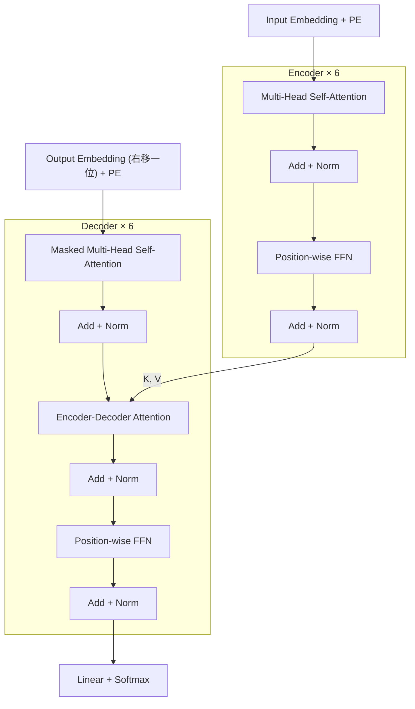

# Attention Is All You Need

> **一句话结论**：去掉循环与卷积，只用 attention 搭建 encoder-decoder，把「关联任意两个位置」的顺序操作数从 $O(n)$ 降到 $O(1)$，让训练在样本内部完全并行；代价是每层复杂度从 $O(n \cdot d^2)$ 变成 $O(n^2 \cdot d)$——这个代价在 2017 年的句子级任务上可以忽略，在今天的长上下文场景下成为主要矛盾。

---

## 1. 元信息

| 项目 | 内容 |
| --- | --- |
| 作者 / 机构 | Vaswani 等 8 人 · Google Brain / Google Research / University of Toronto |
| 发表 | NeurIPS 2017（arXiv:1706.03762，2017-06 首次提交，当前 v7） |
| 原文 | [PDF](paper.pdf) · [HTML](paper.html) · [arXiv](https://arxiv.org/abs/1706.03762) |
| 代码 | [tensorflow/tensor2tensor](https://github.com/tensorflow/tensor2tensor) |
| 关键词 | Transformer · self-attention · multi-head attention · positional encoding |
| 前置知识 | seq2seq、encoder-decoder、RNN/LSTM 的顺序依赖问题、BLEU |
| 实验条件 | WMT 2014 EN-DE / EN-FR，8× NVIDIA P100，单机 |

**记号约定**（沿用论文）：$n$ 序列长度，$d$ / $d_{\text{model}}$ 表示维度，$h$ 头数，$d_k$ / $d_v$ 单头的 key / value 维度，$k$ 卷积核宽度，$r$ 受限注意力的邻域大小。

---

## 2. 摘要速览（5 分钟版）

### 2.1 要解决的问题

循环模型把计算沿序列位置展开，隐状态满足 $h_t = f(h_{t-1}, x_t)$。这条依赖链使**同一个训练样本内部无法并行**：第 $t$ 步必须等第 $t-1$ 步算完。序列越长这个约束越致命，因为显存限制了「靠加大 batch 跨样本并行」这条补救路径。论文明确指出，factorization tricks 与 conditional computation 绕开了部分开销，顺序计算这个根本约束仍在。

当时 attention 已被广泛用于建模任意距离的依赖，但除极少数工作外，它都**作为 RNN 的附加组件**存在。另一条 CNN 路线（Extended Neural GPU、ByteNet、ConvS2S）能并行，但关联两个位置所需的操作数随距离增长——ConvS2S 线性、ByteNet 对数——远距离依赖依然难学。

### 2.2 核心方法

Transformer 完全去掉 recurrence 与 convolution，只保留 attention。

- **结构**：encoder 与 decoder 各 $N=6$ 层。encoder 每层两个子层（multi-head self-attention + position-wise FFN），decoder 每层三个子层（多一个对 encoder 输出的 multi-head attention）。每个子层外包残差与层归一化：$\mathrm{LayerNorm}(x + \mathrm{Sublayer}(x))$。
- **注意力**：scaled dot-product，$\mathrm{Attention}(Q,K,V) = \mathrm{softmax}\!\left(\frac{QK^T}{\sqrt{d_k}}\right)V$。缩放因子 $1/\sqrt{d_k}$ 阻止大 $d_k$ 下点积量级过大把 softmax 推进饱和区。
- **多头**：$h=8$，$d_k = d_v = d_{\text{model}}/h = 64$。每头维度按比例缩小，**总计算量与全维单头相当**。
- **位置信息**：固定的正余弦编码直接加到 embedding 上，波长构成 $2\pi \to 10000 \cdot 2\pi$ 的几何级数。
- **自回归**：decoder 的 self-attention 把非法连接在 softmax 之前置为 $-\infty$，配合输出 embedding 右移一位，保证位置 $i$ 只依赖 $<i$ 的输出。

### 2.3 主要结果

实验条件：WMT 2014 newstest2014 测试集，8× P100 单机，beam size 4，length penalty $\alpha = 0.6$。

| 模型 | 参数量 | 训练 | EN-DE BLEU | EN-FR BLEU | 训练成本 |
| --- | --- | --- | --- | --- | --- |
| Transformer (base) | 65M | 100K 步 / 12 小时 | 27.3 | 38.1 | $3.3 \times 10^{18}$ FLOPs |
| Transformer (big) | 213M | 300K 步 / 3.5 天 | **28.4** | **41.8** | $2.3 \times 10^{19}$ FLOPs |

big 模型在 EN-DE 上比此前最好结果（**包括 ensemble**）高出 2.0 BLEU 以上；base 模型已超过此前所有已发表的单模型与 ensemble，训练成本只是竞品的一小部分。

迁移到英文句法成分分析（WSJ Section 23）：4 层 $d_{\text{model}}=1024$ 的模型仅用 4 万句 WSJ 训练得 **91.3 F1**（超过 BerkeleyParser 的 90.4），半监督设置下 **92.7 F1**，仅次于生成式 RNNG 的 93.3。

### 2.4 我的评价

必读，且 §3.2 与 §4 要逐句读。价值有两层：

1. **架构本身**是之后所有 LLM 的底座。今天讨论 KV Cache、prefix caching、PD 分离时用到的每一个结构假设，都来自这篇论文的 §3.1 与 §3.2。
2. **论证方式**值得学。§4 用「每层复杂度、最小顺序操作数、最长依赖路径」三个可量化指标，把「该用哪种层」从审美问题变成可比较的工程问题。这种把架构选择还原成资源账的写法，在系统论文里同样适用。

对做 serving 的人，最关键的一句在 §3.1 的 Decoder 段落：位置 $i$ 的预测只依赖 $<i$ 的输出。这意味着解码到第 $t$ 步时，前 $t-1$ 个位置的 $K$ 与 $V$ **不会因为新 token 的加入而改变**，因此可以缓存复用——这就是 KV Cache 的全部依据。论文本身没有讨论推理优化，但整条推理优化路线的前提就写在这里。

---

## 3. 细读

### 3.1 Introduction

论文的论证起点是**训练的可并行性**。

- RNN / LSTM / GRU 把计算沿位置展开，$h_t$ 是 $h_{t-1}$ 与位置 $t$ 输入的函数。这种「计算步与序列位置对齐」的做法从根本上排除了样本内并行。
- 通常的补救是跨样本 batching，但序列变长时显存首先成为瓶颈，batch 开不大，硬件填不满。
- 已有的效率改进（factorization tricks、conditional computation）绕开了部分开销，顺序计算这个根本约束仍在。
- attention 允许建模不依赖距离的依赖关系，但当时几乎总是**与循环网络配合**使用。
- 本文提出的 Transformer 完全依赖 attention 建立输入输出之间的全局依赖，在 8 张 P100 上训练 12 小时即可达到新的翻译 SOTA。

> **批注**：这一节把并行性而非精度放在首位。这解释了为什么论文所有对比表格都带训练成本一列——它主张的是同等或更好质量下的成本优势。

### 3.2 Background

这一节交代与 CNN 路线的关系，并**第一次给出 multi-head 的动机**。

- Extended Neural GPU、ByteNet、ConvS2S 都用 CNN 做基础构件，可对所有位置并行计算隐表示。但关联任意两个位置所需的操作数随距离增长：ConvS2S 线性，ByteNet 对数。距离越远越难学。
- Transformer 把这个操作数降到**常数**。代价是：注意力对加权位置做平均，会**降低有效分辨率**（reduced effective resolution）。论文明确说 multi-head attention 就是用来抵消这个效应的。
- self-attention（intra-attention）此前已在阅读理解、抽象摘要、文本蕴含、任务无关句表示等任务上取得成功。
- 论文自我定位：据作者所知，Transformer 是**第一个完全依靠 self-attention 计算输入输出表示、不使用序列对齐 RNN 或卷积**的转导模型。

> **批注**：multi-head 在这里的动机是「补偿加权平均导致的分辨率损失」，比 §3.2.2 里那句更常被引用的「不同表示子空间」具体得多。两处动机指向同一件事：单个 softmax 分布只能产生一个凸组合，信息被压平了。

### 3.3 Model Architecture

整体沿用 encoder-decoder：encoder 把符号序列 $(x_1, \dots, x_n)$ 映射到连续表示 $\mathbf{z} = (z_1, \dots, z_n)$；decoder 在给定 $\mathbf{z}$ 后逐个生成 $(y_1, \dots, y_m)$，每一步都是自回归的——消费上一步自己生成的符号作为额外输入。

#### 3.3.1 Encoder and Decoder Stacks

**Encoder**：$N=6$ 个相同的层。每层两个子层——multi-head self-attention 与 position-wise 全连接前馈网络。每个子层外包残差连接与层归一化，输出为 $\mathrm{LayerNorm}(x + \mathrm{Sublayer}(x))$。为了让残差能相加，**所有子层与 embedding 层的输出维度统一为 $d_{\text{model}} = 512$**。

**Decoder**：同样 $N=6$ 层。除 encoder 的两个子层外，插入第三个子层，对 encoder 栈的输出做 multi-head attention。同样使用残差与层归一化。self-attention 子层被修改为**禁止关注后续位置**；这个 mask 与「输出 embedding 右移一位」共同保证位置 $i$ 的预测只依赖位置 $<i$ 的已知输出。

> **批注**：`LayerNorm(x + Sublayer(x))` 是 **Post-LN** —— 归一化在残差相加之后。这个细节决定了 §5.3 为什么必须用 warmup（见 Q8）。今天多数实现改用了 Pre-LN，这不是本文的内容。

#### 3.3.2 Attention（Scaled Dot-Product / Multi-Head）

**通用定义**：attention 把一个 query 和一组 key-value 对映射到输出。query、key、value、输出都是向量。输出是 values 的**加权和**，每个 value 的权重由 query 与对应 key 的兼容函数（compatibility function）算出。

**Scaled Dot-Product Attention**（式 1）：

$$\mathrm{Attention}(Q, K, V) = \mathrm{softmax}\!\left(\frac{QK^T}{\sqrt{d_k}}\right)V$$

query 与 key 维度为 $d_k$，value 维度为 $d_v$。实践中把多个 query 打包成矩阵 $Q$，key 与 value 打包成 $K$、$V$，一次矩阵运算算完。

**为什么用点积而非加性注意力**：两者理论复杂度相近，但点积可直接调用高度优化的矩阵乘法实现，实际更快、更省空间。

**为什么要除以 $\sqrt{d_k}$**：论文观察到，$d_k$ 小时两种注意力表现相近，$d_k$ 大时**未缩放的点积注意力反而不如加性注意力**。作者的猜测（原文 "We suspect"）是：$d_k$ 大时点积量级变大，把 softmax 推到梯度极小的区域。脚注给出量级论证——设 $q$、$k$ 的各分量是均值 0、方差 1 的独立随机变量，则 $q \cdot k = \sum_{i=1}^{d_k} q_i k_i$ 的均值为 0、**方差为 $d_k$**。除以 $\sqrt{d_k}$ 正好把方差归一化回 1。

**Multi-Head Attention**（式 2）：

$$\mathrm{MultiHead}(Q,K,V) = \mathrm{Concat}(\mathrm{head}_1, \dots, \mathrm{head}_h)W^O$$

$$\text{where}\quad \mathrm{head}_i = \mathrm{Attention}(QW_i^Q,\; KW_i^K,\; VW_i^V)$$

投影矩阵 $W_i^Q \in \mathbb{R}^{d_{\text{model}} \times d_k}$，$W_i^K \in \mathbb{R}^{d_{\text{model}} \times d_k}$，$W_i^V \in \mathbb{R}^{d_{\text{model}} \times d_v}$，$W^O \in \mathbb{R}^{hd_v \times d_{\text{model}}}$。

本文取 $h = 8$，$d_k = d_v = d_{\text{model}}/h = 64$。**由于每个头的维度按比例减少，总计算成本与全维单头注意力相近。** 论文给出的动机：multi-head 让模型能在不同位置上联合关注来自不同表示子空间的信息；单头时平均会抑制这一点。

**三种用法**（§3.2.3）：

| 用法 | Query 来源 | Key / Value 来源 | 作用 |
| --- | --- | --- | --- |
| encoder-decoder attention | decoder 上一层 | encoder 栈的输出 | decoder 每个位置可关注输入序列全部位置 |
| encoder self-attention | encoder 上一层 | encoder 上一层 | encoder 每个位置可关注前一层全部位置 |
| decoder masked self-attention | decoder 上一层 | decoder 上一层 | 每个位置只能关注到**含自身在内**的此前位置 |

mask 的实现方式写得很具体：在 scaled dot-product attention **内部**，把 softmax 输入中对应非法连接的全部值置为 $-\infty$。

#### 3.3.3 Position-wise Feed-Forward Networks

除注意力子层外，encoder 与 decoder 的每层都含一个全连接前馈网络，**逐位置分别且相同地**应用。它由两个线性变换与中间的 ReLU 组成（式 2）：

$$\mathrm{FFN}(x) = \max(0,\; xW_1 + b_1)W_2 + b_2$$

线性变换在不同位置之间相同，在**不同层之间不同**。另一种描述是两个 kernel size 为 1 的卷积。维度：输入输出 $d_{\text{model}} = 512$，内层 $d_{ff} = 2048$。

> **批注**：Transformer 的职责分离在这里体现得很清楚——**跨位置的信息交换只发生在 attention 子层，逐位置的特征变换只发生在 FFN 子层**。这使得参数量的大头（FFN 每层约 $2 \times 512 \times 2048 \approx 2.1\text{M}$，约占单层参数三分之二）与序列长度无关。

#### 3.3.4 Embeddings and Softmax

用学习得到的 embedding 把输入输出 token 转成 $d_{\text{model}}$ 维向量，用常规的学习线性变换加 softmax 把 decoder 输出转成下一 token 的概率。两处细节：

- **两个 embedding 层与 pre-softmax 线性变换共享同一权重矩阵**。
- 在 embedding 层中，把这些权重**乘以 $\sqrt{d_{\text{model}}}$**（论文未给出理由，见 Q7）。

#### 3.3.5 Positional Encoding

模型既无循环也无卷积，要利用序列顺序就必须显式注入位置信息。做法是把位置编码**加到**（而非拼接到）encoder 与 decoder 栈底部的输入 embedding 上，因此位置编码与 embedding 同为 $d_{\text{model}}$ 维。

本文使用不同频率的正弦与余弦函数：

$$PE_{(pos,\,2i)} = \sin\!\left(pos / 10000^{2i/d_{\text{model}}}\right)$$

$$PE_{(pos,\,2i+1)} = \cos\!\left(pos / 10000^{2i/d_{\text{model}}}\right)$$

其中 $pos$ 是位置，$i$ 是维度索引，即位置编码的每一维对应一条正弦曲线。**波长构成从 $2\pi$ 到 $10000 \cdot 2\pi$ 的几何级数。**

选择这个函数的假设是：它能让模型容易学会按**相对位置**做注意——因为对任意固定偏移 $k$，$PE_{pos+k}$ 都可以表示成 $PE_{pos}$ 的线性函数。

论文也试过**学习式**位置嵌入，结果与正弦版**几乎完全相同**（Table 3 行 (E)）。作者选择正弦版的理由是：它**可能**允许模型外推到训练时未见过的更长序列。

> **批注**：这里的「可能」值得标注——论文没有做任何外推实验。这个未经验证的论断在后续影响很大，RoPE、ALiBi 等相对位置方案正是沿「相对位置 + 长度外推」这条线继续推进的。

### 3.4 Why Self-Attention

论文用三个诉求比较 self-attention、循环层、卷积层：**每层总计算复杂度**、**可并行的计算量**（以所需最小顺序操作数衡量）、**长程依赖的路径长度**。第三项的理由是：前向与反向信号需要穿越的路径越短，长程依赖越容易学。

**Table 1**（$n$ 序列长度，$d$ 表示维度，$k$ 卷积核宽度，$r$ 受限自注意力的邻域大小）：

| Layer Type | Complexity per Layer | Sequential Operations | Maximum Path Length |
| --- | --- | --- | --- |
| Self-Attention | $O(n^2 \cdot d)$ | $O(1)$ | $O(1)$ |
| Recurrent | $O(n \cdot d^2)$ | $O(n)$ | $O(n)$ |
| Convolutional | $O(k \cdot n \cdot d^2)$ | $O(1)$ | $O(\log_k n)$ |
| Self-Attention (restricted) | $O(r \cdot n \cdot d)$ | $O(1)$ | $O(n/r)$ |

论文对这张表的解读：

- self-attention 用**常数次**顺序操作连接所有位置，循环层需要 $O(n)$ 次。
- 就每层复杂度而言，**self-attention 比循环层更快的条件是 $n < d$**。论文指出这在机器翻译常用的 word-piece / byte-pair 句子表示下通常成立。
- 对超长序列，可以把 self-attention 限制在以输出位置为中心、大小为 $r$ 的邻域内，最大路径长度随之升到 $O(n/r)$。论文把这列为 future work。
- 核宽 $k < n$ 的单个卷积层无法连接所有输入输出位置对；要做到需要堆 $O(n/k)$ 层（连续核）或 $O(\log_k n)$ 层（膨胀卷积）。卷积层通常比循环层贵 $k$ 倍；可分离卷积能降到 $O(k \cdot n \cdot d + n \cdot d^2)$，但即使取 $k = n$，其复杂度也等于「self-attention 层 + point-wise 前馈层」的组合——正是本文采用的方案。
- 附带收益：self-attention 可能带来更好的可解释性。附录展示的注意力分布显示，不同的头明显学会了不同的任务，许多头表现出与句法、语义结构相关的行为。

> **批注**：这张表是全文最有工程价值的部分，也最容易被误用。$n < d$ 这个前提论文写得很清楚，引用者常常省略它。$d_{\text{model}} = 512$、句子几十个 token 时前提成立；今天 $n$ 到 4K–128K 而 $d$ 仍在 4K 量级，$O(n^2 d)$ 完全主导。另外表里**没有显存这一列**——注意力矩阵是 $n \times n$，训练时要保留用于反向传播，这项开销在四个 $O(\cdot)$ 中全部不可见，而它正是 FlashAttention 要解决的问题。

### 3.5 Training

#### 数据与 batching（§5.1）

- **EN-DE**：WMT 2014，约 450 万句对，byte-pair encoding，源目标**共享**约 37000 token 的词表。
- **EN-FR**：WMT 2014，3600 万句，32000 word-piece 词表。
- 句对按**近似序列长度**分桶后组 batch，每个训练 batch 约含 25000 源 token 与 25000 目标 token。

#### 硬件与调度（§5.2）

单机 8× NVIDIA P100。base 每步约 0.4 秒，共 100,000 步 / 12 小时；big 每步 1.0 秒，共 300,000 步 / 3.5 天。

#### 优化器（§5.3）

Adam，$\beta_1 = 0.9$，$\beta_2 = 0.98$，$\epsilon = 10^{-9}$。学习率按式 (3) 变化：

$$lrate = d_{\text{model}}^{-0.5} \cdot \min\!\left(step\_num^{-0.5},\; step\_num \cdot warmup\_steps^{-1.5}\right)$$

即前 $warmup\_steps$ 步线性升温，之后按步数的负平方根衰减。本文取 $warmup\_steps = 4000$。

#### 正则化（§5.4）

- **Residual Dropout**：对每个子层的输出、在与子层输入相加并归一化**之前**施加 dropout；此外对 encoder 与 decoder 栈中「embedding + 位置编码」之和也施加 dropout。base 模型 $P_{drop} = 0.1$。
- **Label Smoothing**：$\epsilon_{ls} = 0.1$。论文直言这会**损害 perplexity**（模型被迫变得更不确定），但提升 accuracy 与 BLEU。

> **批注**：label smoothing 这条是值得记住的取舍范式——训练目标的代理指标（perplexity）与真实评价指标（BLEU）可以反向变动。凡是用代理指标做早停或调参的场景都要小心这一点。

### 3.6 Results

#### 6.1 机器翻译

**Table 2**（newstest2014）：

| 模型 | EN-DE BLEU | EN-FR BLEU | 训练成本 (FLOPs) |
| --- | --- | --- | --- |
| Transformer (base) | 27.3 | 38.1 | $3.3 \times 10^{18}$ |
| Transformer (big) | **28.4** | **41.8** | $2.3 \times 10^{19}$ |

- EN-DE 上，big 模型超过此前最好结果（**含 ensemble**）2.0 BLEU 以上，训练耗时 3.5 天 / 8×P100。base 模型也超过了此前所有已发表的模型与 ensemble，成本只是竞品的一小部分。
- EN-FR 的 big 模型使用 $P_{drop} = 0.1$ 而非 0.3。
- **推理设置**：base 取最后 5 个 checkpoint（每 10 分钟写一个）的平均，big 取最后 20 个的平均；beam size 4，length penalty $\alpha = 0.6$；推理最大输出长度设为输入长度 + 50，可提前终止。
- **FLOPs 估算方式**：训练时间 × GPU 数 × 单卡持续单精度算力估计。脚注给出各卡取值：K80 2.8、K40 3.7、M40 6.0、P100 9.5 TFLOPS。

> **批注（原文不一致）**：§6.1 正文写 EN-FR big 模型达到 **41.0** BLEU，而摘要与 Table 2 都写 **41.8**。同一篇论文内部数字冲突，引用时必须注明取自何处。本笔记统一采用 Table 2 的 41.8 并标出该差异。

#### 6.2 模型变体（消融）

设置：在 EN-DE **开发集** newstest2013 上测量，使用 beam search，**不做 checkpoint averaging**。

| 行 | 变动 | 结论 |
| --- | --- | --- |
| (A) | 固定总计算量，改变头数 $h$ 与 $d_k$/$d_v$ | 单头比最佳设置差 **0.9 BLEU**；头数过多质量同样下降 |
| (B) | 减小 attention key 维度 $d_k$ | 损害质量。论文推断：兼容性判定并不容易，比点积更复杂的兼容函数可能有益 |
| (C)(D) | 改变模型规模 / dropout | 更大的模型更好；dropout 对抑制过拟合非常有效 |
| (E) | 用学习式位置嵌入替换正弦编码 | 与 base 模型结果**几乎相同** |

big 模型配置（Table 3 末行）：$N=6$，$d_{\text{model}}=1024$，$d_{ff}=4096$，$h=16$，$P_{drop}=0.3$，300K 步 → dev PPL **4.33**、dev BLEU **26.4**、参数量 **213M**。

#### 6.3 英文句法成分分析

用来检验泛化性。这个任务的特点：输出受**强结构约束**，且显著长于输入；同时 RNN seq2seq 在小数据下达不到 SOTA。

- 模型：4 层，$d_{\text{model}} = 1024$。
- 数据：Penn Treebank 的 WSJ 部分，约 4 万训练句（词表 16K）；半监督设置额外使用高置信度语料与 BerkeleyParser 语料，约 1700 万句（词表 32K）。
- 调参：只在 Section 22 开发集上小范围调了 dropout、学习率与 beam size，其余超参沿用 EN-DE base 模型。推理时最大输出长度设为输入长度 + **300**，beam size **21**，$\alpha = 0.3$。

**Table 4**（WSJ Section 23 F1）：

| Parser | 训练设置 | F1 |
| --- | --- | --- |
| Petrov et al. (2006)，BerkeleyParser | WSJ only, discriminative | 90.4 |
| Dyer et al. (2016) | WSJ only, discriminative | 91.7 |
| **Transformer (4 layers)** | **WSJ only, discriminative** | **91.3** |
| McClosky et al. (2006) | semi-supervised | 92.1 |
| **Transformer (4 layers)** | **semi-supervised** | **92.7** |
| Dyer et al. (2016), RNNG | generative | **93.3** |

结论：在缺少任务特定调优的情况下，除生成式 RNNG 外优于此前所有报告结果；且**仅用 4 万句 WSJ 训练就超过了 BerkeleyParser**，而 RNN seq2seq 在同样的小数据设置下做不到。

### 3.7 Conclusion

- Transformer 是第一个完全基于 attention 的序列转导模型，用 multi-head self-attention 替换了 encoder-decoder 架构中最常用的循环层。
- 翻译任务上训练显著快于基于循环或卷积的架构，在 WMT 2014 EN-DE 与 EN-FR 上同时达到新 SOTA，EN-DE 上超过此前所有 ensemble。
- 展望三条：扩展到文本以外的模态；研究**局部受限的注意力机制**以高效处理图像、音频、视频这类大输入输出；**让生成过程更少地依赖顺序**（making generation less sequential）。

> **批注**：第三条展望至今仍是开放问题。自回归解码的顺序性正是今天 LLM 推理延迟的根源，speculative decoding、Medusa、diffusion LM 都在攻这个点，还没有通用解。

---

## 4. 关键问题解析

### Q1: 为什么 scaled dot-product attention 要除以 $\sqrt{d_k}$？

**A**: 分三层。

**现象层**。论文观察到 $d_k$ 较小时点积注意力与加性注意力表现相近，$d_k$ 较大时**不加缩放的点积注意力反而更差**。缩放是为了修复这个退化。

**量级层**（脚注 1 的论证）。假设 $q$、$k$ 的各分量是均值 0、方差 1 的独立随机变量，则

$$q \cdot k = \sum_{i=1}^{d_k} q_i k_i, \qquad \mathbb{E}[q \cdot k] = 0, \qquad \mathrm{Var}[q \cdot k] = d_k$$

标准差为 $\sqrt{d_k}$。本文 $d_k = 64$，点积的典型量级就在 $\pm 8$。softmax 输入之间相差 8 量级时输出接近 one-hot，落在梯度极小的饱和区。除以 $\sqrt{d_k}$ 把方差归一化回 1，使 softmax 输入的分布**与 $d_k$ 无关**。

**证据边界**。论文原文用的是 "We suspect"，给出的是量级论证而非梯度界的严格证明；论文也没有做「去掉缩放」的消融。当前证据覆盖「$d_k$ 大时未缩放版本更差」这一实验事实与方差量级推导；「饱和区梯度消失是唯一原因」需要单独验证。

**工程含义**。缩放因子只依赖 $d_k$，不依赖 $h$。在 $d_k = d_{\text{model}}/h$ 的约定下，改变头数会自动改变缩放——自己实现 multi-head 时这里容易写错。

### Q2: Multi-head 相比单个大 head 到底多了什么表达能力？

**A**: 先明确**它不多花算力**：$d_k = d_v = d_{\text{model}}/h$，$h$ 个头的总计算成本与一个全维单头相当。所以 multi-head 是在同等预算下**重新划分表示空间**。

论文在两处给出动机，指向同一件事：

- §2 Background：注意力对加权位置做平均会降低**有效分辨率**，multi-head 用来抵消。
- §3.2.2：multi-head 让模型能在不同位置上联合关注来自**不同表示子空间**的信息；单头时平均会抑制这一点。

**机制上的解释**：单头只产生一个 softmax 概率分布，一个 query 位置最终只能拿到 values 的**一个**凸组合。如果某个词同时需要「指向它的句法主语」和「指向它的语义论元」，单个分布必须在两者之间折中，折中的结果是两个信号都被削弱。$h$ 个头产生 $h$ 个独立分布，各自输出拼接后再经 $W^O$ 混合，多组指向可以同时保留。

**实证边界**（Table 3 行 (A)，固定总计算量）：单头比最佳设置差 **0.9 BLEU**；但**头数过多质量也会下降**。原因可与行 (B) 对照理解——头数增加使每头的 $d_k$ 变小，而减小 $d_k$ 本身就伤质量。因此存在一个最优 $h$，本文取 8（base）与 16（big）。

「不同头覆盖不同子空间」在论文里只有端到端 BLEU 的间接证据与附录的定性可视化，没有直接的定量验证。

### Q3: 正弦式 positional encoding 的设计动机是什么？和学习式相比取舍在哪？

**A**:

**为什么必须有位置编码**。self-attention 对输入位置是置换等变的：打乱输入顺序，输出只是同样被打乱，模型无法区分词序。去掉循环与卷积后，位置信息没有任何其他来源。

**为什么是相加而非拼接**。位置编码与 embedding 同为 $d_{\text{model}}$ 维，直接相加不增加维度，因而不改变后续所有子层的形状与计算量。

**为什么是这组正余弦**。频率沿维度构成几何级数，波长从 $2\pi$ 到 $10000 \cdot 2\pi$。论文给出的假设是：对任意固定偏移 $k$，$PE_{pos+k}$ 可以写成 $PE_{pos}$ 的**线性函数**（正余弦的和角公式直接给出这一点），因此模型容易学会「按相对位置注意」。

**与学习式的取舍**：

| | 正弦式 | 学习式 |
| --- | --- | --- |
| 翻译质量 | Table 3 行 (E)：两者**几乎相同** | 同左 |
| 参数量 | 0 | $L_{\max} \times d_{\text{model}}$ |
| 超出训练长度 | 有定义（函数在任意 $pos$ 都可算） | 无定义（表外没有条目） |

论文选择正弦版的**唯一理由**是「可能允许外推到训练时未见的更长序列」。这是全文影响最深远但**完全没有实验支撑**的论断——论文没有做任何长度外推实验。后来的实践表明正弦编码的外推能力也很有限，这正是 RoPE、ALiBi 等方案出现的动因。

### Q4: Decoder 的 masked self-attention 如何保证自回归性质？

**A**: 两个机制叠加，缺一不可。

1. **输出 embedding 右移一位**（offset by one position）：预测位置 $i$ 时，输入端喂进去的是位置 $i-1$ 及之前的真实 token。
2. **在 scaled dot-product attention 内部做 mask**：把 softmax **输入**中所有对应非法连接的值置为 $-\infty$。

**为什么是 $-\infty$ 而不是在 softmax 之后置 0**。mask 必须作用在 softmax 之前。$e^{-\infty} = 0$ 使这些位置的权重严格为 0，**且不进入归一化的分母**，剩余合法位置的权重之和仍为 1。若在 softmax 之后把非法位置置 0，剩余权重的和会小于 1，等于给不同位置施加了不同的缩放。

**最重要的后果**：训练时可以一次性并行计算所有位置的损失（teacher forcing），推理必须逐 token 展开。**训练可并行、推理仍顺序**——这个不对称是今天 prefill / decode 两阶段划分的直接来源，也是 §7 里「making generation less sequential」这条展望的对象。

它同时给出了 KV Cache 的依据：位置 $j$ 的 $K_j$、$V_j$ 只依赖位置 $\le j$ 的输入，新生成的 token 不会改变它们，因此可以缓存。

### Q5: §4 用三项指标论证 self-attention 优于 RNN/CNN，这个论证在什么条件下会失效？

**A**: 论文自己给出了**一个**失效条件，还有若干它没有讨论的。

**论文明说的条件**：self-attention 每层比循环层更快，前提是 **$n < d$**。$O(n^2 d)$ 与 $O(n d^2)$ 的交叉点正在 $n = d$。论文场景下 $d_{\text{model}} = 512$、BPE 后句子长度几十，前提成立。

**今天为什么失效**：$n$ 已到 4K–128K，$d$ 仍在 4K 量级，$n \gg d$，$O(n^2 d)$ 完全主导。论文其实预见到了方向——它提出 restricted self-attention 把复杂度降到 $O(r \cdot n \cdot d)$，代价是最大路径长度升到 $O(n/r)$——但列为 future work，没有实验。此后所有稀疏 / 滑窗 / 线性注意力都在这条线上。

**Table 1 没有覆盖的三件事**：

- **显存**。注意力矩阵是 $n \times n$，训练时需要保留用于反向传播。这项开销在四个 $O(\cdot)$ 中完全不可见，却是长序列训练的第一约束。FlashAttention 通过分块与重计算把它降到线性，而**不改变 Table 1 中的任何一个复杂度**——这说明这张表衡量的维度是不完整的。
- **常数因子与硬件适配**。$O(n d^2)$ 的循环层是一串小矩阵乘，$O(n^2 d)$ 的注意力是大矩阵乘。GPU 上后者的实际吞吐远高于渐进复杂度所暗示的，这也是论文选点积而非加性注意力的理由（可复用高度优化的 matmul），但它没有把这个因素写进表里。
- **推理侧的成本结构**。Table 1 衡量的是训练时一层的前向。自回归解码时每步只处理一个新 token，瓶颈从算力转向访存（读取 KV Cache 与权重），三列都无法描述这个阶段。

**「最长路径 $O(1)$」的另一重局限**：它只衡量信息的**可达性**，不衡量优化的**难度**。路径短不等于梯度好走，深层堆叠仍然依赖残差连接与 LayerNorm 才能训得动。

### Q6: 既然 attention 已经能混合全局信息，为什么每层还需要 FFN？

**A**: 因为 **attention 子层对 $V$ 是线性的**。给定注意力权重，输出是 values 的凸组合；多层线性混合叠起来仍然是线性混合，无法表达逐位置的非线性变换。

FFN 提供两件事：

- **非线性**：$\max(0, \cdot)$ 是模型中主要的非线性来源。
- **容量**：$512 \to 2048 \to 512$，中间层放大 4 倍。按参数量算，每层 FFN 约 $2 \times 512 \times 2048 \approx 2.1\text{M}$，而 multi-head attention 的四个投影矩阵合计约 $4 \times 512 \times 512 \approx 1.05\text{M}$。**FFN 占单层参数约三分之二。**

由此得到 Transformer 的职责分离：**跨位置的信息交换只在 attention 子层发生，逐位置的特征变换只在 FFN 子层发生**。这个分离的工程价值是参数量大头与 $n$ 无关，也是后来 MoE 只替换 FFN 而不动 attention 的原因。

顺带说明：论文标题 "Attention Is All You Need" 与模型实际构成并不吻合——去掉 FFN 模型不可用。更准确的表述是「attention 替代了 recurrence」。

### Q7: Embedding 权重为什么要乘 $\sqrt{d_{\text{model}}}$？

**A**: **论文只陈述了做法，没有给出理由。** 以下是推断。

线索是同一句话的前半段：两个 embedding 层与 pre-softmax 线性变换**共享同一权重矩阵**。这个矩阵要同时满足两个角色的需求——作为输出层它希望按 $\sim \mathcal{N}(0,\, 1/d_{\text{model}})$ 这类量级初始化以稳定 logits，而这会让 embedding 查表得到的向量各分量量级在 $1/\sqrt{d_{\text{model}}}$ 附近。

位置编码是正余弦，各分量量级为 $O(1)$。若不作调整，二者相加时**位置信号会压过词义信号**。乘以 $\sqrt{d_{\text{model}}}$（本文即 $\sqrt{512} \approx 22.6$）把 embedding 拉回 $O(1)$，使两个加数量级可比。

证据边界：这个解释与论文的实现细节一致，但论文既没有说明，也没有做消融。归类为**推断**。

### Q8: 学习率 warmup 是必需的吗？

**A**: 式 (3) 的调度：

$$lrate = d_{\text{model}}^{-0.5} \cdot \min\!\left(step^{-0.5},\; step \cdot warmup^{-1.5}\right)$$

前 $warmup = 4000$ 步线性上升，之后按 $step^{-0.5}$ 衰减，两段在 $step = warmup$ 处取值相等因而连续。$d_{\text{model}}^{-0.5}$ 这个因子使调度对模型宽度自适应——模型越宽学习率越小。

**论文没有解释为什么需要 warmup。** 可以指出的是本文的结构前提：§3.1 明确写的是 $\mathrm{LayerNorm}(x + \mathrm{Sublayer}(x))$，即 **Post-LN**——归一化在残差相加之后。这个位置使得初始化时深层的梯度量级偏大，训练初期直接使用目标学习率容易发散。

后续工作（Pre-LN，把 LayerNorm 移到子层输入侧）表明在该结构下 warmup 可以省略。这条线索说明 **warmup 不是 Transformer 的固有需求，而是对 Post-LN 的补偿**。

证据边界：Post-LN / Pre-LN 的对比分析出自本文之后的论文；本文提供的只有「用了这个调度并且训得动」这一事实。

---

## 5. 可迁移的知识点

- [Self-Attention](../../../concepts/self-attention.md) —— 本文把它从 RNN 的附属组件提升为唯一的序列建模原语，并给出 scaled dot-product 这一具体形式与 $1/\sqrt{d_k}$ 缩放。
- [Multi-Head Attention](../../../concepts/multi-head-attention.md) —— 本文在恒定计算预算下把表示空间切成 $h$ 份，用来抵消单个注意力分布的平均效应。
- [Positional Encoding](../../../concepts/positional-encoding.md) —— 本文提出正余弦绝对位置编码，并提出（未验证）它可外推到更长序列。
- [残差连接与 Layer Normalization](../../../concepts/residual-and-layer-norm.md) —— 本文采用 Post-LN 形式 $\mathrm{LayerNorm}(x + \mathrm{Sublayer}(x))$，这是它需要 warmup 的结构原因。
- [学习率 Warmup](../../../concepts/lr-warmup.md) —— 本文的 Noam 调度是这类策略最常被引用的出处。
- [KV Cache](../../../concepts/kv-cache.md) —— 本文未讨论推理优化，但 §3.1 decoder 的因果 mask 与自回归性质给出了 KV 可缓存的全部依据。

---

## 6. 批判与开放问题

### 6.1 局限性

**作者自己承认的**：

- 注意力对加权位置做平均会降低有效分辨率，需要用 multi-head 抵消（§2）。
- 处理很长序列需要把注意力限制在邻域内，这只是分析，未实现（§4，列为 future work）。
- 生成过程仍然是顺序的，「让生成更少顺序化」被列为研究目标（§7）。

**论文没提但存在的**：

- **Table 1 的维度不完整**。它只给渐进复杂度，不含显存、不含常数因子、不含推理阶段的访存瓶颈。$n \times n$ 注意力矩阵的显存开销在表中完全不可见，而它是长序列训练的第一约束。
- **实验域窄于结论域**。全部结果来自 WMT 两个翻译任务与 WSJ 句法分析，都是句子级、长度几十到几百的任务。论文对「长序列」只有分析没有实验，但结论的表述方式覆盖面远大于此。
- **消融缺少不确定度**。Table 3 在 dev set 上单次运行、无 checkpoint averaging，也没有多 seed 的方差。行 (A) 那个 0.9 BLEU 的差值没有置信区间，无法判断它相对于随机种子噪声有多显著。
- **正弦编码的外推能力从未被验证**。这是全文唯一「没有实验支撑却直接决定了设计选择」的论断，且被后续工作大量继承。

### 6.2 我的质疑

- **原文数字自相矛盾**。§6.1 正文写 EN-FR big 模型 41.0 BLEU，摘要与 Table 2 写 41.8。这不是舍入差异。引用这个数字时必须注明来源位置。
- **标题与模型不符**。按参数量，position-wise FFN 占每层约三分之二，去掉它模型不可用。"Attention Is All You Need" 准确的读法是「attention 足以替代 recurrence」。
- **multi-head 的动机缺少直接证据**。「不同头覆盖不同表示子空间」在正文中是陈述，Table 3 行 (A) 提供的是端到端 BLEU 差异，附录的注意力可视化是定性挑选的样例。论文没有给出「头之间确实学到互补信息」的定量度量。后续研究（如注意力头剪枝实验）发现大量头可以被裁掉而质量几乎不降，这与论文暗示的图景存在张力。
- **跨架构的 FLOPs 比较只能算量级参考**。论文用「训练时间 × GPU 数 × 标称 TFLOPS」估算成本，脚注列了 K80/K40/M40/P100 四种卡的取值。这个方法把各基线的实际 GPU 利用率差异全部抹平——而不同架构的利用率差异恰恰可能很大（循环层的小矩阵乘利用率通常显著低于大矩阵乘）。这会系统性地**高估基线的有效算力**，从而低估 Transformer 的相对优势；方向对结论有利，但精度不足以支撑「$\times N$ 倍成本优势」这类精确表述。

### 6.3 后续可读

- **FlashAttention** —— 直接针对 Table 1 未覆盖的显存维度，IO-aware 的精确注意力。
- **BERT / GPT 系列** —— 本文的 encoder 与 decoder 各自独立发展出的两条分支。
- **RoPE / ALiBi** —— 沿 §3.5「相对位置 + 长度外推」这条未验证的线索继续推进。
- **Pre-LN 相关工作** —— 解释并消除本文 §5.3 warmup 的必要性。
- **vLLM / PagedAttention** —— 把 Q4 中指出的「$K$、$V$ 对已生成前缀不变」这一性质工程化为 KV Cache 的分页管理。
