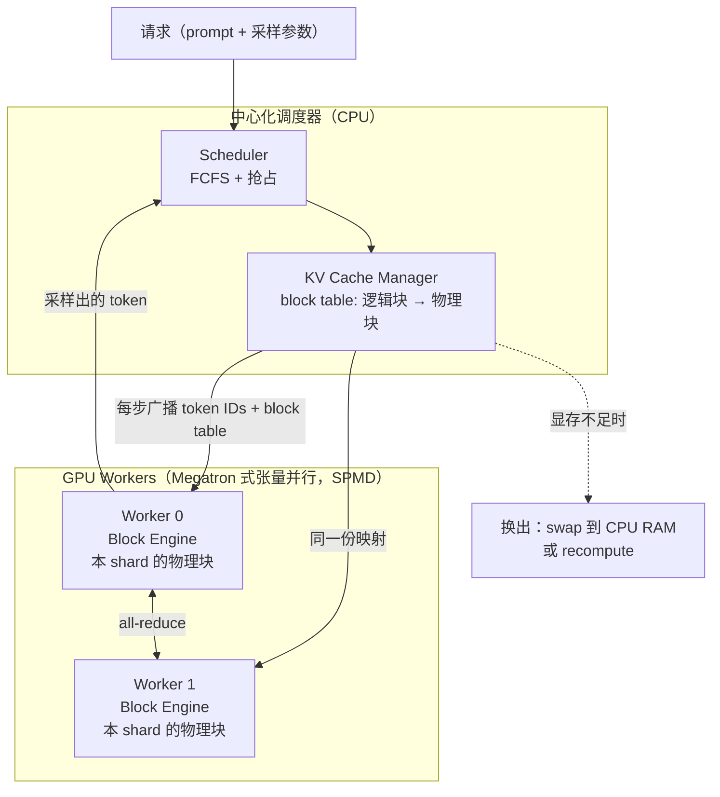

# Efficient Memory Management for LLM Serving with PagedAttention（vLLM）

> **一句话结论**：把操作系统的虚拟内存分页原封不动搬到 KV Cache 上——KV 切成定长 block、逻辑块经 block table 映射到不连续的物理块——把 KV 显存的有效利用率从 20.4%–38.2% 提到接近 100%，从而在同等延迟下把可批量并发数提高 2–4 倍。

---

## 1. 元信息

| 项目 | 内容 |
| --- | --- |
| 作者 / 机构 | Woosuk Kwon、Zhuohan Li（共同一作）等 9 人 · UC Berkeley / Stanford / UCSD |
| 发表 | **SOSP 2023**（arXiv:2309.06180，DOI 10.1145/3600006.3613165） |
| 原文 | [PDF](paper.pdf) · [HTML](paper.html) · [arXiv](https://arxiv.org/abs/2309.06180) |
| 代码 | [vllm-project/vllm](https://github.com/vllm-project/vllm)（工业界事实标准，仍在活跃开发） |
| 关键词 | PagedAttention · KV cache · virtual memory · copy-on-write · LLM serving |
| 前置知识 | [KV Cache](../../../concepts/kv-cache.md)、操作系统的虚拟内存与分页、内部/外部碎片、写时复制 |
| 实验条件 | OPT-13B/66B/175B、LLaMA-13B，GCP A2 实例（A100），ShareGPT / Alpaca 负载 |

**为什么这篇要优先读**：它是当前所有 LLM 推理系统的公共底座。vLLM 已经是开源推理引擎的事实标准，SGLang、TensorRT-LLM、以及各家自研引擎的 KV 管理都在这个设计的延长线上。读完它，[CacheRoute](../2026-cacheroute/README.md) 里的「每个 destination 暴露 40,071 个 KV block」这类描述才有具体所指。

---

## 2. 摘要速览（5 分钟版）

### 2.1 要解决的问题

LLM 推理的吞吐由**能同时批处理多少个请求**决定，而批量大小由 GPU 显存决定。在 A100 40GB 上跑 13B 模型时，约 65% 显存被权重固定占用，约 30% 留给随请求动态增减的 KV Cache，其余是激活值。因此**KV Cache 的管理方式直接决定最大 batch size**。

已有系统（Orca、FasterTransformer）把一个请求的 KV Cache 存成**连续张量**，因为深度学习框架的算子普遍要求张量连续。但 KV Cache 与训练时的张量有本质差异：它**随生成动态增长，且最终长度事先不可知**。连续存储 + 长度未知，逼出一个做法——按最大可能长度（如 2048 token）预分配。由此产生三类浪费：

| 浪费类型 | 成因 | 何时可知 |
| --- | --- | --- |
| **Reserved**（预留） | 为未来 token 占住的槽位 | 会被用到，但整个请求生命周期内占着 |
| **内部碎片** | 按最大长度过量分配，实际用不到 | 请求结束后才知道 |
| **外部碎片** | buddy allocator 等分配器留下的空隙 | 请求开始前就知道，且永远用不上 |

实测：已有系统中真正存放 token 状态的显存**只占 20.4%–38.2%**。

第二个问题是**无法共享**。parallel sampling 和 beam search 会为一个请求生成多个序列，它们本可以共享 prompt 部分的 KV，但连续存储让共享无从谈起。

### 2.2 核心方法

**PagedAttention**：把每个序列的 KV Cache 切成定长的 **KV block**，每个 block 存 $B$ 个 token 的 key 与 value。注意力按块计算：

$$A_{ij} = \frac{\exp(q_i^\top K_j / \sqrt{d})}{\sum_{t=1}^{\lceil i/B \rceil} \exp(q_i^\top K_t \mathbf{1} / \sqrt{d})}, \qquad o_i = \sum_{j=1}^{\lceil i/B \rceil} V_j A_{ij}^\top$$

块之间**不需要物理连续**，kernel 按 block table 逐块取数。

**vLLM** 在此之上建了完整的映射层，对应关系是逐项照搬 OS 的：

| 操作系统 | vLLM |
| --- | --- |
| page（页） | KV block |
| byte（字节） | token |
| process（进程） | request |
| page table（页表） | block table |
| 按需分页 | 按需分配物理块 |
| copy-on-write（fork） | 块级 CoW + 引用计数 |
| swap to disk | swap 到 CPU 内存 |
| 共享库 | 共享 prefix 的物理块 |

### 2.3 主要结果

**基础采样**（ShareGPT 负载，相同延迟水平下可承受的请求率）：

| 对比对象 | 提升 |
| --- | --- |
| Orca (Oracle)（假设已知输出长度，实际不可达的上界） | $1.7\times$–$2.7\times$ |
| Orca (Max)（按 2048 预留） | $2.7\times$–$8\times$ |
| FasterTransformer | 最高 $22\times$ |

OPT-13B 上，vLLM 同时在批的请求数是 Orca (Oracle) 的 $2.2\times$、Orca (Max) 的 $4.3\times$。

**共享带来的额外收益**（OPT-13B）：

| 场景 | 显存节省 | 吞吐提升 |
| --- | --- | --- |
| parallel sampling（Alpaca / ShareGPT） | 6.1%–9.8% / 16.2%–30.5% | — |
| beam search，width=6（Alpaca） | 37.6%–55.2% / 44.3%–66.3% | 相对 Orca (Oracle) 从 $1.3\times$ 升到 $2.3\times$ |
| 共享 prefix（1 例 80 token） | — | $1.67\times$ |
| 共享 prefix（5 例 341 token） | — | $3.58\times$ |
| chatbot（1024 token prompt） | — | $2\times$（对全部三档 Orca） |

**代价**：PagedAttention kernel 比 FasterTransformer 高度优化的实现**慢 20%–26%**。论文的论证是这个开销只落在 attention 算子上，端到端仍然大幅领先。

### 2.4 我的评价

必读，而且是本仓库到目前为止**工程可操作性最强**的一篇。

它的价值不在算法新颖性——虚拟内存、分页、写时复制都是 1960 年代的东西，论文自己在标题和 §4 都直说了灵感来源。价值在于**问题定位的准确性**：作者识别出「吞吐瓶颈在显存而非算力，显存瓶颈在碎片而非容量」，然后把一个成熟的 OS 方案精确地映射过来，并处理好了 LLM 特有的部分（all-or-nothing 换出、重算恢复、kernel 融合抵消间接寻址开销）。

对新人最有借鉴意义的一点：**这篇论文的核心贡献是「测出 20.4% 这个数字」**。一旦知道有效显存只有五分之一，解法几乎是自明的。§1 的 Fig. 2 那张碎片占比图，是整篇论文最有说服力的部分。

读完这篇之后，[CacheRoute](../2026-cacheroute/README.md) 的位置就清楚了：vLLM 解决**单机内**的 KV 管理与复用，CacheRoute 解决**跨机**的 KV 该落在哪台机器。两者是同一条链上相邻的两环。

---

## 3. 细读

### 3.1 Introduction

论文的开场是一个成本论证：处理一个 LLM 请求可能比传统关键词查询贵 $10\times$，因此提升吞吐（等价于降低单请求成本）是核心目标。

**Fig. 1（左）显存分布**（13B 模型，A100 40GB）：

- 约 **65%** 是模型权重（26 GB），服务期间恒定；
- 约 **30%** 是请求的动态状态，即 KV Cache，随请求分配与释放；
- 剩余小部分是激活值这类临时张量。

权重恒定、激活值很小，于是 **KV Cache 的管理方式唯一地决定了最大 batch size**。

**Fig. 2 碎片剖析**：已有系统中实际用于存储 token 状态的显存**只有 20.4%–38.2%**。

论文由此给出问题的两个面向：碎片（内部 + 外部 + 预留）与无法共享。解法是 PagedAttention——block 对应 page，token 对应 byte，request 对应 process。小 block 缓解内部碎片、等大 block 消除外部碎片、块级映射使共享成为可能。

> **批注**：这一节的结构值得学。它没有先讲方法，而是先花两张图把「浪费有多大」量化出来。当读者接受了「80% 的显存被浪费」，后面的方案说服起来几乎不费力。系统论文里，**把问题量化清楚往往比方案本身更值钱**。

### 3.2 Background

#### 2.1 Transformer LLM

给出自回归分解（式 1）与自注意力（式 2、3）。关键的一句在最后：除注意力外的所有组件（embedding、FFN、LayerNorm、残差、logits、QKV 投影）都是**逐位置独立**的 $y_i = f(x_i)$。

> **批注**：这句话解释了为什么整篇论文只需要改 attention。跨位置的耦合只存在于注意力算子里，因此 KV 布局的变化只需要一个新的 attention kernel，模型其余部分完全不用动。这与 [Transformer 笔记](../../foundations/2017-attention-is-all-you-need/README.md) §3.3.3 里「跨位置交换只在 attention 子层」是同一件事的两个方向。

#### 2.2 LLM 服务与自回归生成

两阶段划分：

| 阶段 | 输入 | 计算形态 | 硬件特征 |
| --- | --- | --- | --- |
| **Prompt phase** | 整个 prompt $(x_1,\dots,x_n)$ | 矩阵-矩阵乘，可并行 | 有效利用 GPU 并行度 |
| **Autoregressive generation** | 每步一个 token | 矩阵-向量乘，不可并行 | 严重欠利用算力，**memory-bound**，占单请求延迟的大部分 |

论文另外点明一个容易搞错的事实：**同一个 token 出现在序列的不同位置，其 KV 是不同的**（因为 KV 依赖此前所有 token）。这是后来 prefix caching 必须精确前缀匹配的根本原因。

#### 2.3 批处理技术

朴素批处理有两个问题：请求到达时间不同（等待造成排队延迟）、输入输出长度差异大（padding 浪费算力与显存）。

**细粒度批处理**（cellular batching、Orca 的 iteration-level scheduling）把调度粒度从 request 降到 iteration：每次迭代后移出已完成请求、加入新请求。新请求只需等待**一次迭代**，而非整个 batch 结束。

> **批注**：这就是今天常说的 **continuous batching**。注意它出自 Orca（OSDI'22）而非 vLLM——vLLM 把它当作既有背景，自己解决的是正交的显存问题。论文 §9 明确写了两者是互补的。

### 3.3 Memory Challenges in LLM Serving

三个挑战，每个都给了量化。

**挑战一：KV Cache 很大。** OPT-13B 的单 token KV 占用：

$$2\ (\text{K 和 V}) \times 5120\ (\text{hidden}) \times 40\ (\text{layers}) \times 2\ (\text{fp16 字节}) = 800\ \text{KB}$$

OPT 最长生成 2048 token，单个请求的 KV Cache 因此可达 **1.6 GB**。当代 GPU 显存是几十 GB 量级，即便全部给 KV Cache 也只能装下几十个请求。

论文补了一条趋势判断：**GPU 算力的增长快于显存容量**——A100 到 H100，FLOPS 涨了 2 倍以上，显存上限仍是 80GB。因此显存瓶颈会越来越突出。

**挑战二：复杂解码算法。** parallel sampling 时 prompt 部分的 KV 可共享，实测占总 KV 显存的 **12%**；beam search 可共享的部分更多，**最高节省 55%**，且共享模式随解码推进动态变化。

**挑战三：输入输出长度未知。** 输出长度在解码过程中才逐步确定，可能耗尽显存，系统需要能做删除或换出的调度决策。

#### 3.1 已有系统的内存管理

**Fig. 3** 举了两个请求：A 的最大长度 2048、B 的最大长度 512。三类浪费的性质不同：

- **外部碎片**：服务请求**之前**就知道它永远用不上——纯粹浪费。
- **内部碎片**：请求采样**结束后**才知道用不上——纯粹浪费。
- **Reserved**：最终会被用到，但在整个请求生命周期内占着空间，挡住了本可以处理的其他请求。

论文也否决了 compaction（内存整理）这条路：KV Cache 体量太大，在延迟敏感的在线服务里做整理不现实；而且即便整理了，按请求预分配的块仍然阻断了解码算法层面的共享。

### 3.4 Method

#### 4.1 PagedAttention

把序列的 KV Cache 划分成 **KV block**，每块含 $B$ 个 token 的 K/V：

$$K_j = (k_{(j-1)B+1}, \dots, k_{jB}), \qquad V_j = (v_{(j-1)B+1}, \dots, v_{jB})$$

注意力改写成按块的形式（式 4）：

$$A_{ij} = \frac{\exp(q_i^\top K_j / \sqrt{d})}{\sum_{t=1}^{\lceil i/B \rceil} \exp(q_i^\top K_t \mathbf{1} / \sqrt{d})}, \qquad o_i = \sum_{j=1}^{\lceil i/B \rceil} V_j A_{ij}^\top$$

其中 $A_{ij}$ 是 query $i$ 对第 $j$ 个 KV block 的注意力分数行向量。kernel 逐块识别并取数，因此**块在物理显存中不必连续**。

论文有一个容易被跳过的脚注：Transformer 中每个 token 在每一层、每个注意力头上都有一组 K/V。**可以把所有层所有头的 KV 放进同一个 block，也可以每层每头各自成块、各自维护 block table。两种设计性能无差别，作者选了后者因为实现简单。**

#### 4.2 KV Cache Manager

三层结构：

- **逻辑 KV 块**：请求视角的连续块序列，从左到右填充。最后一个块的空位留给后续生成。
- **物理 KV 块**：GPU worker 上的 block engine 预先分配一大块连续 GPU 显存，切成等大的物理块（CPU 内存上也做一份，用于 swap）。
- **Block table**：每个请求一张，记录每个逻辑块对应的物理块编号与**已填充位置数**（`#filled`）。

逻辑与物理分离，使得 KV Cache 可以**按需增长**而无需事先为所有位置预留。

#### 4.3 解码过程走查

**Fig. 6** 的三步（block size = 4，prompt 有 7 个 token）：

1. **Prefill**：只为 prompt 实际需要的 KV 分配块——2 个逻辑块（0、1）映射到物理块 7 和 1。这一步用**常规注意力算法**（论文举了 FlashAttention）计算，把前 4 个 token 的 KV 放进逻辑块 0、后 3 个放进逻辑块 1，第 8 个槽位留给后续生成。
2. **第一步解码**：用 PagedAttention 在物理块 7 和 1 上算，新 KV 写进逻辑块 1 的空位，更新 `#filled`。
3. **第二步解码**：最后一个逻辑块满了，分配新逻辑块，映射到新物理块 3，记入 block table。

**关键性质**：由于块从左往右填、只有前面全满才分配新块，**每个请求的显存浪费被限制在一个块以内**。

关于块大小的取舍在这里第一次出现：block size > 1 让 kernel 一次处理更多位置、提高硬件利用率并降低延迟；block size 越大内部碎片越多。

#### 4.4 应用到其他解码场景

**Parallel sampling**（一个 prompt 采多个样）：prompt 阶段只存一份 KV，多个序列的逻辑块指向同一批物理块。每个物理块维护**引用计数**。生成阶段各序列采出不同 token，需要写入时触发**块级 copy-on-write**——发现 refcount > 1，就分配新物理块、拷贝内容、把原块 refcount 减 1；等 refcount 降到 1，后续序列直接原地写。

**Beam search**：共享的不只是 prompt，还包括生成过程中的公共块，且共享结构随解码动态变化——论文的类比是「OS 中由复合 fork 形成的进程树」。beam 候选被淘汰时释放逻辑块、递减 refcount，refcount 归零的物理块被回收。

对比之下，已有系统在 beam 候选间需要**频繁的大块 KV 拷贝**；vLLM 只在新 token 落进旧共享块时做 CoW，**只拷贝一个 block**。

**Shared prefix**：system prompt / few-shot 示例这类跨请求共享的前缀，服务方可以**预先**为一组预定义前缀保留物理块（论文的类比是 OS 的共享库），用户请求的逻辑块直接映射过去（最后一块标记为 CoW），prompt 阶段只需要计算用户自己的输入部分。

**Mixed decoding**：不同解码方式的请求可以混在同一个 batch 里。原因是复杂的共享关系被**统一的映射层**藏起来了——模型和 kernel 只看到「每个序列一串物理块 ID」，完全不需要知道共享结构。

> **批注**：这一段是整篇论文设计上最漂亮的地方。「加一个间接层把复杂度藏起来」是系统设计里最常用的一招，而这里它带来的额外好处是**扩大了可批处理的请求集合**——不同采样参数的请求原本无法同批，现在可以了。

#### 4.5 调度与抢占

**调度策略**：FCFS，保证公平、防止饿死。抢占时**最早到达的请求最后被抢占**。

**淘汰粒度**：由于一个序列的所有块总是一起访问，采用 **all-or-nothing** 淘汰——整个序列的块要么全留、要么全走。一个请求内的多个序列（如 beam 候选）组成 **sequence group**，被**成组调度**（gang-scheduled），一起抢占或一起恢复。

**恢复方式**两选一：

| 方式 | 做法 | 特点 |
| --- | --- | --- |
| **Swapping** | 把被淘汰的块拷到 CPU 内存 | 换出的块数永远不超过 GPU 上物理块总数，因此 **CPU 侧交换空间有界** |
| **Recomputation** | 重新算一遍 KV | 已生成的 token 可以和原 prompt 拼成一个新 prompt，**一次 prompt-phase 迭代**就能重算出所有位置的 KV，因此比原始生成快得多 |

另有一条限制写得很轻但影响很大：**一旦发生抢占，vLLM 停止接收新请求，直到所有被抢占的序列完成。**

#### 4.6 分布式执行

支持 Megatron-LM 式的**张量并行**，SPMD 执行，线性层按块切分，中间结果用 all-reduce 同步，注意力按 head 维度切分。

关键观察：**即便做了模型并行，每个 shard 处理的仍是同一批输入 token，因此需要相同位置的 KV**。所以 vLLM 只在中心调度器里放**一个** KV cache manager，所有 GPU worker 共享同一份逻辑→物理映射。各 worker 上的物理块 ID 相同，但每个 worker 只存自己那部分注意力头的 KV。

每步的流程：调度器准备 token ID 与 block table → 广播给所有 worker → worker 执行模型、按 block table 读 KV → worker 之间自行 all-reduce（不经调度器协调）→ 把采样出的 token 送回调度器。

> **批注**：`GPU workers do not need to synchronize on memory management` 这句是这个设计的核心收益。内存管理决策集中在一处、每步随控制消息一次性下发，worker 之间不需要就显存分配达成一致。这是典型的「把一致性问题消灭在单点」的做法。

### 3.5 Implementation

**Table 1（模型与服务器配置）**：

| | 13B | 66B | 175B |
| --- | --- | --- | --- |
| GPU | A100 | 4×A100 | 8×A100-80GB |
| 总显存 | 40 GB | 160 GB | 640 GB |
| 参数占用 | 26 GB | 132 GB | 346 GB |
| KV Cache 可用 | 12 GB | 21 GB | 264 GB |
| 最大 KV 槽位数 | 15.7K | 9.7K | 60.1K |

工程规模：FastAPI 前端 + GPU 推理引擎，**8.5K 行 Python + 2K 行 C++/CUDA**。调度器与 block manager 用 Python，PagedAttention 等关键算子写成自定义 CUDA kernel。跨 worker 通信用 NCCL。

**三个 kernel 优化**（§5.1）：

1. **Fused reshape and block write**：每层把新 KV 切块、重排成利于块读取的布局、按 block table 写入——三步融成一个 kernel，减少启动开销。
2. **Fusing block read and attention**：改造 FasterTransformer 的注意力 kernel，按 block table 边读边算。为保证**访存合并**（coalesced access），**给每个块分配一个 GPU warp**。并支持 batch 内变长序列。
3. **Fused block copy**：CoW 触发的块拷贝可能作用在不连续的块上，用 `cudaMemcpyAsync` 会产生大量小数据搬运；改为把多个块的拷贝批进一次 kernel 启动。

**解码算法的抽象**（§5.2）：只用三个方法——`fork`（从已有序列派生新序列）、`append`（追加 token）、`free`（删除序列）。parallel sampling、beam search、prefix sharing 全部由这三者组合实现。

### 3.6 Evaluation

#### 6.1 实验设置

- **模型**：OPT-13B / 66B / 175B，LLaMA-13B。GCP A2 实例（A100）。
- **负载**：基于 **ShareGPT**（用户分享的 ChatGPT 对话）与 **Alpaca**（GPT-3.5 self-instruct 生成）合成。ShareGPT 的输入平均比 Alpaca 长 $8.4\times$、输出长 $5.8\times$，方差也更大。数据集无时间戳，用 **Poisson** 过程生成到达时间。
- **基线 1 FasterTransformer**：本身没有调度器，作者补了一个类似 Triton 的动态批处理调度器，按显存容量设定尽可能大的最大 batch size。
- **基线 2 Orca**（原系统不公开，作者自行实现，假设使用 buddy allocation），分三档：
  - **Orca (Oracle)**：假设**已知**每个请求的真实输出长度——实践中不可达的**性能上界**。
  - **Orca (Pow2)**：过量预留不超过 $2\times$（真实输出 25 就预留 32）。
  - **Orca (Max)**：一律按模型最大长度 2048 预留。
- **指标**：**normalized latency** = 每个请求端到端延迟除以其输出长度，再取均值（沿用 Orca 的定义）。多数实验跑 1 小时 trace；OPT-175B 因成本限制只跑 15 分钟。

#### 6.2 基础采样

延迟曲线的形状值得注意：请求率上升时延迟先缓慢增长、**然后突然爆炸**——超过系统容量后队列无限增长。

ShareGPT 上，vLLM 在相近延迟下可承受的请求率是 Orca (Oracle) 的 $1.7\times$–$2.7\times$、Orca (Max) 的 $2.7\times$–$8\times$、FasterTransformer 的最高 $22\times$。原因直接：OPT-13B 上 vLLM 同时批处理的请求数是 Orca (Oracle) 的 $2.2\times$、Orca (Max) 的 $4.3\times$。

**一个例外值得记住**：OPT-175B + Alpaca 这一格（Fig. 12(f)），vLLM 对 Orca (Oracle) 与 Orca (Pow2) 的优势明显变小。原因是 175B 配置留给 KV Cache 的显存高达 264 GB，而 Alpaca 的序列很短——此时系统**从 memory-bound 变成了 compute-bound**，显存管理的改进不再转化为吞吐。

> **批注**：这一格是全文最有信息量的负面结果。它精确地界定了 PagedAttention 的适用条件：**只有当系统受显存约束时，省显存才等于提吞吐**。这与 §8 Discussion 里「不要把这套东西用到 compute-bound 的非 LLM DNN 服务上」是同一条判据。

#### 6.3 Parallel Sampling 与 Beam Search

共享带来的收益随共享程度增长。OPT-13B + Alpaca 上，相对 Orca (Oracle) 的优势从基础采样的 $1.3\times$ 升到 beam width = 6 时的 $2.3\times$。

**显存节省**（节省块数 / 无共享时的总块数）：

| 场景 | Alpaca | ShareGPT |
| --- | --- | --- |
| parallel sampling | 6.1%–9.8% | 16.2%–30.5% |
| beam search | 37.6%–55.2% | 44.3%–66.3% |

#### 6.4 共享 Prefix

LLaMA-13B（多语言），WMT16 英德翻译，构造两种前缀：

| 前缀 | 相对 Orca (Oracle) 的吞吐 |
| --- | --- |
| one-shot（1 个示例，80 token） | $1.67\times$ |
| few-shot（5 个示例，341 token） | $3.58\times$ |

#### 6.5 Chatbot

OPT-13B，用 ShareGPT 合成对话历史与用户提问，prompt 截断到最后 1024 token，最多生成 1024 token。vLLM 相对三档 Orca **全部是 $2\times$**——因为多数请求的 prompt 都是 1024 token，buddy allocation 让三档 Orca 都预留 1024 个位置，三者行为趋同。

这一节有一句关键的实验设定：**「We do not store the KV cache between different conversation rounds」**——不跨轮保留 KV Cache，理由是那会占用轮次之间其他请求的空间。

> **批注**：这句话现在读起来意味深长。跨轮保留 KV 正是后来 **automatic prefix caching** 的核心场景，也是 [CacheRoute](../2026-cacheroute/README.md) 整篇论文成立的前提。2023 年的 vLLM 主动把它排除了，因为当时显存太紧、且没有跨请求的前缀索引机制。三年之内这个判断被完全反转——这是一个很好的例子，说明**系统论文里的「我们不做 X」往往是下一篇论文的题目**。

### 3.7 Ablation Studies

#### 7.1 Kernel 微基准

PagedAttention 的动态块映射带来三项额外开销：访问 block table、执行额外分支、处理变长序列。结果是注意力 kernel 延迟比高度优化的 FasterTransformer 实现**高 20%–26%**。

论文的论证：这个开销只影响注意力算子，不影响 Linear 等其他算子；端到端仍然大幅领先。

#### 7.2 Block Size 的影响

取舍很清楚：块太小则无法充分利用 GPU 读取与处理 KV 的并行度；块太大则内部碎片增加、共享概率下降。

实测：ShareGPT 上 **16 到 128** 都接近最佳；Alpaca 上 **16 和 32** 好，更大的块显著劣化（序列本身比块还短）。**vLLM 默认取 16**——足够大到能有效利用 GPU，足够小到在多数负载下不产生显著内部碎片。

#### 7.3 重算 vs 换出

| | 小 block | 大 block |
| --- | --- | --- |
| **Swapping** | 差：大量小数据 CPU↔GPU 传输，压不满 PCIe 带宽 | 好 |
| **Recomputation** | 好 | 开销恒定（不使用 KV block，因此与块大小无关） |

结论：重算的开销**从不超过换出延迟的 20%**；block size 在 16–64 之间时两者端到端表现相当。

### 3.8 Discussion

**这套方法能否推广到别的 GPU 负载？** 论文给了明确的适用条件——需要**动态内存分配**（输出长度事先未知）且性能**受显存容量约束**。反例给了两个：

- **DNN 训练**：张量形状通常静态，内存分配可以提前优化好。
- **非 LLM 的 DNN 服务**：性能主要受算力约束，显存效率的提升不转化为性能。

在这些场景下引入 vLLM 的技术**反而会因为内存间接寻址与非连续块访问的额外开销而降低性能**。

**vLLM 对 OS 方案做了哪些 LLM 特有的改造**：

1. **all-or-nothing 换出**——利用了「处理一个请求需要它全部的 token 状态都在 GPU 上」这一语义。
2. **重算恢复**——在 OS 里不可行（无法「重新计算」一个被换出的页），在 LLM 里可行且高效。
3. **kernel 融合**——用融合把分页带来的间接寻址开销压下去。

### 3.9 Related Work

论文把相关工作分四类，其中**与 Orca 的关系**说得最清楚：

> iteration-level scheduling（Orca）与 PagedAttention（vLLM）是**互补**的技术。两者都为提高 GPU 利用率与吞吐，但 Orca 通过**调度与交错请求**让更多请求并行处理，vLLM 通过**提高显存利用率**让更多请求的工作集装进显存。

论文还补了一句反向的论证：Orca 那样细粒度的调度与交错**让显存管理更困难**，因此 vLLM 提出的技术反而更关键。

其他三类：通用模型服务系统（Clipper、TF Serving、Nexus、InferLine、Clockwork、DVABatch、REEF、Shepherd、AlpaServe）——它们没有考虑自回归特性与 token 状态；Transformer 专用服务系统；内存优化（FlexGen 研究显存受限下的权重与 token 状态换出但不针对在线服务，OLLA 优化张量生命周期但不做块级管理，FlashAttention 用 tiling 降低注意力峰值显存与 IO）。

### 3.10 Conclusion

PagedAttention 让 KV 存在不连续的分页内存中；vLLM 在其上实现高吞吐服务。论文强调的是**把虚拟内存与写时复制这类成熟技术适配到 LLM serving**，相对 SOTA 取得 2–4 倍吞吐提升。

---

## 4. 关键问题解析

### Q1: 为什么「改进内存管理」能带来 2–4 倍吞吐？因果链是什么？

**A**: 链条有四环，每一环论文都给了数据。

$$\text{省显存} \to \text{更大 batch} \to \text{摊薄权重读取} \to \text{吞吐提升}$$

1. **decode 阶段是 memory-bound 的**（§2.2）。每步只处理一个新 token，是矩阵-向量乘，算力严重欠利用。此时 GPU 的时间主要花在**把权重从显存读到片上**。
2. **batch 大小摊薄权重读取成本**（§2.3）。batch 内所有请求共享同一份权重，读一次权重可以服务 $N$ 个请求。$N$ 越大，每个请求分摊到的权重搬运成本越低。
3. **batch 大小由 KV Cache 显存决定**（§1、§3）。权重占用恒定、激活值很小，剩下的显存全给 KV Cache。有效 KV 显存越多，能同时在批的请求越多。
4. **有效 KV 显存从 20.4%–38.2% 提到接近 100%**（§1 Fig. 2、§4.3）。分页把每个请求的浪费限制在**一个块以内**。

数字上闭合：OPT-13B 上 vLLM 同时在批的请求数是 Orca (Oracle) 的 $2.2\times$、Orca (Max) 的 $4.3\times$（§6.2），与 $1.7\times$–$2.7\times$ 和 $2.7\times$–$8\times$ 的吞吐提升量级一致。

**这条链的断点在哪**：第 1 环。如果系统不是 memory-bound 的，整条链失效。§6.2 的 OPT-175B + Alpaca 就是断点的实例——264 GB 的 KV 空间加上很短的序列，系统变成 compute-bound，vLLM 的优势大幅收窄。

### Q2: PagedAttention 相比普通注意力究竟改了什么？为什么必须写新 kernel？

**A**: **数学上没有任何改变。** 式 (4) 与式 (3) 计算的是同一个结果，只是把对 $j$ 的求和按块分组了。输出逐位精确相同，论文明确写了 "without affecting the model accuracy at all"。

改的是**访存模式**。常规注意力 kernel 假设一个序列的 K/V 在显存中连续，可以用一个基址加偏移量寻址。PagedAttention 下，第 $j$ 块的物理位置要**先查 block table 才知道**。这带来三项新开销（§7.1）：

1. 访问 block table（一次额外的间接寻址）；
2. 执行额外分支；
3. 处理 batch 内变长序列。

**为什么现成 kernel 不能用**：PyTorch/框架层的算子普遍要求张量连续，这正是 §1 里已有系统被迫连续存储的原因。要打破这个约束，必须自己写 kernel。

**vLLM 怎么把开销压下去**（§5.1）：

- **每个块分配一个 GPU warp** 来读，保证访存合并（coalesced access）——这是把「非连续」的代价限制在块之间、块内部仍然连续的关键。
- 把「切块 + 重排 + 按表写入」融成一个 kernel。
- 把 CoW 触发的多个块拷贝批进一次 kernel 启动。

**最终代价**：注意力 kernel 慢 20%–26%。论文的辩护是它只影响 attention 算子。这个辩护是**部分成立**的——见 [§6.2 我的质疑](#62-我的质疑)。

### Q3: block size 该怎么选？16 这个默认值是怎么来的？

**A**: 这是一个**三方向的取舍**，论文在 §4.3、§7.2、§7.3 分别讨论了三个方向。

| 增大 block size | 效果 |
| --- | --- |
| GPU 并行度 | **变好**：kernel 一次能并行处理更多位置 |
| 内部碎片 | **变差**：每个请求最多浪费一个块，块越大浪费越多 |
| 共享概率 | **变差**：共享要求整块相同，块越大越难命中 |
| Swap 效率 | **变好**：大块传输能压满 PCIe 带宽 |

实测结论（§7.2）：

- ShareGPT（长序列）：16–128 都接近最佳。
- Alpaca（短序列）：16、32 好，再大就显著劣化——**因为序列本身比块还短**，一个请求可能只用了块的一小部分。

**16 的理由**：足够大到能有效利用 GPU 并行度，足够小到在多数负载（包括短序列负载）下不产生显著内部碎片。它是**对负载分布最不敏感**的那个取值，而不是任何单一负载下的最优值。

**一个实用推论**：如果你的负载序列普遍很长（例如长文档处理），把 block size 调大到 32 或 64 可能有收益，同时也会让 swap 比 recompute 更划算（§7.3）。默认值是为「未知负载」优化的。

### Q4: 抢占时该 swap 还是 recompute？

**A**: 判据是 **block size**，论文给了明确的交叉点。

**Swapping 的成本结构**：把块拷到 CPU 内存，成本 = 数据量 / 有效 PCIe 带宽。小块导致大量小数据传输，**压不满 PCIe 带宽**，有效带宽远低于标称值。因此 swap 的开销随 block size 减小而急剧上升。

**Recomputation 的成本结构**：重新做一次 prompt phase。这里有一个关键优化——**已生成的 token 可以和原 prompt 拼成一个新 prompt**，所有位置的 KV 在**一次 prompt-phase 迭代**中并行算出来。因此重算的成本远低于「重新走一遍原来的生成过程」，且**与 block size 无关**（重算根本不碰 KV block）。

**实测结论**：

- 小 block → recompute 更优。
- 大 block → swap 更优。
- **block size 16–64 之间两者端到端表现相当**。
- 重算的开销**从不超过换出延迟的 20%**。

**我的判断**：在默认的 block size = 16 下，recompute 是更稳的选择——它对 PCIe 带宽、CPU 内存容量都没有依赖，成本可预测。swap 的价值在于「已经花掉的算力不浪费」，但在 prompt phase 可以一次性并行重算的前提下，这个价值比直觉上小得多。

### Q5: Orca (Oracle) 已经假设「知道输出长度」了，为什么还是输给 vLLM？

**A**: 因为**知道长度只消除了三类浪费中的一类**。

回到 §3.1 的三分类：

| 浪费类型 | Orca (Oracle) 是否消除 | 原因 |
| --- | --- | --- |
| 内部碎片 | **消除** | 知道真实长度，不会过量分配 |
| 外部碎片 | **未消除** | 每个请求预分配的大小不同，buddy allocator 仍然留下空隙 |
| Reserved | **未消除** | 仍需在请求开始时占住整段空间，直到请求结束 |

**Reserved 是这里的主要成本**。假设一个请求最终会生成 500 个 token，Oracle 在请求开始时就占住 500 个槽位的空间——即便此刻只用了 10 个。这段空间在整个请求生命周期内对其他请求不可用。vLLM 则是**用到第 $t$ 个 token 才占第 $t$ 个槽位**，未使用的空间随时可以给别的请求。

数字上：vLLM 相对 Orca (Oracle) 的并发请求数是 $2.2\times$（§6.2）。这 $2.2\times$ 几乎完全来自消除 reserved 与外部碎片。

**这个基线设计的价值**：Oracle 是**实践中不可达的上界**。作者用它证明——即便把「预测输出长度」这个难题完美解决，连续分配方案仍然输给分页方案 $2\times$ 以上。这堵死了「与其做分页，不如做个输出长度预测器」这条替代路线。

> 这是基线设计的一个范本：**构造一个比任何真实竞品都强的、不可达的对手，然后仍然赢它**。

### Q6: OS 虚拟内存的类比在哪些地方成立、哪些地方不成立？

**A**: 成立的部分是逐项对应的（见 [§2.2](#22-核心方法) 的表）。**不成立**的地方更值得记，论文在 §8 自己列了三条，我再补两条。

**论文列出的三条 LLM 特有改造**：

1. **all-or-nothing 换出**。OS 按页粒度换出，可以只换出一个进程的部分页。vLLM 必须整个序列一起换，因为处理一个请求需要它**全部**的 token 状态同时在 GPU 上。缺一块就没法算。
2. **重算恢复**。OS 无法「重算」一个被换出的页——页的内容是任意数据。vLLM 可以，因为 KV 是 prompt 的确定性函数。这给了 OS 没有的第二条恢复路径，而且它往往比换出更便宜。
3. **kernel 融合抵消间接开销**。OS 的页表查找由硬件 MMU + TLB 完成，几乎零成本。GPU 上没有这套硬件，block table 查找是软件开销，必须靠融合和访存合并来压。

**我补两条**：

4. **访问模式完全可预测**。OS 的页面置换要猜「哪一页最久不会被访问」，因此有 LRU、CLOCK 等一堆启发式。vLLM 不需要猜——一个序列的所有块**总是一起被访问**，这正是 all-or-nothing 策略成立的前提。**把 OS 里最难的那部分（置换策略）直接消掉了。**
5. **共享结构由应用语义给定**。OS 的 CoW 发生在 fork 时，共享关系由进程树决定。vLLM 的共享关系由解码算法决定（parallel sampling 共享 prompt、beam search 共享动态前缀），且服务方**事先知道**这些结构，因此可以主动设计（如为预定义 prefix 保留物理块）。

### Q7: 什么工作负载不该用 PagedAttention？

**A**: 论文 §8 给了明确的判据——需要同时满足两个条件：

1. **动态内存分配**：分配量事先不可知。
2. **性能受显存容量约束**（memory-bound）。

任一条不满足，分页带来的间接寻址与非连续访问开销就是**净成本**。论文举的两个反例：

- **DNN 训练**：张量形状静态，内存分配可以提前规划到最优。条件 1 不满足。
- **非 LLM 的 DNN 服务**（CNN 推理等）：性能主要受算力约束。条件 2 不满足。

**论文自己实验里的第三个反例**（§6.2 Fig. 12(f)）：OPT-175B + Alpaca。这个配置留给 KV Cache 的显存有 264 GB，而 Alpaca 序列很短——**同一个系统在不同负载下，条件 2 可以从满足变成不满足**。vLLM 的优势随之收窄。

**实用推论**：判断是否该关心 KV 显存效率，先测一件事——**加大 batch size 时吞吐是否还在涨**。如果已经不涨了，说明系统 compute-bound，省显存不会有收益。

### Q8: 这篇和 CacheRoute 是什么关系？读完这篇再读那篇会有什么不同？

**A**: 两者是同一条链上相邻的两环，解决**正交**的问题。

| | vLLM (2023) | CacheRoute (2026) |
| --- | --- | --- |
| 作用域 | **单机内** | **跨机（集群入口）** |
| 问题 | KV 在一台机器内如何存放与共享 | 请求该发给哪台机器 |
| 手段 | 分页 + block table + CoW | 周期性路由规划（准入 + LPT 放置） |
| 前提 | 请求已经到了这台机器 | 机器上已经有高效的 prefix 复用机制 |

读完 vLLM 之后，CacheRoute 里三处描述才有具体所指：

1. **「每个 TP2 destination 暴露 40,071 个实测 KV block」**——这个 block 就是 vLLM 的物理 KV 块，40,071 × 16 ≈ 641K token 正好对上 CacheRoute 报告的数字。
2. **「准入的 prefix 与冷尾 prefix 共享引擎原生的缓存与驱逐策略，CacheRoute 既不预留也不迁移 KV block」**——它明确表示不干预 vLLM 这一层的块管理，只改路由。
3. **「shared prefix：服务方可以预先为一组预定义前缀保留物理块」**（vLLM §4.4）——vLLM 提供的是**手动指定**的共享前缀。CacheRoute 面对的是**自动、跨请求、按业务 key 变化**的前缀复用，这正是 vLLM 之后 automatic prefix caching 的演进方向。

**还有一条更有意思的联系**：vLLM §6.5 明确写了「不跨对话轮次保留 KV Cache」。CacheRoute 整篇论文的前提恰恰是跨轮次、跨会话保留并复用 per-business 前缀。**2023 年被主动排除的场景，成了 2026 年论文的全部立足点。**

---

## 5. 可迁移的知识点

- [KV Cache](../../../concepts/kv-cache.md) —— 本文把它从「一个实现细节」提升为「决定服务吞吐的一等资源」，并给出了 800 KB/token 这类可直接复用的容量估算方法。
- [分页式 KV 管理](../../../concepts/paged-kv-memory.md) —— 本文的核心贡献：block table、引用计数、块级 copy-on-write、三类碎片的划分与消除。
- [Continuous Batching](../../../concepts/continuous-batching.md) —— 本文的背景与前提（出自 Orca），论文明确说明它与 PagedAttention 正交互补。
- [Prefix Caching](../../../concepts/prefix-caching.md) —— 本文 §4.4 的 shared prefix 是它最早的系统化实现（需手动指定前缀），后续演进为自动前缀缓存。

---

## 6. 批判与开放问题

### 6.1 局限性

**作者自己承认的**（§8）：

- 方法只适用于「动态分配 + memory-bound」的负载；用在训练或 compute-bound 的推理上会因间接寻址开销而**降低**性能。
- 注意力 kernel 比高度优化的 FasterTransformer 实现慢 20%–26%（§7.1）。

**论文没有明说但存在的**：

- **抢占后停止接纳新请求**。§4.5 写道：一旦抢占某个序列并换出其块，vLLM **停止接受新请求**，直到所有被抢占的序列完成。这是一个很强的限制，在过载时会造成**队头阻塞**：一个长请求被抢占后，整个系统的入口被堵住。论文没有测量这个策略在持续过载下的行为。
- **FCFS 没有考虑请求异质性**。输入输出长度差异极大（ShareGPT 比 Alpaca 长 $8.4\times$），FCFS 下一个超长请求会显著推高其后所有请求的延迟。论文选 FCFS 的理由是「公平、防饿死」，但没有与 SJF 之类的策略做对比。
- **中心化调度器的可扩展性未评估**。每步解码都要为 batch 内每个请求准备 block table 并广播。batch 很大时，这部分 CPU 侧开销与广播消息大小如何随规模变化，论文没有测。8.5K 行 Python 实现的调度器在高 QPS 下是否成为瓶颈，是一个自然的疑问。
- **只测了 A100**。§3 自己指出「算力增长快于显存容量」这个趋势会让显存瓶颈更突出，但没有在 H100 或显存更大的卡上验证结论的稳定性。

### 6.2 我的质疑

- **normalized latency 掩盖了尾延迟。** 全文唯一的延迟指标是「端到端延迟 / 输出长度」的**均值**。这个指标有两个问题：(a) 它把 TTFT 和 TPOT 混在一起，而两者的瓶颈完全不同（prefill 是 compute-bound，decode 是 memory-bound）；(b) **全文没有报告任何百分位数**。而 vLLM 的抢占机制恰恰会制造长尾——被抢占的请求要么等待换回、要么重算，其延迟远高于均值。这是分页方案相对预分配方案的**固有代价**，论文用均值指标把它隐藏了。对比 [CacheRoute](../2026-cacheroute/README.md) 全程使用 p99 与 SLO 容量，差距明显。
- **「20–26% kernel 开销只影响 attention」这个辩护不完整。** 要判断这个开销的实际影响，需要知道 **attention 占端到端时间的比例**。这个比例强依赖于序列长度：短序列时 FFN 主导，attention 慢一点无所谓；长序列时 attention 的占比迅速上升，20–26% 就会显著传导到端到端。论文在长序列（ShareGPT）上做了实验但没有拆解算子级时间占比，因此这个辩护在最需要它的场景下反而缺少支撑。
- **Orca 是重实现，且 buddy allocation 是作者的假设。** 论文写明 "We assume Orca uses the buddy allocation algorithm"。Orca 原文并未公开代码，其真实的显存分配策略无从核对。三档（Oracle / Pow2 / Max）都建立在这个假设之上，因此 $1.7\times$–$2.7\times$ 这个核心比值实际上是「vLLM vs 作者假想的 Orca」。**Oracle 这档的构造缓解了这个问题**（它是上界，无论真实 Orca 如何都不会更强），但 Pow2 和 Max 两档的绝对数字应当谨慎引用。
- **§6.5 的 chatbot 设定回避了最关键的场景。** 「不跨对话轮次保留 KV Cache」这个设定，让 chatbot 实验退化成了「长 prompt 的基础采样」。而真实 chatbot 最大的优化机会恰恰是跨轮复用——每一轮的 prompt 都是上一轮的严格前缀。论文给出的理由（会占用轮次间其他请求的空间）是合理的工程判断，但这意味着 $2\times$ 这个数字**低估了 PagedAttention 在对话场景的潜力**，同时也说明论文当时没有跨请求的前缀索引机制。这个缺口在两年内被 automatic prefix caching 和 RadixAttention 补上。
- **共享 prefix 需要服务方预先声明。** §4.4 的做法是「为一组预定义的共享前缀保留物理块」。这要求运营方**事先知道**哪些前缀会被共享。真实系统中前缀的分布是动态的、长尾的（见 CacheRoute 的 128,824 个业务 key）。论文没有讨论如何自动发现共享前缀，这是设计上一个明显的未完成部分。

### 6.3 后续可读

- **Orca: A Distributed Serving System for Transformer-Based Generative Models**（OSDI'22）—— continuous batching 的出处，本文的直接前提。
- **SGLang / RadixAttention**（NeurIPS'24）—— 用基数树做自动前缀复用，补上本文 §4.4 手动声明共享前缀的缺口。
- **FlashAttention**（NeurIPS'22）—— 本文 prefill 阶段直接调用它；两者解决注意力的不同资源维度（IO vs 容量）。
- **DistServe / Splitwise**（OSDI'24）—— 把 prefill 与 decode 分离到不同机器，直接针对本文 §2.2 指出的「两阶段硬件特征完全不同」。
- **Mooncake**（FAST'25）—— 把 KV Cache 做成独立的分布式存储层，是本文「KV 是本地状态」这一假设的反面。
- **[CacheRoute](../2026-cacheroute/README.md)** —— 本仓库已有笔记，处理跨机路由。
