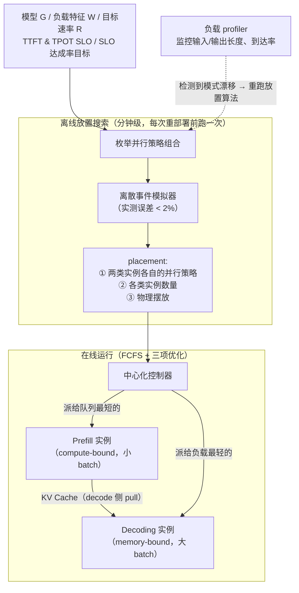

# DistServe: Disaggregating Prefill and Decoding for Goodput-optimized LLM Serving

> **一句话结论**：prefill 是算力受限的、decode 是访存受限的，把它们放在同一批 GPU 上会互相干扰、且被迫共用同一套资源与并行策略；把两者拆到不同的 GPU 实例上，各自按 TTFT / TPOT 独立选并行度和资源量，在满足 SLO 的前提下把每 GPU 可承受的请求率提高到最高 $7.4\times$。

---

## 1. 元信息

| 项目 | 内容 |
| --- | --- |
| 作者 / 机构 | Yinmin Zhong、Shengyu Liu 等 8 人 · 北京大学 / StepFun / UC San Diego |
| 发表 | **OSDI 2024**（arXiv:2401.09670v3） |
| 原文 | [PDF](paper.pdf) · [HTML](paper.html) · [arXiv](https://arxiv.org/abs/2401.09670) |
| 代码 | [LLMServe/DistServe](https://github.com/LLMServe/DistServe) |
| 关键词 | prefill/decode 分离 · goodput · TTFT / TPOT · 并行策略搜索 |
| 前置知识 | [KV Cache](../../../concepts/kv-cache.md)、[Continuous Batching](../../../concepts/continuous-batching.md)、[SLO 容量与 p99 尾延迟](../../../concepts/slo-capacity.md)、[张量并行](../../../concepts/tensor-parallelism.md) |
| 实验条件 | OPT-13B/66B/175B，fp16，4 节点 × 8× A100-80GB（NVLINK 内连，**跨节点仅 25 Gbps**） |

**这篇在本仓库的位置**：[vLLM 笔记](../2023-vllm-pagedattention/README.md) §2.2 指出 prefill 是矩阵-矩阵乘、compute-bound，decode 是矩阵-向量乘、memory-bound，两者硬件特征完全不同——但 vLLM 仍然把它们放在同一批机器上跑。DistServe 直接把这个观察推到底：**既然特征不同，就不该共用资源**。

---

## 2. 摘要速览（5 分钟版）

### 2.1 要解决的问题

LLM 服务的延迟由**两个**指标刻画，而不是一个：

| 指标 | 含义 | 对应阶段 |
| --- | --- | --- |
| **TTFT**（time to first token） | 首 token 的等待时间 | prefill |
| **TPOT**（time per output token） | 后续每个输出 token 的平均生成时间 | decode |

请求总延迟 $= \text{TTFT} + \text{TPOT} \times \text{生成 token 数}$。不同应用对两者的要求截然不同：实时聊天机器人优先要低 TTFT，而 TPOT 只要快过人的阅读速度（约 250 词/分）就够；文档摘要则相反，TTFT 可以放宽，TPOT 要紧。

已有系统把两个阶段**放在同一批 GPU 上并用 continuous batching 混合调度**，优化的是总吞吐（每秒生成的 token 数）。在有 SLO 约束时，这会产生两个问题：

1. **prefill-decode 干扰**。一个 prefill step 通常比一个 decode step 长得多。混批时 batch 内的 decode 请求被 prefill 拖住，TPOT 显著变长；反过来加入 decode 也让 TTFT 上升。即便分开调度，两者仍在抢 GPU，排队延迟照样传导。
2. **资源与并行策略被耦合**。两个阶段共用一份资源分配和并行配置，只能按**要求更苛刻的那个**指标来配，导致为了同时满足两个 SLO 而超额配置资源。

**动机数字**（Figure 1，13B 模型，单张 A100-80GB，输入 512 / 输出 64，90% SLO 达成率）：

| 配置 | per-GPU goodput |
| --- | --- |
| 现有系统（prefill + decode 混合） | 约 **1.6 rps** |
| 只跑 prefill | 5.6 rps |
| 只跑 decode | 10 rps |
| 2 GPU 做 prefill + 1 GPU 做 decode | 整体 10 rps ⇒ **3.3 rps/GPU（$2.1\times$）** |

### 2.2 核心方法

把两个阶段**拆到不同的 GPU 实例**上：prefill 实例只做 prefill 并产出第一个 token，然后把中间状态（主要是 KV Cache）传给 decode 实例。由于 decode 的 GPU 利用率低，可以给一个 decode 实例配多个 prefill 实例。

在此之上做三件事：

1. **取舍分析**（§3）：用 M/D/1 排队模型推出「低负载偏好 intra-op 并行、高负载偏好 inter-op 并行」，并给出 prefill 的临界输入长度 $L_m$、decode 的批量策略。
2. **放置算法**（§4）：给定模型、负载特征、TTFT/TPOT 要求与 SLO 达成目标，用**模拟器**枚举搜索出使 per-GPU goodput 最大的 placement（两类实例各自的并行策略、数量、物理摆放）。分为高节点亲和性（Alg. 1）与低节点亲和性（Alg. 2）两个版本。
3. **在线调度**（§4.3）：FCFS + 按队列长度分派，配合三项优化——按 token 数平衡流水线批次以减少气泡、用 **pull 而非 push** 传 KV 以抗突发、周期性 replanning。

### 2.3 主要结果

统一条件：4 节点 × 8× A100-80GB，跨节点 25 Gbps，OPT 系列 fp16，Poisson 到达，90% SLO 达成率。

| 应用 / 模型 | vs vLLM | vs DeepSpeed-MII |
| --- | --- | --- |
| Chatbot（ShareGPT，13B/66B/175B） | $2.0\times$–$4.6\times$ 请求率；$1.8\times$–$3.2\times$ 更严 SLO | $1.6\times$–$\mathbf{7.4\times}$ 请求率 |
| Code Completion（HumanEval，66B） | $5.7\times$ 请求率；$1.4\times$ 更严 SLO | $1.6\times$ 请求率；$1.4\times$ 更严 SLO |
| Summarization（LongBench，66B） | $4.3\times$ 请求率；$\mathbf{12.6\times}$ 更严 SLO | $1.8\times$ 请求率；$2.6\times$ 更严 SLO |

**传输开销**（OPT-175B，最不利的情形）：KV 传输占总延迟 **< 0.1%**；**95% 以上的请求传输延迟低于 30 ms**——尽管测试床跨节点只有 25 Gbps。原因是 Alg. 2 强制把同一 inter-op stage 的 prefill 段与 decode 段放在同一个节点内，走 NVLINK。

**模拟器精度**（Table 2）：与真机的 SLO 达成率误差**在所有测试点上都小于 2%**。

### 2.4 我的评价

必读，而且它的**分析方法**比结论更值得学。

这篇论文最有价值的地方是 §3 那套推导：它没有停留在「两个阶段特征不同」这个定性观察上，而是用 M/D/1 排队模型写出

$$Avg\_TTFT = \underbrace{D}_{\text{执行时间}} + \underbrace{\frac{RD^2}{2(1-RD)}}_{\text{排队延迟}}$$

然后分别代入 inter-op 与 intra-op 的执行时间，**从公式里读出「低负载用 intra-op、高负载用 inter-op」这个非平凡的结论**，再用实验验证。这是把工程直觉变成可推导命题的范本。

三个值得记住的点：

1. **优化目标的选择本身就是贡献**。从「总吞吐（token/s）」换成「per-GPU goodput（满足 SLO 的请求率 / GPU 数）」，这一步换掉之后，很多原本看起来合理的设计（混批、chunked-prefill）就显出问题了。论文自称是**第一个为自回归 LLM 推理优化 goodput 的工作**。
2. **对 chunked-prefill 的批评给了具体机制**：把 prefill 切成 $N$ 块后，为了算第 $i$ 块要重新加载前 $i-1$ 块的 KV，总访存量是 $N + (N-1) + \dots + 1 = O(N^2)$。这比「它只是缓解而没有消除干扰」这种泛泛之谈有力得多。
3. **它自己划出了不适用的边界**（§7）：离线吞吐优先的场景该用 chunked-prefill；单卡或少卡的资源受限场景该用不分离的系统。这种自我限定在本仓库读过的论文里是共同的高质量特征。

对照 [CacheRoute](../2026-cacheroute/README.md) 读会更有收获：两篇都在做「放置」，但 DistServe 放的是**实例**（离线一次，按 workload 特征），CacheRoute 放的是**请求的路由目标**（周期性，按 key 速率）。两者是可组合的。

---

## 3. 细读

### 3.1 Introduction

论文用一组对照数字立论（见 [§2.1](#21-要解决的问题) 的表）。核心概念定义得很干净：

> **per-GPU goodput**：在满足 SLO 达成率目标（例如 90%）的前提下，每张已配置的 GPU 能承受的最大请求率。per-GPU goodput 越高，单次查询的成本越低。

论文点明差距的来源：**colocation of the prefill and decoding — two phases with very distinct computational characteristics and latency requirements**。

三项贡献：识别干扰与耦合问题并提出分离；设计放置算法自动选出 goodput 最优方案；用真实负载做完整评测。

> **批注**：这篇的选题逻辑是「换一个优化目标，重新审视既有设计」。总吞吐这个指标不区分请求是否满足 SLO——一个已经违反 SLO 的请求生成的 token 照样计入吞吐。换成 goodput 之后，「把 prefill 和 decode 混批以填满 GPU」这个在吞吐视角下正确的做法，在 goodput 视角下就变成了错误。**优化目标定义错了，后面所有优化都会朝错误方向使劲**——这是本文最可迁移的一条。

### 3.2 Background and Motivation

#### 2.1 LLM 推理

关键的一组对照：

| | prefill | decode |
| --- | --- | --- |
| 每步处理 | 整个 prompt（多 token，并行） | 一个新 token |
| 计算量 | 随并行处理的 token 数**超线性**增长 | 单 token |
| I/O 量 | 搬运权重与中间状态 | **与 prefill 相近** |
| 瓶颈 | **compute-bound**（13B 模型上，512-token 序列已接近打满 A100） | **memory-bandwidth-bound** |

论文点出为什么大家都 colocate：**两个阶段共用同一份模型权重和 KV Cache**，分开就要各存一份权重。

#### 2.2 已有优化

**Batching**：continuous batching 把新请求的 prefill 与在跑请求的 decode 混批，最大化总吞吐。它的进阶变体 chunked-prefill 把长 prefill 切块再挂上 decode 任务，**本质上是拿 TTFT 换 TPOT，无法消除干扰**。

**Model parallelism**：

| | intra-op（张量并行） | inter-op（流水并行） |
| --- | --- | --- |
| 做法 | 切分单个算子（如矩阵乘） | 把层分成 stage，各占一个 GPU |
| 执行时间 | **降低**（尤其利于 TTFT） | 略微增加（stage 间通信） |
| 通信 | 大，需要 NVLINK 级带宽 | 小 |
| 速率容量 | — | 随 GPU 数**线性扩展** |

论文声称揭示了模型并行的一个额外收益：**执行时间变短会连带降低排队延迟**——这一点在 §3 用排队论展开。

脚注里有一个值得注意的用词区分：论文强调说「execution time」而非「latency」，因为 **latency = execution time + queuing delay**。全文的分析都建立在这个拆分上。

#### 2.3 问题与机会

**prefill-decode 干扰**（Figure 2）：往一批 decode 请求里加**一个** prefill 任务，就同时显著拖慢两者。prefill 越长，decode 被拖得越狠。

**对 chunked-prefill 的三条具体批评**（这段是全文最锋利的地方）：

1. chunk 设得远小于打满 GPU 的拐点 → prefill 与同批的 decode 竞争，无法独占 GPU，执行时间反而变长；
2. chunk 增大到接近打满 GPU → 剩给 decode token 的槽位变少，**piggyback 的机会随之消失**；
3. **chunked-prefill 造成显著更多的访存**：为了算第 $i$ 块，前面所有块的 KV 都要从 HBM 重新加载到 SRAM。若切成 $N$ 等份，总加载量为

$$N + (N-1) + \dots + 1 = O(N^2)$$

**资源与并行耦合**：prefill 偏好更多 intra-op 以压低 TTFT，而 decode 的最优并行配置取决于运行时的 batch size。共用配置只能按**更苛刻**的那个指标来配，于是超额配置。

**机会**：论文定义 **instance** = 恰好管理一份完整模型权重副本的资源单元（应用模型并行时可对应多张 GPU）。分离后得到 **prefill instance** 与 **decoding instance**。由于 decode 的 GPU 利用率低，**可以给一个 decode 实例配多个 prefill 实例**，从而攒出更大的 decode batch。

### 3.3 Tradeoff Analysis

这一节是全文的分析核心。

#### 3.1 prefill 实例

**批处理策略**：prefill 是计算密集的。13B 模型上处理**单条** 512-token 序列就能打满 A100。一旦进入 compute-bound，继续加请求不再提升 GPU 效率，只会按比例拉长整批的处理时间、延迟批内所有请求。因此需要**事先 profile 出临界输入长度 $L_m$**，只在待调度请求的输入长度低于 $L_m$ 时才考虑攒批。实践中用户 prompt 通常有几百 token，所以 **prefill 的 batch size 一般很小**。

**并行策略**：分离之后 prefill 阶段近似一个 **M/D/1 队列**（Poisson 到达、确定性服务时间、单服务台），可以直接用排队论分析。设单请求执行时间为 $D$、到达率为 $R$，在 $RD < 1$ 时：

$$Avg\_TTFT = D + \frac{RD^2}{2(1-RD)} \tag{1}$$

第一项是执行时间，第二项是排队延迟。

**2 路 inter-op**：请求级延迟 $D_s \approx D$，最慢 stage 耗时 $D_m \approx D/2$（层间激活通信可忽略）：

$$Avg\_TTFT_{inter} = D_s + \frac{RD_m^2}{2(1 - RD_m)} = D + \frac{RD^2}{4(2-RD)} \tag{2}$$

**2 路 intra-op**：引入加速系数 $K$（$1 < K < 2$，反映通信开销导致的不完美加速），执行时间 $D_s = D/K$：

$$Avg\_TTFT_{intra} = \frac{D}{K} + \frac{RD^2}{2K(K - RD)} \tag{3}$$

**对比式 (2) 与式 (3) 得到的结论**：

- **低到达率**下第一项（执行时间）主导 → intra-op 缩短执行时间，因此更优。
- **到达率升高**后第二项（排队延迟）主导 → inter-op 更优。
- **SLO 越严** → 越偏向 intra-op（因为它直接压执行时间）。
- **$K$ 越小**（通信开销越大）→ intra-op 的优势越弱。

$K$ 取决于输入长度、模型结构、通信带宽和物理摆放。

> **批注**：这是把工程直觉转成可推导命题的教科书式例子。「低负载用张量并行、高负载用流水并行」这个结论如果只靠实验曲线给出，读者无法迁移到自己的配置；给出闭式表达式之后，任何人都可以代入自己的 $D$、$R$、$K$ 去判断。**分离本身是这个分析成立的前提**——只有把 prefill 单独拿出来，它才是一个干净的 M/D/1 队列。

#### 3.2 decode 实例

**批处理策略**：单个 decode 任务严重受带宽约束，**攒批是提高 GPU 利用率的关键**。而在 colocate 的系统里加大 decode batch 很困难——它与延迟目标冲突：到达率一高就产生更多 prefill 任务，若优先保 TTFT 就会挤压 TPOT。分离之后，**用多个 prefill 实例喂一个 decode 实例**，就能在专用 GPU 上攒出大批量而不牺牲 TPOT。

**并行策略**：分离后 decode 的 batch size 受显存容量约束（要为所有活跃请求保留 KV Cache）。用模型并行扩展，或用 PagedAttention、GQA 这类显存优化，可以把 batch 继续推大到接近 compute-bound。**当 decode batch 大到接近 compute-bound 时，它的计算特征开始像 prefill**。此时（Figure 5）：

- intra-op 降低延迟但**收益递减**（通信开销 + 切分后利用率下降）；
- inter-op 几乎**线性扩展吞吐**。

因此：TPOT SLO 严格时，intra-op 是压低 TPOT 的必需手段；在此之上再加 inter-op 线性提吞吐。

另外，当模型能装进单卡时，**复制**也是与模型并行并列的选项：它线性扩展速率容量，并按式 (1) 把 $R$ 换成 $R/N$ 来降低排队延迟，代价是多存几份权重。

#### 3.3 实践问题

**变长 prefill**：§3 的分析假设 prompt 等长。真实负载下长度不均，会让使用 inter-op 的 prefill 实例产生**流水线气泡**，从而偏离 M/D/1 模型的结论。对策放在 §4.3 的调度里。

**通信开销**：OPT-66B 上单条 512-token 请求的 KV Cache 约 **1.13 GB**。按平均 10 rps 计，每秒要传 11.3 GB —— 相当于需要 **90 Gbps** 才能把开销藏住。现代 GPU 集群常配 InfiniBand（如 800 Gbps）；跨节点带宽不足时，DistServe 依赖节点内 NVLINK（A100 之间峰值 600 GB/s）。这个要求会转化为**对放置的额外约束**。

### 3.4 Method

**placement** 的定义：给定模型、负载特征、延迟要求与 SLO 达成目标，决定 (a) 两类实例各自的并行策略、(b) 各类实例的数量、(c) 如何摆到物理集群上。目标是最大化 per-GPU goodput。

#### 4.1 高节点亲和性集群（Alg. 1）

跨节点带宽充裕时约束最少：枚举并行度组合，用模拟器评估 goodput，取最优，再复制到满足目标速率。

#### 4.2 低节点亲和性集群（Alg. 2）

跨节点带宽不足时，直觉的做法是把 prefill 与 decode 实例放在同一节点走 NVLINK。但对 175B（350 GB）这种规模，一个 8 卡节点装不下一对实例：

$$80\,\text{GB} \times 8 = 640\,\text{GB} < 350 \times 2\,\text{GB}$$

**关键洞察**：**KV Cache 的传输只发生在 prefill 与 decode 实例的对应层之间**。利用 inter-op 并行把层分组成 stage，把每个实例切成若干 **instance segment**，每段维护一个 inter-op stage。**只要把同一 stage 的 prefill 段与 decode 段放进同一个节点**，传输就一定走 NVLINK。节点内为同一实例的各段设置相同的并行度与资源分配；由于每节点 GPU 数通常只有 8，可以直接枚举节点内的所有配置并用模拟器挑最优。

#### 4.3 在线调度

基础策略很简单：FCFS。所有请求先到中心化控制器，**派给队列最短的 prefill 实例**，prefill 完成后**派给负载最轻的 decode 实例**。在此之上有四项增强：

**减少流水线气泡**：观察到「批内新 token 数是批执行时间的可靠指示器」。对 prefill 实例，profile 出打满 GPU 所需的最短 prompt 长度 $L_m$，调度时让每批的总序列长度接近 $L_m$——短于 $L_m$ 的多条攒一批，长于 $L_m$ 的单独一批。对 decode 实例，把 $L_m$ 设为最大 batch size。

**抗突发**：突发流量会让大量 KV Cache 同时涌向 decode 实例，有撑爆其显存的风险。DistServe 用 **pull 而非 push**——**decode 实例按需去 prefill 实例拉取 KV Cache，把 prefill 实例的显存当作排队缓冲**。prefill 实例算完 prompt 后把 KV 留在显存里就可以继续处理下一个 prefill 任务。两类实例各按自己的节奏运行，不需要复杂协调。

**Replanning**：负载 profiler 监控平均输入/输出长度、平均到达率等关键参数；检测到显著模式漂移时，基于近期历史数据重跑放置算法。论文论证这个过程足够快：**算法在秒级到分钟级完成，重新加载模型权重在分钟级**，而真实负载的变化通常是小时级的。

**抢占与容错——未实现**。论文诚实地讨论了两者：

- FCFS 会产生 **convoy effect**（长请求堵住短请求）；引入抢占策略是可行的，但当前系统没做。
- **分离引入了故障传播风险**：一个 decode 实例故障，可能拖垮映射到它的所有 prefill 实例，进而瘫痪整个服务。在传统的 colocation + 复制架构里，单个实例故障通常不影响其他副本。

> **批注**：容错这一条是分离架构相对 colocation 的**实质性倒退**，论文用一段话交代后列为 future work。这在工程上是个真问题：分离把「一个实例挂了影响一个副本」变成了「一个 decode 实例挂了影响它上游的所有 prefill 实例」，故障影响面被放大了。任何要落地这套架构的团队都必须先解决它。

### 3.5 Implementation

- 算法模块 + RESTful 前端 + 编排层：**6.5K 行 Python**；并行执行引擎：**8.1K 行 C++/CUDA**。
- 前端兼容 OpenAI API。
- 编排层负责请求分派、KV Cache 传输、结果返回。**跨节点用 NCCL，节点内用异步 `CudaMemcpy`**，避免传输阻塞 GPU 计算。
- 每个实例由并行执行引擎驱动，用 **Ray actor** 实现 GPU worker。
- 集成了 continuous batching、FlashAttention、PagedAttention。

### 3.6 Evaluation

#### 6.1 设置

**集群**：4 节点 × 8× NVIDIA SXM A100-80GB，节点内 NVLINK，**跨节点带宽仅 25 Gbps**。因此除消融外的大部分实验都使用**低节点亲和性算法**（Alg. 2）。

**模型选择的理由值得注意**：选 OPT 系列而非更新的模型，因为新模型普遍采用 GQA / MQA，KV Cache 更小、传输开销更低。论文明确说：**选用经典 MHA 的 OPT 是为了给传输开销施加足够压力**，也就是说这是一个对自己不利的选择。fp16。

**Table 1（负载与 SLO）**：

| 应用 / 模型 | 权重 | TTFT SLO | TPOT SLO | 数据集 |
| --- | --- | --- | --- | --- |
| Chatbot OPT-13B | 26 GB | 0.25 s | 0.1 s | ShareGPT |
| Chatbot OPT-66B | 132 GB | 2.5 s | 0.15 s | ShareGPT |
| Chatbot OPT-175B | 350 GB | 4.0 s | 0.2 s | ShareGPT |
| Code Completion OPT-66B | 132 GB | 0.125 s | 0.2 s | HumanEval |
| Summarization OPT-66B | 132 GB | 15 s | 0.15 s | LongBench |

论文说明 SLO 是**根据服务目标凭经验设定的**，因为「据我们所知这些应用没有可用的 SLO 设定」。数据集无时间戳，用 Poisson 生成到达时间。

**指标**：**SLO attainment**（满足 SLO 的请求占比）。主要关心 90% 达成率下的两件事——最大 per-GPU goodput、以及系统能承受的最严 SLO。附录另有 99% 达成率的结果。

**基线**：

- **vLLM**：只支持 intra-op，按其原论文设置三个模型的 intra-op 为 1 / 4 / 8。
- **DeepSpeed-MII**：支持 chunked-prefill。**无法服务 OPT-175B**，因为其 kernel 实现要求 `vocab_size / intra_op` 满足某个整除条件而 OPT 的 `vocab_size = 50272` 不满足。

#### 6.2 端到端

数字见 [§2.3](#23-主要结果)。几个解释性的细节：

- **175B 上算法选出的 placement**：prefill 实例 inter-op = 3、intra-op = 3；decode 实例 inter-op = 3、intra-op = 4。论文强调**这种非平凡的配置很难手工找到**，以此论证搜索算法的价值。
- **vLLM 在 chatbot 上败于 TPOT**：colocate 严重拖慢 decode，虽然大部分请求满足 TTFT，整体达成率被大量违反 TPOT 的请求拉下来。
- **DeepSpeed-MII 在更大模型上表现更好**，因为 prefill 任务更大、chunked-prefill 的缓解作用更明显。
- **Summarization 上 $12.6\times$ 更严 SLO** 这个最大数字的来源：LongBench 输入很长，给 prefill 极大压力；但该任务 TTFT 要求宽松（15 s），因此**TPOT 成为关键**，而 colocate 恰恰最伤 TPOT。

「更严 SLO」的测法是引入 **SLO Scale** 参数同比缩放 Table 1 的两个延迟要求，观察系统在保持达成率目标的前提下能承受的最小 SLO Scale。

#### 6.3 延迟拆解

把请求生命周期分成五段：**prefill 排队、prefill 执行、传输、decode 排队、decode 执行**。

OPT-175B + ShareGPT（KV 传输压力最大的配置）：

- **KV Cache 传输占总延迟不到 0.1%**；
- **超过 95% 的请求传输延迟低于 30 ms**。

原因归于 §4.2 的算法——强制同一 stage 的 prefill 段与 decode 段共处一节点，传输走 NVLINK。

#### 6.4 消融

由于 vLLM 不支持 inter-op 且测试床跨节点带宽低，**这一节用模拟**。

**模拟器精度**（Table 2，OPT-66B？论文未标注模型，为 vLLM 与 DistServe-Low 两种配置）：

| Rate (req/s) | vLLM 真机 | vLLM 模拟 | DistServe-Low 真机 | DistServe-Low 模拟 |
| --- | --- | --- | --- | --- |
| 1.0 | 97.0% | 96.8% | 100.0% | 100.0% |
| 1.5 | 65.5% | 65.1% | 100.0% | 100.0% |
| 2.0 | 52.8% | 51.0% | 99.3% | 99.3% |
| 2.5 | 44.9% | 46.1% | 87.3% | 88.3% |
| 3.0 | 36.7% | 38.3% | 83.0% | 84.1% |
| 3.5 | 27.8% | 28.0% | 77.3% | 77.0% |
| 4.0 | 23.6% | 24.1% | 70.0% | 68.9% |

**所有点误差都小于 2%**。论文的依据是 DNN 模型执行具有高可预测性，即便在并行设置下也是如此。

**结果**（OPT-66B + ShareGPT，四个系统）：

- **vLLM++**（枚举并行策略取最优）**与 vLLM 表现相同**——因为默认的 intra-op = 4 已经是 per-GPU goodput 最优。论文用这一点反过来论证分离的重要性：**prefill 与 decode 的干扰把「调并行策略」这条路的潜在收益压没了**。
- **DistServe-High > DistServe-Low**，因为前者不受「同节点内 prefill 与 decode 段必须共享同一 stage」这个部署约束。

#### 6.5 算法运行时间

在 96 核的 AWS m5d.metal 上测：算法**随 GPU 数扩展良好，且与模型大小无关**（模拟器只模拟离散事件）。两个算法都高度可并行——不同并行策略的搜索彼此独立，因此运行时间随核数近乎线性下降。

GPU 数增加时 Dist-Low 比 Dist-High 慢，因为前者要枚举所有节点内并行组合。即便如此，运行时间在**分钟级**，而它只需在每次重部署前跑一次。

### 3.7 Discussion

论文主动划出三条边界：

| 场景 | 判断 |
| --- | --- |
| **吞吐优先的离线场景** | 用户对响应时间要求低，此时应最大化总吞吐而非 goodput，DistServe 的有效性打折。**chunked-prefill 可能更好**，因为它能把每批填到 compute-bound 阈值 |
| **资源受限场景** | 只有少数几张甚至一张 GPU 时，DistServe 的设计空间被严重限制，难以通过调并行策略和资源分配获益。**不分离的系统更简单** |
| **长上下文场景** | KV Cache 随 prompt 长度**线性**增长，而 prefill 计算随长度**平方**增长，因此传输的相对占比反而下降；同时长上下文进一步拉大 prefill 与 decode 的计算差异，干扰更严重。**分离在长上下文下更有前景** |

### 3.8 Related Work

论文把自己放在三条线的交叉点上：

| 线索 | 代表工作 | 与 DistServe 的关系 |
| --- | --- | --- |
| **推理服务** | Orca（continuous batching）、vLLM（paged-attention）、SARATHI（chunked-prefill）、FastServe（迭代级抢占调度） | 它们都 colocate 两个阶段，因此存在严重干扰 |
| **并行的 disaggregation** | Splitwise、TetriInfer、DéjàVu | **并行工作**，采用相似的分离思路，「进一步印证了该方法的有效性」；DistServe 的区别在于更强调 goodput 优化与网络带宽这一维 |
| **goodput 优化系统** | Pollux、Sia、Clockwork、Shepherd、AlpaServe | 前几个针对传统小模型；AlpaServe 面向 LLM 但只针对非自回归生成。**DistServe 自称是第一个为自回归 LLM 推理优化 goodput 的工作** |

另有一条把它接到系统研究的更长脉络上：**resource disaggregation**——把硬件资源从单体服务器中解耦成独立管理的资源池。

### 3.9 Conclusion

分离 prefill 与 decode 计算，最大化 per-GPU goodput，实现最高 $7.4\times$ 更低的单次查询成本。结论段的判断：**随着延迟成为 LLM 服务越来越重要的指标，prefill / decode 分离是一条关键策略**。

---

## 4. 关键问题解析

### Q1: 为什么必须把 TTFT 和 TPOT 分开看？「总吞吐」错在哪？

**A**: 因为**总吞吐不区分请求是否满足 SLO**。

一个已经违反 SLO 的请求，它生成的每个 token 照样计入「tokens per second」。于是一个系统可以通过「让所有请求都慢一点、但都在跑」来把吞吐做得很高，而实际上一个用户都没伺候好。

换成 **goodput**（满足 SLO 达成率目标的最大请求率 / GPU 数）之后，只有**合格的服务**才算数。这一步换掉之后，几个原本合理的设计立刻显出问题：

- **混批（continuous batching）**：吞吐视角下它填满了 GPU，是纯收益；goodput 视角下它让 decode 请求被 prefill 拖慢，制造 TPOT 违约。
- **chunked-prefill**：吞吐视角下它让每批都接近 compute-bound；goodput 视角下它是拿 TTFT 换 TPOT，且带来 $O(N^2)$ 的额外访存。

**两个指标不能合并成一个**的原因在于它们的**需求方向随应用而反转**：

| 应用 | TTFT | TPOT |
| --- | --- | --- |
| 实时聊天 | **紧**（响应要快） | 松（快过人类阅读速度即可，约 250 词/分） |
| 文档摘要 | 松（15 s 都可接受） | **紧**（生成要快） |
| 代码补全 | **紧** | **紧** |

任何把两者加权成一个标量的做法，都会在某类应用上给出错误的优化方向。

**与本仓库其他论文的对照**：[vLLM](../2023-vllm-pagedattention/README.md) 只报告 normalized latency 的**均值**且不区分 TTFT / TPOT；[CacheRoute](../2026-cacheroute/README.md) 用 p99 TTFT + SLO 容量。DistServe 的指标体系（双指标 + SLO 达成率 + per-GPU 归一化）是三者中最完整的。

### Q2: prefill-decode 干扰的机制是什么？chunked-prefill 为什么消除不了它？

**A**:

**干扰机制**：一个 prefill step 处理几百个 token、是 compute-bound；一个 decode step 只处理 1 个 token、是 memory-bound。混进同一批时：

- batch 内的 decode 请求必须**等 prefill 算完**才能拿到自己这一步的结果 → TPOT 被拉长，prefill 越长拉得越狠；
- 反过来加入 decode 也会增加 prefill 的完成时间，尤其在 GPU 已接近满载时。

即便不混批而是顺序调度，问题依然存在——decode 任务要排在正在跑的 prefill 后面，反之亦然。**优先保任何一边都会伤到另一边**。

**chunked-prefill 的三个具体问题**（§2.3，论文给的机制而非泛论）：

1. **chunk 太小**：prefill 与同批 decode 竞争，无法独占 GPU，prefill 执行时间反而更长。
2. **chunk 大到接近打满 GPU**：留给 decode token 的槽位所剩无几，**piggyback 的机会本身消失了**——这个方法的收益来源被自己掐断。
3. **访存放大到 $O(N^2)$**：切成 $N$ 块后，算第 $i$ 块需要把前 $i-1$ 块的 KV 从 HBM 重新读进 SRAM，总加载量 $N + (N-1) + \dots + 1 = O(N^2)$。

第 1、2 条构成一个**没有出路的取舍**：chunk size 往哪边调都会失去一部分收益。第 3 条是纯粹的额外成本，无法通过调参消除。

**分离为什么能消除干扰**：因为干扰的根源是「两类任务共享同一个执行单元」。把它们放到不同 GPU 上，这个共享关系不存在了，干扰在定义上就为零。代价是要多存一份权重，以及跨实例传 KV。

### Q3: 为什么 prefill 低负载偏好 intra-op、高负载偏好 inter-op？

**A**: 从式 (1)–(3) 直接读出来。核心是 **latency = 执行时间 + 排队延迟**，两种并行方式作用在不同的项上。

回顾 M/D/1 的基本式：

$$Avg\_TTFT = \underbrace{D}_{\text{执行时间}} + \underbrace{\frac{RD^2}{2(1-RD)}}_{\text{排队延迟}}$$

**intra-op（张量并行）**做的是**把 $D$ 变小**（变成 $D/K$）。执行时间直接缩短，排队延迟也随之下降。

$$Avg\_TTFT_{intra} = \frac{D}{K} + \frac{RD^2}{2K(K-RD)}$$

**inter-op（流水并行）**几乎不改变单请求的端到端执行时间（$D_s \approx D$），但它把**服务台的节拍**从 $D$ 缩短到最慢 stage 的 $D_m \approx D/2$——也就是说系统每 $D_m$ 就能接纳一个新请求，**排队能力翻倍**。

$$Avg\_TTFT_{inter} = D + \frac{RD^2}{4(2-RD)}$$

于是：

| 负载 | 主导项 | 谁更优 | 原因 |
| --- | --- | --- | --- |
| 低 $R$ | 执行时间 $D$ | **intra-op** | 它是唯一能压小 $D$ 的 |
| 高 $R$ | 排队延迟 | **inter-op** | 它把服务节拍减半，排队项分母更大 |

两个额外的调节因素：

- **SLO 越严，越偏 intra-op**——因为在极严的 SLO 下，即使排队为零，执行时间本身可能就已经超标。
- **$K$ 越小（通信开销越大），intra-op 越吃亏**。$K$ 取决于输入长度、模型结构、通信带宽和物理摆放，这也是为什么 intra-op 通常只在 NVLINK 域内使用。

**decode 侧的结论形式相同但理由不同**（§3.2）：intra-op 降低延迟但收益递减（通信 + 切分后利用率下降），inter-op 几乎线性扩展吞吐。所以先用 intra-op 把 TPOT 压到 SLO 以内，再用 inter-op 提吞吐。

### Q4: 分离之后 KV 传输开销有多大？25 Gbps 的跨节点带宽为什么够用？

**A**: 先算账，再看它是怎么被绕过去的。

**账**（§3.3）：OPT-66B 上单条 512-token 请求的 KV Cache 约 **1.13 GB**。按 10 rps 计：

$$1.13\,\text{GB} \times 10/\text{s} = 11.3\,\text{GB/s} \approx 90\,\text{Gbps}$$

也就是说，**要把传输开销完全藏住需要约 90 Gbps**。测试床的跨节点带宽只有 25 Gbps，不够。

**怎么绕过去的**：§4.2 的 Alg. 2。关键洞察是 **KV 传输只发生在 prefill 与 decode 实例的对应层之间**。用 inter-op 把层分成 stage，把实例切成 **instance segment**，然后**强制把同一 stage 的 prefill 段与 decode 段放进同一节点**。这样传输永远走节点内 NVLINK（A100 间峰值 600 GB/s），跨节点带宽根本不参与。

**实测结果**（§6.3，OPT-175B，最不利配置）：

- KV 传输占总延迟 **< 0.1%**；
- **> 95% 的请求传输延迟 < 30 ms**。

**三条限定**，读的时候要带上：

1. **模型选择对自己不利**：OPT 用经典 MHA，KV Cache 比用 GQA/MQA 的现代模型大得多。论文明说这是为了「给传输开销施加足够压力」。换成 GQA 模型，传输开销还会显著更小。
2. **代价是放置自由度**：Alg. 2 比 Alg. 1 多了「同节点内 prefill 段与 decode 段共享同一 stage」这个约束，消融显示 **DistServe-High 确实优于 DistServe-Low**。所以 25 Gbps 够用是有代价的，只是代价小于收益。
3. **长上下文下这笔账会变**：KV 随长度线性增长，但 prefill 计算随长度平方增长，**相对占比反而下降**（§7）。

### Q5: 放置算法在搜什么？为什么敢用模拟器？

**A**:

**搜索空间**：给定模型 $G$、每实例节点数上限 $N$、每节点 GPU 数 $M$、GPU 显存 $C$、负载 $W$、目标速率 $R$，输出一个 placement：

1. prefill 实例的并行策略（inter-op × intra-op 度数）；
2. decode 实例的并行策略；
3. 两类实例各自的数量（复制到满足目标速率）；
4. 物理摆放（低亲和性场景下还要满足同 stage 同节点约束）。

目标函数是 **per-GPU goodput**。

**为什么这是个搜索而不是求解**：目标函数没有闭式表达——goodput 取决于排队行为、批组成、SLO 达成率，这些只能通过模拟得到。所以做法是**枚举 + 模拟评估 + 取最优**。

**为什么模拟器可信**：论文的依据是 **DNN 模型执行具有高可预测性**，即便在并行设置下也是如此。实测（Table 2）在 7 个到达率点上，模拟与真机的 SLO 达成率**误差全部小于 2%**。

**开销**：在 96 核机器上运行时间是**分钟级**，且随 GPU 数扩展良好、与模型大小无关（模拟器只处理离散事件）。两个算法都高度可并行——不同并行策略的搜索彼此独立。由于只在每次重部署前跑一次，这个开销可以接受。

**对照**：这与 [CacheRoute](../2026-cacheroute/README.md) 的做法形成有趣的反差。CacheRoute 也想做离线规划，但它试图用**解析式的缓存驻留模型**去预测命中率，结果失败了（中位数误差 14.3 个百分点、p90 误差 44.7 个百分点），最终不得不改用 shadow replay 实测。DistServe 的模拟器之所以能做到 < 2% 的误差，是因为它模拟的是**计算与排队**——这两者确定性强；而缓存驻留涉及驱逐策略与跨请求的时序耦合，可预测性差得多。

**一条可迁移的判断**：**能不能用模拟器替代实测，取决于被模拟对象的可预测性，而不是模拟器本身做得多精细。**

### Q6: 为什么 KV 用 pull 而不是 push？

**A**: 为了**把突发流量的缓冲压力放在 prefill 侧而不是 decode 侧**。

**push 的问题**：突发到来时，多个 prefill 实例几乎同时算完，把大量 KV Cache 一起推给 decode 实例。decode 实例的显存本来就要为所有活跃请求保留 KV，突然涌入可能直接**撑爆显存**。

**pull 的做法**：decode 实例**按需**去 prefill 实例拉取。prefill 实例算完 prompt 后把 KV 留在自己的显存里，继续处理下一个 prefill 任务。**prefill 实例的显存成了排队缓冲区**。

三个好处：

1. **背压天然存在**。decode 侧拉不动时，KV 就积压在 prefill 侧，不会导致 decode 侧 OOM。
2. **两类实例解耦**。论文原话是「each type of instance operates at its own pace without complex coordination」——不需要一个跨实例的流控协议。
3. **prefill 侧的显存本来就有余量**。prefill 的 batch 很小（§3.1：单条 512-token 序列就打满 A100），它的显存压力远小于要为所有活跃请求保留 KV 的 decode 实例。

**代价**：prefill 实例的显存被占用会限制它能同时持有的已完成 prompt 数量，极端情况下会反压到 prefill 的接纳能力。论文没有量化这个边界。

### Q7: 什么时候不该用 DistServe？

**A**: 论文 §7 自己给了三条，都很具体。

| 场景 | 为什么不适用 | 该用什么 |
| --- | --- | --- |
| **离线 / 吞吐优先** | 用户对响应时间要求低，优化目标回到总吞吐；此时混批填满 GPU 才是对的 | **chunked-prefill**（能把每批填到 compute-bound 阈值） |
| **资源受限**（几张甚至一张 GPU） | 设计空间被压没了——分离要求至少两类实例各持一份权重，单卡根本做不到；也没有足够 GPU 去调并行策略 | **不分离的系统**（vLLM、DeepSpeed-MII），部署更简单 |
| **长上下文** | 这条是**反向**的：论文认为分离在长上下文下**更有前景** | 仍用 DistServe |

第三条的推理值得单独记：KV Cache 随 prompt 长度**线性**增长，而 prefill 计算随长度**平方**增长。因此长度增加时，**传输时间相对于 prefill 时间的占比反而下降**。同时长上下文进一步拉大 prefill 与 decode 的计算差异，混批的干扰更严重。两个效应都指向分离。

**我补一条论文没写的**：**当负载的前缀复用率很高时，分离的收益会被稀释**。prefix caching 省掉的正是 prefill 计算，而 DistServe 的主要收益来自「让 prefill 不再干扰 decode」。如果大部分 prefill 本来就被缓存命中跳过了，可干扰的东西就少了。这一点在论文里完全没有讨论——见 [§6.2](#62-我的质疑)。

### Q8: DistServe 和 vLLM / SGLang / CacheRoute 是什么关系？

**A**: 四篇论文切的是**四个不同的维度**，两两之间基本正交。

| 论文 | 优化的维度 | 关键机制 | 作用域 |
| --- | --- | --- | --- |
| [vLLM](../2023-vllm-pagedattention/README.md) | **显存效率** | 分页 + block table + CoW | 单实例内 |
| [SGLang](../2024-sglang-radixattention/README.md) | **重复计算** | 基数树 LRU 缓存 + cache-aware 调度 | 单实例内（附录 A.4 涉及跨实例） |
| **DistServe** | **阶段间干扰 + 资源配比** | prefill / decode 分离 + 放置搜索 | 实例的划分与摆放 |
| [CacheRoute](../2026-cacheroute/README.md) | **请求落点** | 周期性路由规划（准入 + LPT） | 集群入口 |

**可组合性**：DistServe 的实现里明确集成了 continuous batching、FlashAttention、PagedAttention——它是**建立在 vLLM 那一层之上**的编排层。CacheRoute §7 也说了，DistServe / Splitwise 这类 PD 分离系统「仍然可以使用一个入口计划来避免路由本身造成的重复 prefill」。

**一个未被任何论文处理的交叉点**：**分离之后，prefix caching 该放在哪一侧？** KV Cache 在 prefill 实例产生、传给 decode 实例，那么用于跨请求复用的前缀缓存应该留在 prefill 侧（省 prefill 计算）。但这意味着**路由必须同时考虑「prefix 亲和性」（要回到持有该前缀的 prefill 实例）和「prefill/decode 配比」（要平衡两类实例的负载）**——这是 CacheRoute 的问题与 DistServe 的问题的乘积。DistServe 用的 OPT 系列没有 prefix caching，论文对此完全没有讨论。这是一个明确的开放问题。

---

## 5. 可迁移的知识点

- [Prefill / Decode 分离](../../../concepts/prefill-decode-disaggregation.md) —— 本文是这一架构最系统的论证与实现。
- [SLO 容量与 p99 尾延迟](../../../concepts/slo-capacity.md) —— 本文把 goodput 定义为「per-GPU 的、在 SLO 达成率约束下的最大请求率」，并给出 TTFT / TPOT 双指标体系。
- [KV Cache](../../../concepts/kv-cache.md) —— 本文让 KV 第一次成为需要**跨机传输**的对象，并给出了传输量的估算方法。
- [张量并行](../../../concepts/tensor-parallelism.md) —— 本文用排队论给出了 intra-op 与 inter-op 的选择判据，比「哪个更快」这类经验规则精确得多。

---

## 6. 批判与开放问题

### 6.1 局限性

**作者自己承认的**：

- **未实现抢占**，FCFS 会产生 convoy effect（长请求堵住短请求）。
- **未实现容错**，且论文自己指出分离引入了**故障传播风险**：一个 decode 实例故障可能拖垮映射到它的所有 prefill 实例。
- 变长 prompt 会让 inter-op 的 prefill 实例产生流水线气泡，只能靠调度缓解，与 M/D/1 模型有偏差。
- SLO 是**凭经验设定**的，因为没有公认的 SLO 基准。
- 三条不适用场景（离线吞吐优先、资源受限、见 §7）。

**论文没提但存在的**：

- **完全没有讨论 prefix caching**。OPT 系列 + 没有前缀复用机制，意味着评测里每个 prefill 都是从头算的。而 2024 年 prefix caching 已经是 vLLM / SGLang 的标配。如果基线开启了自动前缀缓存，vLLM 的 prefill 压力会显著下降，$7.4\times$ 这个数字会被压缩多少，论文没有回答。
- **消融依赖模拟而非真机**。§6.4 的四系统对比全部在模拟器上做。Table 2 验证了模拟精度，但那个验证**只覆盖 vLLM 与 DistServe-Low 两种配置**，**DistServe-High 的模拟结果没有真机对照**——而「DistServe-High 优于 DistServe-Low」正是论证 Alg. 1 价值的关键结论。
- **测试床的跨节点带宽（25 Gbps）明显低于论文自己引用的现代集群配置（800 Gbps InfiniBand）**。这使得低亲和性算法（Alg. 2）成为主力，也使得「传输开销可忽略」这个结论部分依赖于 Alg. 2 的约束。在真正的高带宽集群上，Alg. 1 的自由度更大、结论会更好——但论文没有在这种集群上验证过。
- **pull 机制的边界未量化**。prefill 实例的显存作为缓冲区，能缓冲多少、什么时候会反压到 prefill 的接纳能力，论文没有给出分析或实验。

### 6.2 我的质疑

- **$7.4\times$ 与 $12.6\times$ 这两个头条数字来自不同的对手和不同的任务，且都是区间的上端。** $7.4\times$ 是 chatbot 上相对 DeepSpeed-MII 的**请求率**上限（区间是 $1.6\times$–$7.4\times$）；$12.6\times$ 是 summarization 上相对 vLLM 的**SLO 紧度**。摘要把两者并列为「7.4× more requests or 12.6× tighter SLO」，读者很容易理解成同一组实验的两个侧面。准确的读法需要带上任务、对手和区间下端。
- **SLO 的选取是一个可调旋钮，而它直接决定倍数大小。** 论文承认 SLO 是凭经验设的。而 $12.6\times$ 这个最大值恰好出现在 SLO 组合最"偏"的任务上（summarization：TTFT 15 s 极松、TPOT 0.15 s 极紧）——这正是 colocate 最吃亏的配置。把 TTFT SLO 收紧，这个倍数会迅速下降。论文提供了 SLO Scale 的扫描曲线，缓解了这个问题，但头条数字仍然取自最有利的那一点。
- **用一个不支持 inter-op 的基线去论证「分离带来的并行自由度」，混淆了实现限制与设计限制。** vLLM 当时只支持 intra-op，这是**实现**上的限制；而论文要论证的是 colocate 这个**设计**限制了并行选择。论文用 vLLM++（枚举并行策略）和模拟器做了部分补救，且发现默认配置已是最优——但这个「已是最优」的结论本身是在只有 intra-op 的搜索空间里得出的，不能推广到「colocate 系统调并行策略没有收益」。
- **容错的倒退被一句话带过。** 从「一个实例挂了影响一个副本」变成「一个 decode 实例挂了影响它上游的所有 prefill 实例」，这是分离架构相对 colocation 的**实质性退步**，而且是无法通过调参绕开的结构性问题。论文把它和抢占并列为 future work，但两者的性质不同——抢占是锦上添花，容错是生产部署的门槛。
- **「第一个为自回归 LLM 推理优化 goodput」这个声明需要放在时间线上看。** 论文自己在 §8 列出 Splitwise、TetriInfer、DéjàVu 三个**并行工作**采用了相似的分离思路。在同一时间窗口内有三个独立团队得出同样结论，说明这个方向在当时已经"到点了"。这不减损论文的质量（它的分析深度和评测完整度明显高于同期），但「first」这个词的信息量比字面上小。

### 6.3 后续可读

- **Splitwise**（ISCA'24）—— 并行工作，同样做 PD 分离，可对照两者的取舍差异。
- **Sarathi-Serve**（OSDI'24）—— chunked-prefill 的代表，是本文批评的主要对象，读原文以判断批评是否公允。
- **Mooncake**（FAST'25）—— 把 KV 做成独立存储层，与本文「KV 在实例间点对点传输」是两种不同的解耦方式。
- **[CacheRoute](../2026-cacheroute/README.md)** —— 本仓库已有笔记；与本文的组合（prefix 亲和路由 + PD 分离）是 Q8 里指出的开放问题。
- **AlpaServe**（OSDI'23）—— 本文引用的 goodput 优化前作，面向非自回归生成。
- **Pollux**（OSDI'21）—— goodput 这个概念在 DL 集群调度中的出处。
