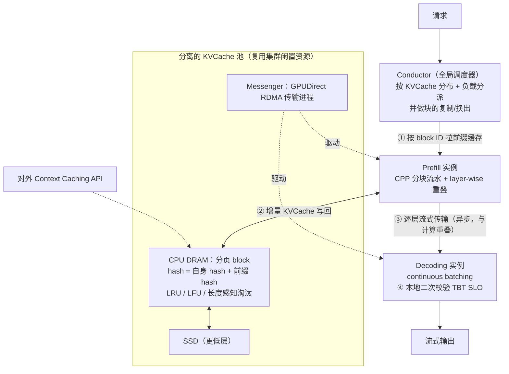

# Mooncake: A KVCache-centric Disaggregated Architecture for LLM Serving

> **一句话结论**：把 GPU 集群里闲置的 CPU、DRAM、SSD、RDMA 攒成一个**独立的分布式 KVCache 池**，让调度器围绕「KVCache 在哪里」来分派请求；再加上为**长上下文**设计的分块流水并行、以及为**长期过载**设计的预测式早拒——这是 Kimi 线上服务的真实架构，也是本仓库第一篇来自生产环境的论文。

---

## 1. 元信息

| 项目 | 内容 |
| --- | --- |
| 作者 / 机构 | Ruoyu Qin、Zheming Li、Weiran He 等 7 人 · **Moonshot AI / 清华大学** |
| 发表 | **FAST 2025**（arXiv:2407.00079v3） |
| 原文 | [PDF](paper.pdf) · [HTML](paper.html) · [arXiv](https://arxiv.org/abs/2407.00079) |
| 代码 / 数据 | [kvcache-ai/Mooncake](https://github.com/kvcache-ai/Mooncake)（含开源请求 trace） |
| 关键词 | KVCache 池化 · 分块流水并行（CPP）· layer-wise prefill · 预测式早拒 |
| 前置知识 | [KV Cache](../../../concepts/kv-cache.md)、[Prefix Caching](../../../concepts/prefix-caching.md)、[Prefill / Decode 分离](../../../concepts/prefill-decode-disaggregation.md)、[SLO 容量](../../../concepts/slo-capacity.md) |
| 实验条件 | **与 LLaMA2-70B 同架构的 dummy model**，8× A800-80GB / 节点，节点间 RDMA 最高 800 Gbps |

**这篇在本仓库的位置**：它是 [CacheRoute](../2026-cacheroute/README.md) 的**技术路线反面**。CacheRoute 的做法是「靠入口路由让请求回到持有该 prefix 的那台机器」，Mooncake 的做法是「把 KVCache 从机器里拿出来做成共享存储层，请求去哪台机器都能拉到」。两者解决同一个问题，假设完全相反，对照读收获最大。

---

## 2. 摘要速览（5 分钟版）

### 2.1 要解决的问题

作为 MaaS 提供商，Kimi 的优化问题是：**在满足 TTFT 与 TBT 两个延迟 SLO 的约束下，最大化整体有效吞吐**（直接决定收入）。

提升吞吐通常有两条路，但它们都与 SLO 冲突：

| 路径 | 与 SLO 的冲突 |
| --- | --- |
| 尽量复用 KVCache 以省算力 | 从**远端**取 KVCache 会拉长 TTFT |
| 尽量增大每批的 token 数以提升 MFU | 大 batch 会拉长 TBT |

在此之上还有两个 Kimi 特有的现实约束：

- **长上下文**。trace 里平均输入 **7,590 token**、平均输出 **182 token**。prefill 成本极度主导，单个 8 卡节点处理不过来。
- **长期过载**。GPU 供给增长远慢于请求量增长，**过载是常态而非异常**。论文明说：已有研究都假设所有请求都会被处理，这个假设在生产环境不成立。

### 2.2 核心方法

**架构**：不只分离 prefill / decoding 节点，还把 GPU 集群的 **CPU、DRAM、SSD、RDMA 资源攒成一个独立的 KVCache 池**——论文称之为「利用闲置资源实现零额外成本的 near-GPU prefix caching」。全局调度器叫 **Conductor**。

**请求的四步流程**：

1. **KVCache Reuse**：选中的 prefill 节点按 block ID 从远端 CPU 内存把前缀缓存拉进显存。
2. **Incremental Prefill**：用前缀缓存完成 prefill，新增的 KVCache 写回 CPU 内存。未命中 token 超过 `prefill_chunk`（通常 > 1000）时分块流水执行。
3. **KVCache Transfer**：由 **Messenger**（基于 GPUDirect RDMA 的独立进程）**逐层流式**传给 decoding 节点，与 prefill 计算重叠。
4. **Decoding**：KVCache 全部到达后加入 continuous batching。本地调度器**二次校验** TBT SLO，可能拒绝——此时 prefill 的开销被浪费。

**三项关键技术**：

| 技术 | 解决什么 |
| --- | --- |
| **Chunked Pipeline Parallelism（CPP）** | 长上下文 prefill 需要跨节点，但 TP 每层两次 RDMA all-reduce、SP 每层至少一次跨节点通信，都损害 MFU。CPP 只在流水段边界通信 |
| **Layer-wise Prefill** | KVCache 的加载与写回逐层异步、与计算重叠，使 prefill 的显存占用可以忽略，**调度时不必考虑 VRAM** |
| **预测式早拒** | 过载时提前拒绝，避免浪费 prefill；朴素早拒会造成负载反相震荡，用系统级预测修正 |

### 2.3 主要结果

| 场景 | 配置 | 结果 |
| --- | --- | --- |
| ArXiv Summarization（缓存率 ~0%） | Mooncake-[3P+1D] vs vLLM-[4M] | 吞吐 **+20%** |
| L-Eval（缓存率 > 80%） | 同上 | 吞吐 **+40%** |
| 模拟长上下文（16k–128k） | 同上 | 吞吐 **+50% ~ +525%** |
| **真实 trace 回放** | Mooncake-[10P+10D] vs vLLM-[20M] | 在满足 SLO 前提下多处理 **约 75%** 的请求 |
| 过载（2× 回放速度） | 8P+8D，23,000 请求 | 拒绝数 4183 → 3771（早拒）→ **3589**（预测式早拒） |

真实 trace 那一组的细节值得单独记：**两个系统的 TTFT 分布几乎相同、都接近 100% 达标**；差距全部来自 TBT——Mooncake 约 100% 达标，**vLLM 只有 57%**。

### 2.4 我的评价

值得读，但读法要调整——它更像一份**生产系统的设计报告**，而不是一篇假设驱动的研究论文。

它的价值有三处：

1. **它是本仓库第一篇有真实线上负载支撑的论文**，而且开源了 trace（23,608 条，含 timestamp / input_length / output_length / 重映射的 block hash）。论文称这是**第一个可用于真实前缀复用分析的开源数据集**。
2. **它诚实地报告了一个对自己不利的关键数字**：在 Kimi 的线上 trace 上，**即便假设存储容量和 TTFT SLO 都无限，KVCache 的理论可复用上限也只有 50%**，远低于开源基准上复现出来的结果。这一句话比论文里任何一个加速倍数都有信息量——它给整条 prefix caching 路线划了一条现实的天花板。
3. **overload-oriented scheduling 是一个此前没人系统处理过的问题**。已有工作都假设所有请求都会被处理；Mooncake 指出在真实 MaaS 里过载是常态，并揭示了一个反直觉现象——**朴素的早拒会造成 prefill 与 decoding 负载的反相震荡**。

需要保留的是：主结果里最大的那个数字（525%）来自模拟数据，且基线是一个被长上下文逼到**逐请求处理（batch size = 1）**的 vLLM。真实负载下的数字是 75%，公共数据集上是 20%–40%。

对照 [CacheRoute](../2026-cacheroute/README.md) 读最有价值：两篇论文对「KVCache 是有位置的状态」这个事实给出了相反的应对——一个把状态搬到共享层，一个把请求路由到状态所在处。

---

## 3. 细读

### 3.1 Introduction

论文把目标写得很直接：**最大化整体有效吞吐（直接影响收入），约束是各级 SLO（主要是 TTFT 与 TBT）**。

前提是充分利用 GPU 集群里的各类资源——论文主张把 DGX/HGX 这类高度集成的节点**解耦重组成若干专用资源池**。分离 prefill 与 decoding 服务器是其中一步，而 Mooncake 更进一步：**把 CPU、DRAM、SSD、RDMA 也组成一个分离的 KVCache 池**。

**核心判断**：

> 我们发现 **KVCache 的调度是 LLM serving 调度的中心**。

Conductor 的职责不止分派请求，还包括**预测 KVCache 块的未来使用并据此做换出与复制**：最热的块复制到多个节点以避免取数拥塞，最冷的块换出以降低占用成本。

论文还点出一个 prefill 侧的约束：**prefill 调度受限于该节点的 DRAM 空间**，尤其当大量内存被预留给全局 KVCache 池时。

**overload-oriented scheduling** 的引入写得很有说服力：

> 已有的 LLM serving 研究假设资源充足并聚焦于提升利用率。而当前 GPU/加速器供给有限，许多 MaaS 提供商面临严重的过载问题，尤其在高峰期。这类场景下的调度带来了已有工作未曾探索的独特挑战。

**一处必须记住的实验披露**（论文用方框单独框出）：

> 为保护专有信息并便于复现，本文所有实验结果均基于真实负载的回放 trace，但使用的是一个**与 LLaMA2-70B 架构相同的 dummy model**。trace 只包含请求到达时刻、输入 token 数、输出 token 数、重映射后的 block hash，不含任何真实用户内容。

### 3.2 Preliminary and Problem Definition

**两阶段的计算特征**（与 [DistServe](../2024-distserve/README.md) §2.1 一致，但给了更细的解释）：

- prefill 的注意力计算随输入长度**平方**增长、MLP 随长度**线性**增长，因此整体 prefill 时间随输入长度**超线性**增长。
- decode 每批每次只处理一个 token，受显存带宽约束，计算时间随 batch size **亚线性**增长。

**SLO 的定义方式**值得注意——它是**相对**的而非绝对的：

> $\text{TTFT}_{P90} = 4\times$ 表示 90% 的请求的 TTFT 不超过「同等条件下单请求无干扰运行」时的 4 倍。

端到端实验里取 $\text{TTFT}_{P90} = 10\times$、$\text{TBT}_{P90} = 5\times$。

**goodput 的定义与 [DistServe](../2024-distserve/README.md) 有一处关键差异**：

> 我们的方式不同之处在于，**只有完整执行完毕的请求才计入 goodput**。否则此前消耗/生成的所有 token 都不计数，对应资源被浪费。换句话说，如果一个请求无法在 SLO 内完成全部执行，就应当**尽早拒绝**。

> **批注**：这个定义上的小差别，直接推出了 §7 一整节的内容。DistServe 的 goodput 衡量「满足 SLO 的请求率」，隐含假设是「不满足就慢一点」；Mooncake 的定义把「中途放弃」的代价显式化了——一个跑到一半被拒的请求，它消耗的 prefill 算力是**纯亏损**。有了这个定义，「早拒」就从一个工程 trick 变成了目标函数直接推出的必然要求。

### 3.3 Overview of Mooncake's Disaggregated Architecture



**KVCache 池的存储组织**（Figure 3）：CPU 内存里以**分页 block** 形式存储，每个 block 附带一个哈希值，由**它自身的哈希与其前缀的哈希共同决定**——这是去重的关键。淘汰可用 LRU、LFU 或基于请求特征的算法。跨 CPU/GPU 的块传输由独立的 **Messenger** 组件（基于 GPUDirect RDMA）负责。

这个架构还带来一个产品能力：**对外提供 context caching API**，让用户主动提高 KVCache 复用率。

**四步工作流**的细节：

| 步骤 | 要点 |
| --- | --- |
| 1) KVCache Reuse | 选择要平衡三个目标：**尽量多复用、平衡各 prefill 节点负载、保证 TTFT SLO** |
| 2) Incremental Prefill | 未缓存 token 超过 `prefill_chunk`（选取标准是打满 GPU 算力，通常 > 1000）时分块流水 |
| 3) KVCache Transfer | 异步执行、与步骤 2 重叠，**按模型层逐层流式**送到目标 decoding 节点的 CPU 内存 |
| 4) Decoding | Conductor 已按负载预选 decoding 节点，但**本地调度器会二次校验 TBT SLO**，因为 prefill 期间预期负载可能已变。二次校验可能导致拒绝，**此时 prefill 开销被浪费** |

> **批注**：第 4 步那句「二次校验可能导致拒绝，此时 prefill 开销被浪费」是 §7 的直接引子。分离架构把一个请求的处理拆成了两个时间点相隔的决策，而两次决策之间系统状态会变——这是分离引入的**新问题**，colocate 系统里不存在。

### 3.4 Sampled Real-world Request Trace

论文开源了一份 1 小时的线上请求采样，为保留请求间的缓存关系，优先采集了同一 session 内的请求。

- **23,608 条**，字段：`timestamp`、`input_length`、`output_length`、`hash_ids`（重映射后的 block hash）。
- 论文称这是**已知的第一个可用于真实复用分析的开源数据集**。

**统计特征**：平均输入 **7,590 token**、平均输出 **182 token**。论文另称「平均输入输出比约为 720」——这个数字与前两项对不上（$7590/182 \approx 41.7$），见 [§6.2](#62-我的质疑)。

**Table 1（不同淘汰策略与容量下的命中率，假设单一全局缓存池）**：

| 容量（块） | Inf | 100000 | 50000 | 30000 | 10000 | 1000 |
| --- | --- | --- | --- | --- | --- | --- |
| **LRUCache** | 0.51 | 0.51 | 0.50 | 0.48 | 0.40 | 0.30 |
| LFUCache | 0.51 | 0.51 | 0.49 | 0.43 | 0.35 | 0.30 |
| LengthAwareCache | 0.51 | 0.50 | 0.48 | 0.42 | 0.35 | 0.30 |

三条读法：

1. 容量从 1,000 提到 50,000，命中率从 30% 升到 50%；**再往上几乎没有提升**。
2. **LRU 在这份负载上表现最好**，论文归因于请求利用的时间邻近性。
3. 论文特别加粗提醒：**这不应被解读为「更大的缓存没必要」**，因为样本 trace 只是真实负载的一个子集，实际场景所需容量应按比例放大。

**热度极不均衡**：**超过 50% 的缓存块从未被使用**，而某些块被访问数万次。因此**复制热块是避免传输拥塞的必需手段**。

### 3.5 Implementation of the Prefill Pool

论文先摆出反方观点：**有了 chunked prefill，还需要单独的 prefill 池吗？** chunked prefill 有两个明显好处——(1) 不分离则所有节点等价，调度更简单；(2) 把 chunked prefill 内联进 decoding batch 能提高该批的计算强度，MFU 更好。

Mooncake 仍然选择保持分离，理由是两条：**(1) prefill 节点需要不同的跨节点并行设置来处理长上下文；(2) 存在一个节省 VRAM 的独特机会。** 折中做法是：**只有当一个请求的 prefill 能够不分块、且不损害 TBT SLO 时，才把它内联进 decoding batch**。

#### 5.1 多节点 Prefill：为什么是 CPP

上下文长度从 8k 涨到 128K 乃至 1M，长请求的输入 token 可能是输出的 10–100 倍，**优化 TTFT 至关重要**，需要用超过一个 8 卡节点来并行处理。三种方案的对比：

| 方案 | 跨节点通信 | 问题 |
| --- | --- | --- |
| **TP 跨节点** | 每层 **两次** RDMA all-reduce | MFU 显著下降 |
| **SP**（Ring/Striped Attention） | 每层**至少一次** | MFU 仍差于单节点 TP；弹性 SP 需要预先建立全局通信组，且与缓存复用率、SLO 违约等指标交织，Conductor 设计复杂化；仍与 KVCache 传输**争抢网络资源** |
| **CPP**（Mooncake） | 只在**流水段边界** | — |

**CPP 的做法**：把 prefill 集群里每 X 个节点编成一个流水化的 prefill 节点组；每个请求的输入 token 被切成不超过 `prefill_chunk` 的块，**同一请求的不同块由不同节点同时处理**。

两个好处：

1. 跨节点通信只发生在流水段边界，**易于与计算重叠** → MFU 更好，且与 KVCache 传输的网络竞争更少；
2. **同时适配长短上下文**，短上下文没有明显额外开销，也不需要频繁动态调整节点划分。

论文声称这是流水式加速**首次应用于推理阶段**（此前只在训练系统里探索过）。

#### 5.2 Layer-wise Prefill：省的是 VRAM

论文给了一个简洁的成本模型：若一个请求的 KVCache 大小为 $S$、处理时间为 $T$，则其**占用成本为 $S \times T$**。把请求切块并内联进 chunked prefill 会**增大 $T$**，从而增大占用成本。

由于 prefill 是逐层进行且计算受限的，**KVCache 的传输与落盘可以与计算重叠**。具体做法：

- 每层注意力计算开始前，等待该层 KVCache 的异步加载完成，并触发**下一层**的异步加载；
- 该层注意力算完后，启动该层 KVCache 的**异步存储**；
- 所有层算完后，等待全部异步存储完成。

**效果**：prefill 实例的执行时间大致等于「KVCache 加载时间」或「标准 prefill 时间」中的较大者（取决于前缀缓存占输入长度的比例）。

**这个重叠带来的真正好处**：

> 使我们在 prefill 调度中**可以完全无视可用 VRAM 大小**，只要它能装下单个请求即可。prefill 节点的调度只需考虑 **KVCache 分布**与**可用 DRAM 大小**。

论文还提了一个未来方向：空出来的 VRAM 可以用于 batch API 这类无严格 TBT 要求的请求——甚至可以把它们的 decoding 阶段也内联进 prefill 处理以提升 MFU。

### 3.6 KVCache-centric Scheduling

#### 6.1 Prefill 全局调度

已有研究通常用「已分配请求数」衡量实例负载。Mooncake 的 prefill 实例选择还要考虑**前缀缓存命中长度**与**可复用 KVCache 块的分布**。

**Algorithm 1 的流程**：

1. 把请求的输入 token 切块，为每块计算哈希——**该块 token 的哈希与前一块哈希拼接后再哈希**（因此哈希天然编码了前缀）。
2. 逐块与每个 prefill 实例的缓存键比对，得到该实例上的 `prefix_len`。
3. 用**离线测试数据拟合的预测模型**，根据请求长度与 `prefix_len` 估计该实例上的 prefill 执行时间。论文说：得益于 Transformer 规整的计算模式，只要离线数据足够，**预测误差界很小**。
4. 排队时间 = 该实例队列中所有请求的 prefill 时间之和。
5. 执行时间 + 排队时间 = 该实例上的预计 TTFT。**把请求分配给 TTFT 最短的实例**，并更新该实例的缓存与队列时间。
6. **若 SLO 无法达成，直接返回 HTTP 429 Too Many Requests。**

论文点出实现中最难的一处：**传输时间难以预测**，因为它不仅取决于数据量，还取决于当前网络状态、尤其是发送节点是否拥塞。这直接引出下一节的热块复制。

#### 6.2 缓存负载均衡

每台 prefill 机器管理自己的一组本地前缀缓存，而使用频率差异巨大——系统提示几乎被每个请求访问，而某份本地长文档的缓存可能只有一个用户会用。

**为什么不用预测**：稻草人方案是收集每个块的全局使用情况、用预测模型预测未来使用、据此调度。但**负载高度动态**，对一个用户量快速增长的 MaaS 提供商来说，准确预测未来使用是不可能的。因此改用**基于启发式的自动热点迁移**。

两条规则：

1. **迁移**：当请求因负载过高而没有被送到前缀最长的实例时，若「估计增加的 prefill 时间 < 传输时间」，Conductor 就把缓存位置连同请求转发给另一个实例；该实例**主动**从持有者拉取 KVCache 并**存到本地**。
2. **就地重算**：若「最佳远端前缀匹配长度 ≤ 本地可复用前缀 × 阈值」，则**宁可直接计算输入 token**。（脚注承认：**该阈值目前是手工调整的**，未来可由算法自适应调整。）

这两条规则的副作用正是想要的：**热点缓存被自动复制、分布到更多机器上**。

**验证实验**：8 个 prefill + 8 个 decoding 实例（用夜间空闲机器搭建），回放 23,000 条真实请求，对比随机调度、负载均衡调度、cache-aware 调度、以及考虑缓存负载均衡的 KVCache-centric 调度。指标是平均 TTFT 与 TTFT SLO 达成率。结论：cache-aware 与 cache load balancing 都显著降低 TTFT，**KVCache-centric 调度在两个指标上都优于随机与纯负载均衡**。

> **批注**：这一节与 [CacheRoute](../2026-cacheroute/README.md) 是同一个问题的两种解法，而且两者对「能否预测」的判断相反。Mooncake 说「负载高度动态，无法准确预测未来使用，所以用启发式」；CacheRoute 说「用测得的每 key 速率做周期性规划」。CacheRoute 的做法之所以可行，是因为它规划的是**速率分布**（相对稳定）而不是**单个块的未来使用**（高度动态）。这是一个关于「该预测什么粒度的量」的重要区别。

### 3.7 Overload-oriented Scheduling

#### 7.1 过载下的调度

**如何定义「系统负载」**是关键。在传统耦合系统里，由于 prefill 与 decoding 相互干扰，TTFT/TBT 难以预测，因此负载通常只能简单地用「在处理的请求数 / 系统最大容量」来衡量。

Mooncake 因为分离，可以**直接用 SLO 满足度作为负载度量**：定义 $l_{ttft}$、$l_{tbt}$ 为两个 SLO 约束，把实例上预测的最大 TTFT / TBT 与之比较即得负载。

#### 7.2 Early Rejection

问题：prefill 与 decoding 的调度之间存在**时间差**。如果一个请求在 prefill 完成后因 decoding 实例高负载而被拒，**prefill 阶段消耗的算力就浪费了**。

对策很自然：**把对 decoding 实例的负载评估提前到 prefill 开始之前**。请求到达时，Conductor 根据 prefill 池与 decoding 池中**较大的那个负载**来决定是否接受。

#### 7.3 早拒引发的负载震荡

这一节是全文最有意思的发现。

**现象**（Figure 9，20 台机器、20 分钟的真实观测）：采用早拒后，prefill 与 decoding 机器之间出现**显著的反相震荡**（anti-phase fluctuations）。prefill 机器越少、prefill 阶段越长，现象越明显。

**根因**：**预测 decoding 负载与其实际执行之间存在时间差**。基于「当前」decoding 负载做调度，本质上是滞后的。

**四阶段循环**：

| 阶段 | 发生了什么 |
| --- | --- |
| 1 | 两侧负载都低 → Conductor 大量接受请求，直到 prefill 打满 |
| 2 | 这批请求进入 decoding → decoding 负载飙高 → Conductor 开始拒绝 → **prefill 负载降低** |
| 3 | 没有新请求进入 decoding → decoding 负载下降 → Conductor 又开始大量接受 → prefill 再次打满 |
| 4 | decoding 负载再次升高 → 又开始拒绝 → prefill 负载再次降低 |

结果是两侧负载严重震荡，**集群资源利用率很差**。

#### 7.4 预测式早拒

修法：**预测「这批请求 prefill 完成之后」的 decoding 负载**，而不是看当前负载。核心是如何做这个预测，论文给了两条路：

| 路线 | 做法 | 评价 |
| --- | --- | --- |
| **Request level** | 预测每个请求的输出长度 | 成本高或准确率低，**过载条件下尤其困难**（资源稀缺时反而更需要准确预测） |
| **System level** | 不预测单个请求，只估计一段时间后的**整体批数量或 TBT 状态** | 持续进行、精度要求低，**更适合过载场景** |

Mooncake 目前用的是 **system-level**，做法很朴素：假设每个请求的 decoding 阶段耗时**统一为 $t_d$**。对给定时刻 $t$：

1. 把 $t$ 时刻前能被 prefill 实例完成的请求加入 decoding 实例；
2. 把执行时间超过 $t_d$、在 $t$ 之前会完成的请求移出；
3. 计算所有 decoding 实例的平均 TBT 与 $l_{tbt}$ 之比，作为预测负载。

request-level 预测留作未来工作。

### 3.8 Evaluation

**测试床**：每节点 8× NVIDIA A800-SXM4-80GB（NVLINK 互连），节点间 RDMA 网卡支持最高 **800 Gbps**。每个节点按启动参数部署为一个 prefill 实例或一个 decoding 实例。

**Table 2（数据集）**：

| 数据集 | 平均输入 | 平均输出 | 缓存率 | 到达模式 |
| --- | --- | --- | --- | --- |
| ArXiv Summarization | 8,088 | 229 | **~0%** | Poisson |
| L-Eval | 19,019 | 72 | **> 80%** | Poisson |
| Simulated Data | 16k / 32k / 64k / 128k | 512 | 50% | Poisson |
| **Real Data** | 7,955 | 194 | ~50% | **按时间戳回放** |

**指标**：P90 的 TTFT 与 TBT。阈值取「最低观测 RPS 下的值」的 10 倍与 5 倍，超过即视为违反 SLO、对应资源视为浪费。所有值对阈值归一化，基线为 1.0。

**基线**：vLLM。

#### 8.1.1 公共数据集

配置：vLLM-[4M] vs Mooncake-[3P+1D] 与 Mooncake-[2P+2D]。

| 数据集 | Mooncake-[3P+1D] 相对 vLLM-[4M] |
| --- | --- |
| ArXiv Summarization | 吞吐 **+20%** |
| L-Eval | 吞吐 **+40%**（前缀缓存显著减少 prefill 时间） |

一个负面观察：**Mooncake-[2P+2D] 虽然 TBT 更低，但 TTFT 指标不如 [3P+1D] 甚至不如 vLLM-[4M]**——原因是 prefill 与 decoding 实例之间的负载失衡。论文的应对是「真实集群中两类实例的需求在一段时期内相对稳定，因此比例可以预设」，并把更灵活的部署与转换列为未来工作。

#### 8.1.2 模拟数据

**关键的实验设定**：长上下文请求严重扰乱 vLLM 的 decoding 阶段，**为此 vLLM 改为逐个处理请求而非批处理**。

在此条件下，Mooncake 吞吐提升 **+50% ~ +525%**，且由于两阶段分离，**从未突破 TBT SLO**。

#### 8.1.3 真实负载

配置：Mooncake-[10P+10D] vs vLLM-[20M]，回放真实 trace。TTFT 上限 30 秒，TBT 上限 0.1 秒/token。

| 指标 | Mooncake-[10P+10D] | vLLM-[20M] |
| --- | --- | --- |
| TTFT SLO 达成 | ~100% | ~100%（**两者分布几乎相同**） |
| TBT SLO 达成 | ~100% | **57%**（部分请求 TBT 极高） |

结论：在满足 SLO 的前提下，Mooncake 可多处理**约 75%** 的请求。

#### 8.2 过载场景

配置：8 prefill + 8 decoding，23,000 条真实 trace，**回放速度提到 2×** 以制造过载。

**Table 3（被拒请求数）**：

| 策略 | 被拒请求数 |
| --- | --- |
| Baseline（两阶段开始前按负载拒绝） | 4,183 |
| Early Rejection | 3,771 |
| **Early Rejection based on Prediction** | **3,589** |

### 3.9 Related Work

论文对自己在 PD 分离这条线上的位置写得很坦率：

> **Splitwise** 的 arXiv 发表时 Mooncake 尚处于早期开发阶段，它进一步推动了我们的进展。许多并行工作印证了我们的发现，包括 **DistServe**（为每个阶段优化资源分配与并行策略以最大化 GPU goodput）与 **TetriInfer**。

在 prefix caching 这条线上提到了 Prompt Cache 与 **SGLang RadixAttention**。并指出与并行工作 **AttentionStore**（分层 KV 缓存系统）共享许多设计选择，区别在于 Mooncake **不是一个独立的缓存服务**，它同时包含存储机制与 cache-aware 调度策略。

**最有价值的一段自我披露**：

> 我们线上 trace 中的**真实可复用性远小于开源基准复现出来的结果**。理论上，即便假设存储容量与 TTFT SLO 都无限，当前负载下也**最多只有 50% 的 KVCache 可以被复用**。不过这个可复用性高度依赖应用场景，在某些场景下可以高达 90%，例如我们的 chat-to-paper 服务。

### 3.10 Future Work

论文列出的方向里有两条值得记：

1. **异构加速器**。当前旗舰加速器在算力、带宽、容量之间取平衡，因此在任何单项上都不是最优。**只看每美元带宽或每瓦带宽，GDDR 甚至 LPDDR 方案可以比旗舰加速器好一个数量级**。这对降低 decoding 阶段的访存密集操作成本很理想。
2. **把注意力算子从其他线性算子中分离出来**。decoding 阶段注意力算子的算术强度只正比于「注意力头数 / KV 头数」，**这个强度无法通过增大 batch size 提升**，因此比其他算子更受访存约束。论文认为进一步分离它有很大潜力，并提到 DeepSeek-v2 的 MLA 算子从另一个角度直接提高了算术强度。

另外提到 KVCache 压缩这条正交路线对 Mooncake 的两点好处：增大 batch 提升利用率、提高命中率降低 prefill 成本。

---

## 4. 关键问题解析

### Q1: 「KVCache-centric」具体指什么？和 DistServe 的 PD 分离差在哪？

**A**: 两者都做了 prefill / decoding 分离，但**分离的对象多了一层**，而且**调度的中心变了**。

| | [DistServe](../2024-distserve/README.md) | Mooncake |
| --- | --- | --- |
| 分离了什么 | prefill 实例 / decoding 实例 | 同上，**再加一个独立的 KVCache 池**（CPU + DRAM + SSD + RDMA） |
| KV 怎么流转 | prefill 实例 → decoding 实例，**点对点** | prefill 实例 ↔ **共享池** ↔ decoding 实例 |
| 调度依据 | 队列长度（派给最短队列的 prefill 实例） | **KVCache 分布 + 前缀命中长度 + 负载**，三者一起算预计 TTFT |
| 放置的对象 | **实例**（离线搜索并行策略与实例数） | **请求**（在线按缓存分布分派）+ **缓存块**（复制/换出） |
| 跨请求复用 | 未涉及 | **核心机制** |

「KVCache-centric」的实质是：**KVCache 从「一个请求的中间产物」变成了「系统的一等资源」**——它有自己的存储层、自己的淘汰策略、自己的复制与换出决策，而请求的调度反过来要围绕它的分布来做。

这也解释了两篇论文的关注点差异。DistServe 关心的是「怎么给两类实例配资源和并行度」，因为它假设每个 prefill 都要从头算；Mooncake 关心的是「请求该去哪台机器才能命中缓存、以及热块该复制到哪里」，因为在它的负载上（平均输入 7,590 token）**prefill 是绝对的成本大头，而其中约一半理论上可以省掉**。

### Q2: 长上下文 prefill 为什么用 CPP 而不是 TP 或 SP？

**A**: 三者的差别在**每层需要多少跨节点通信**，而跨节点带宽既影响 MFU、又要和 KVCache 传输抢资源。

| 方案 | 每层跨节点通信 | 后果 |
| --- | --- | --- |
| **TP 跨节点** | **两次** RDMA all-reduce | MFU 显著下降 |
| **SP**（Ring / Striped Attention） | **至少一次** | MFU 仍差于单节点 TP |
| **CPP** | **零**（只在流水段边界通信） | 通信可与计算重叠 |

**SP 还有三个额外问题**（论文列得很具体）：

1. 理想部署要把 prefill 节点分成「纯 TP 组」和「SP 组」，只有必要时才把请求发给 SP 组——这带来**两组节点数量如何动态调整**的问题，静态划分会导致利用率低。
2. 弹性 SP 需要**预先建立全局通信组**，并且在调整时要同时考虑缓存复用率与 SLO 违约，**使 Conductor 的设计复杂化**。对需要频繁在线扩缩容的生产环境不友好。
3. SP 仍需频繁跨节点通信，**与 KVCache 传输争抢网络资源**——而 KVCache 传输正是 Mooncake 架构的命脉。

**CPP 的做法与代价**：把每 X 个节点编成一个流水组，同一请求的不同 chunk 由不同节点同时处理。它利用的是 decoder-only Transformer 的自回归性质——chunk $i$ 只依赖 chunk $< i$ 的 KV，因此可以像训练里的流水并行那样排布。

代价是**流水气泡**：与训练中的流水并行一样，段之间的负载不均会产生空转。论文没有量化这一项，只说「同时适配长短上下文，短上下文没有明显额外开销」。

### Q3: layer-wise prefill 省下的到底是什么？为什么它能让调度「无视 VRAM」？

**A**: 省的是 **KVCache 在显存里的占用时间**，而不是占用体积。

论文的成本模型是 $S \times T$——KVCache 大小 × 处理时间。layer-wise prefill 不改变 $S$，它做的是**把 KVCache 的加载与写回从「计算前后的串行步骤」变成「与计算重叠的异步操作」**，从而压缩 $T$：

```
朴素：  [加载全部 KV] → [逐层计算] → [写回全部 KV]
逐层：  层0计算 ‖ 层1加载 ‖ 层-1写回
        层1计算 ‖ 层2加载 ‖ 层0写回
        ...
```

**效果**：prefill 实例的执行时间 ≈ max(KVCache 加载时间, 标准 prefill 时间)，取决于前缀缓存占输入长度的比例。

**为什么能「无视 VRAM」**：由于每一层的 KV 用完即可异步写回、下一层的 KV 提前加载，**任意时刻显存里只需要驻留少数几层的 KVCache**，而不是整个请求的全部层。因此只要显存能装下**单个请求**（的少数几层），prefill 调度就不必把 VRAM 作为约束——

> prefill 节点的调度只需考虑 **KVCache 分布**与**可用 DRAM 大小**。

这是一个很干净的**约束消除**：原本调度要同时考虑「缓存在哪、负载多少、显存够不够」三个维度，现在第三个被工程手段消掉了。

**顺带解释了为什么不用 chunked prefill**：把请求切块并内联进 decoding batch 会**增大 $T$**（要等同批的 decode 任务），从而增大 $S \times T$。这与 layer-wise prefill 的目标直接冲突。

### Q4: cache-aware 调度怎么在「命中率」和「负载」之间取舍？热点迁移怎么触发？

**A**: 两者被**统一到同一个标量**上——预计 TTFT。

**§6.1 的调度公式**（概念上）：

$$\text{TTFT}_{\text{实例 } i} = \underbrace{f(\text{请求长度},\ \text{prefix\_len}_i)}_{\text{执行时间，离线拟合的预测模型}} + \underbrace{\sum_{r \in \text{queue}_i} \text{prefill\_time}(r)}_{\text{排队时间}}$$

**把请求分配给 TTFT 最小的实例**。前缀命中长（执行时间短）与负载轻（排队时间短）在这个式子里自动权衡——命中长但排队久的实例可能输给命中短但空闲的实例。若所有实例都无法满足 SLO，直接返回 **HTTP 429**。

论文说执行时间的预测**误差界很小**，理由是 Transformer 的计算模式规整，只要离线数据足够。**难点在传输时间**——它取决于当前网络状态，尤其是发送节点是否拥塞。

**热点迁移的两条触发规则**（§6.2）：

1. **迁移**：请求因负载被派到非最优实例时，若「估计增加的 prefill 时间 < 传输时间」，就把缓存位置一并转发过去，该实例**主动拉取并本地留存**。
2. **就地重算**：若「最佳远端前缀匹配长度 ≤ 本地可复用前缀 × 阈值」，**宁可直接算**。

这两条规则的巧妙之处在于：**热点复制是副产品而不是显式决策**。一个被很多请求需要的块，会因为规则 1 被反复拉取到不同实例上，自然就复制开了；而冷块不会。这避免了「预测每个块的未来使用」这个论文认为不可行的问题。

**代价**：规则 2 的阈值**目前是手工调整的**（论文脚注承认）。这是整个缓存负载均衡机制的关键旋钮，却没有自适应方案，也没有敏感性分析。

### Q5: 为什么早拒会造成负载反相震荡？预测式早拒怎么修的？

**A**: 因为**控制信号是滞后的**——这是一个典型的控制系统失稳问题。

**震荡的产生**：Conductor 用「当前」decoding 负载来决定是否接受请求，但被接受的请求要经过整个 prefill 阶段之后才会真正加到 decoding 上。这个**时间差**构成了反馈回路里的延迟：

```
接受请求 --(prefill 耗时 τ)--> decoding 负载上升 --> 开始拒绝 --> prefill 空闲
   ↑                                                                    |
   +---------------- (τ 之后 decoding 负载下降) <----------------------+
```

带延迟的负反馈回路，当延迟与系统时间常数可比时会自激振荡。论文观察到的正是这个：prefill 与 decoding 负载**反相**，且「**prefill 机器越少、prefill 阶段越长，现象越明显**」——两者都是在增大回路延迟相对于系统容量的比例。

**修法**：把控制信号从「当前 decoding 负载」换成「**这批请求 prefill 完成之后的 decoding 负载**」，即在反馈回路里加入一个**前馈预测**来补偿延迟。

**预测怎么做**：论文明确选了**系统级**而非请求级：

| | 请求级 | 系统级 |
| --- | --- | --- |
| 预测什么 | 每个请求的输出长度 | 一段时间后的整体批数量 / TBT 状态 |
| 难度 | 高成本或低准确率，**过载时尤其难** | 持续进行、**精度要求低** |
| Mooncake 是否采用 | 否（未来工作） | **是** |

系统级的具体算法很朴素：**假设每个请求的 decoding 耗时统一为 $t_d$**，在时刻 $t$ 上做一次「加入将完成 prefill 的请求、移出已跑满 $t_d$ 的请求」的模拟，再算平均 TBT 与 $l_{tbt}$ 之比。

**效果**：被拒请求数 3,771 → 3,589，改善 **4.8%**。相对 baseline（4,183）总共改善 **14.2%**。

> 这是一个「问题分析比解法更有价值」的典型例子——反相震荡的发现和归因很有洞察力，而解法（假设统一 $t_d$）相当粗糙，收益也有限。

### Q6: Mooncake 的 goodput 定义与 DistServe 有什么不同？为什么这个差别重要？

**A**: 差在**「部分完成」怎么算**。

| | [DistServe](../2024-distserve/README.md) | Mooncake |
| --- | --- | --- |
| 定义 | 满足 SLO 达成率目标的最大请求率 / GPU | 同上，但**只有完整执行完毕的请求才计入** |
| 中途被拒的请求 | 未显式讨论 | **此前消耗/生成的所有 token 都不计数，资源视为浪费** |

这个差别看起来微小，但它**直接推出了 §7 一整节**。

在 Mooncake 的定义下，「一个请求跑完 prefill 后被 decoding 拒绝」是一个**纯亏损事件**——消耗了算力、产出为零。于是目标函数自动给出一条要求：

> 如果一个请求无法在 SLO 内完成全部执行，就应当**尽早拒绝**。

「早拒」因此不是一个工程 trick，而是目标函数的直接推论。而 DistServe 的定义里没有这一项，所以它的论文里也没有这一节。

**为什么 Mooncake 需要这个定义而 DistServe 不需要**：因为两者面对的现实不同。DistServe 研究的是「资源充足时如何配置得更好」；Mooncake 面对的是「**过载是常态**，GPU 供给增长远慢于请求增长」。论文原话：

> 已有的 LLM serving 研究假设资源充足并聚焦于提升利用率……这类场景下的调度带来了已有工作未曾探索的独特挑战。

**一条可迁移的判断**：**指标定义应当反映系统真实的失败模式**。当「做一半然后放弃」是常见事件时，指标必须把这部分损耗算进去，否则优化会朝错误方向走。

### Q7: 「最多只有 50% 可复用」这句话意味着什么？

**A**: 这是全文最有信息量的一句，它给整条 prefix caching 路线划了一条现实天花板。

论文原话（§9）：

> 理论上，即便假设**存储容量与 TTFT SLO 都无限**，当前负载下也最多只有 **50%** 的 KVCache 可以被复用。

三个要点：

1. **这是理论上界，不是实测命中率**。它已经排除了容量不足和延迟约束这两个现实限制。也就是说，任何缓存策略、任何路由算法，在 Kimi 当前的负载上都不可能超过这个数。
2. **它与 §4.2 的 Table 1 一致**：容量给到 Inf 时，三种策略的命中率都是 **0.51**。两处数字互相印证。
3. **它高度依赖场景**：论文说在 chat-to-paper 服务（papers.cool）这类场景下可以高达 **90%**。

**为什么这句话重要**：

- 它解释了为什么 Mooncake 在**缓存率 ~0% 的 ArXiv Summarization** 上只有 +20%，而在**缓存率 > 80% 的 L-Eval** 上有 +40%。收益与可复用份额直接成正比。
- 它与 [CacheRoute](../2026-cacheroute/README.md) 的发现是同一件事的两个侧面。CacheRoute 报告可复用的 key 专属前缀只占 prompt 的 **15%**，且在 32B 聚合负载 A 上亲和性只能把命中率从 1.1% 提到 11.8%、容量反而掉到 $0.5$–$0.67\times$。**两篇来自不同公司的生产系统论文，都在提醒同一件事：真实负载的可复用份额远低于开源基准。**
- 它也说明**论文诚实**。这是一个明显对自己不利的数字，而且论文特意点出「远小于开源基准复现出来的结果」。

**工程推论**：在决定投入做 prefix caching 之前，先在自己的负载上测这个上界。方法很直接——用无限容量的模拟缓存跑一遍 trace，看命中率收敛到多少。

### Q8: 全景——vLLM / SGLang / DistServe / Mooncake / CacheRoute 五篇的关系

**A**: 五篇切的是五个不同层面，但 Mooncake 与 CacheRoute 在同一层面上**给出了相反的答案**。

| 论文 | 层面 | 对「KV 是有位置的状态」的应对 |
| --- | --- | --- |
| [vLLM](../2023-vllm-pagedattention/README.md) | 单实例显存管理 | 不涉及（KV 是请求私有资源，用完释放） |
| [SGLang](../2024-sglang-radixattention/README.md) | 单实例跨请求复用 | 留在本地，用基数树索引 |
| [DistServe](../2024-distserve/README.md) | 实例划分与放置 | 点对点从 prefill 传到 decode |
| **Mooncake** | **集群存储层** | **把 KV 搬出去做成共享池，请求去哪都能拉到** |
| [CacheRoute](../2026-cacheroute/README.md) | **集群入口路由** | **把请求路由到 KV 所在的机器** |

**Mooncake 与 CacheRoute 的正面对比**：

| | Mooncake | CacheRoute |
| --- | --- | --- |
| 基本假设 | KV 可以低成本地跨机移动（依赖 RDMA / 800 Gbps） | KV 移动昂贵，应当让请求去找它 |
| 手段 | 共享 KVCache 池 + Messenger（GPUDirect RDMA） | 周期性路由规划（准入 + LPT 放置） |
| 调度时机 | **每请求在线**（Conductor 算各实例预计 TTFT） | **每控制周期一次**（周期内路由表固定） |
| 对「预测」的态度 | 认为块级未来使用**无法预测**，用启发式热点迁移 | 用**每 key 速率**做规划；同时证明解析式缓存驻留预测会失败 |
| 硬件前提 | 需要高速 RDMA 网络 | 无特殊要求 |

**两者其实不互斥**：一个有共享 KVCache 池的系统，仍然可以用入口路由来减少跨机拉取量。CacheRoute §7 也提到 Mooncake 这类系统「仍然可以使用一个入口计划」。真正的分歧在于**在什么硬件前提下，哪一边更划算**——高速 RDMA 普及时 Mooncake 的路线成本更低，否则 CacheRoute 的路线更稳。

---

## 5. 可迁移的知识点

- [KVCache 池化与分层存储](../../../concepts/disaggregated-kv-store.md) —— 本文把 KVCache 从实例私有资源提升为集群级共享存储层，并给出块哈希去重、热点复制、分层换出的完整设计。
- [Prefix Caching](../../../concepts/prefix-caching.md) —— 本文给出了生产环境的可复用上界（约 50%）与缓存策略对比（LRU 在其负载上最优）。
- [Prefill / Decode 分离](../../../concepts/prefill-decode-disaggregation.md) —— 本文补充了分离架构在长上下文（CPP）与过载（早拒震荡）两个方向上的实践问题。
- [缓存亲和性与负载均衡的取舍](../../../concepts/cache-affinity-vs-load-balance.md) —— 本文把两者统一到「预计 TTFT」这一个标量上，并用启发式热点迁移替代了不可行的使用量预测。

---

## 6. 批判与开放问题

### 6.1 局限性

**作者自己承认的**：

- **所有实验用的是与 LLaMA2-70B 同架构的 dummy model**，trace 只含时间戳与长度信息。
- Mooncake-[2P+2D] 的 TTFT 不如 [3P+1D]，原因是两类实例负载失衡；**动态调整两类实例比例**列为未来工作。
- 热点迁移的**阈值目前手工调整**。
- 系统级负载预测**假设每个请求 decoding 耗时统一为 $t_d$**；request-level 预测留作未来工作。
- 线上真实可复用率**理论上界只有约 50%**。
- 传输时间难以预测（依赖网络拥塞状态）。

**论文没提但存在的**：

- **Conductor 是单点全局调度器，其可扩展性未评估**。它要为每个请求在**所有** prefill 实例上做前缀匹配、估算 TTFT。论文说「TTFT 是并行计算的，处理时间相对推理时间可忽略」，但没有给出实例数增长时的扩展性数据。10 个实例可以，1000 个实例呢？
- **CPP 的流水气泡未量化**。CPP 从训练里借来的流水并行天然有气泡问题，尤其在 chunk 长度不均时。论文只说「短上下文没有明显额外开销」，没有给出气泡占比。
- **没有报告 KVCache 池本身的容量规划方法**。§4.2 的 Table 1 显示容量从 1,000 到 50,000 块有明显收益、再往上没有，但论文同时提醒这只是子集，实际所需容量要按比例放大——**没有给出这个比例怎么算**。
- **SSD 层几乎没有实验数据**。架构图里 SSD 是 KVCache 池的一部分，但全文没有关于 SSD 层命中率、延迟、或它对 TTFT 影响的任何测量。

### 6.2 我的质疑

- **原文数字自相矛盾**。§4.2 报告平均输入 7,590 token、平均输出 182 token，紧接着说「average input-output ratio is approximately **720**」。而 $7590 / 182 \approx 41.7$。这两个数字无法调和，`720` 要么是笔误（可能是 `72.0`？但仍对不上），要么指的是别的量而未说明。引用输入输出比时应回避这个数字，直接用两个均值。
- **525% 这个头条数字的基线是被逼到 batch size = 1 的 vLLM。** §8.1.2 明说：长上下文请求严重扰乱 vLLM 的 decoding，「**为此 vLLM 改为逐个处理请求而非批处理**」。也就是说这个对比是「批处理的 Mooncake vs 单请求处理的 vLLM」。vLLM 失去批处理等于失去它最主要的吞吐来源。摘要把 525% 放在最前面，而公共数据集上的真实数字是 **+20% / +40%**，真实负载上是 **+75%**。三者相差一个量级，摘要选了最大的那个。
- **真实负载下的 75% 全部来自 TBT，而非「更快」。** §8.1.3 明确说两个系统的 **TTFT 分布几乎相同、都接近 100% 达标**，差距在 TBT（Mooncake ~100% vs vLLM 57%）。准确的表述是「Mooncake 在同等资源下能保住 TBT SLO，而 vLLM 会让 43% 的请求违约」，而不是「Mooncake 快 75%」。这个区别对读者判断「我该不该上这套架构」很重要——如果你的应用不在乎 TBT，收益接近于零。
- **overload 一整节的最终收益是 14%，且是在人为 2× 过载下测的。** §7 用四个小节讲早拒与负载震荡，分析质量很高；但 Table 3 的结果是 4,183 → 3,771 → 3,589。预测式早拒相对朴素早拒只多救回 182 个请求（4.8%）。考虑到预测模型假设「每个请求 decoding 耗时统一」这样粗的近似，这个收益量级是合理的，但与论述篇幅不成比例。而且 2× 回放速度是人为构造的过载强度，真实峰值是否如此未说明。
- **「首次在推理阶段应用流水式加速」这个声明需要限定。** 流水并行（inter-op parallelism）用于推理并不新——[DistServe](../2024-distserve/README.md) 的放置搜索里 inter-op 就是流水并行，且它给出了 prefill 实例用 inter-op = 3 的配置。Mooncake 真正新的是**用 chunk 级流水来加速单个长请求的 prefill**（把一个请求的不同 chunk 分给不同节点），这与「把不同请求分给不同流水段」是两回事。论文的表述没有做这个区分。
- **dummy model 的使用需要读者自己补上一层理解。** 用同架构的假权重模型测性能在方法论上是合理的（计算量由架构决定），也确实保护了专有信息。但它意味着：(a) 没有任何输出质量验证；(b) **KVCache 命中的语义在 dummy model 下无法验证**——命中与否由 block hash 决定，而 hash 来自 trace 中重映射过的值，不是真实内容的哈希。也就是说，实验验证的是「按给定 hash 序列做缓存匹配的系统行为」，而不是「真实内容的前缀复用」。这个区别在评估缓存策略（Table 1）时尤其值得注意。

### 6.3 后续可读

- **AttentionStore** —— 论文点名的并行工作，分层 KV 缓存系统，与 Mooncake 共享许多设计选择但不含调度。
- **Splitwise**（ISCA'24）—— 论文说它在 Mooncake 早期阶段推动了其进展。
- **TetriInfer** —— 同期的 PD 分离 + 预测式两阶段调度。
- **[CacheRoute](../2026-cacheroute/README.md)** —— 本仓库已有笔记；与本文是同一问题的相反技术路线。
- **[DistServe](../2024-distserve/README.md)** —— 本仓库已有笔记；论文明确将其列为并行工作。
- **DeepSeek-v2 的 MLA** —— 论文 §10 提到它从提高算术强度的角度解决了 decoding 阶段的访存瓶颈。
- **KVCache 压缩相关工作** —— 论文 §10 列出的正交路线，对提高命中率与批量都有帮助。
