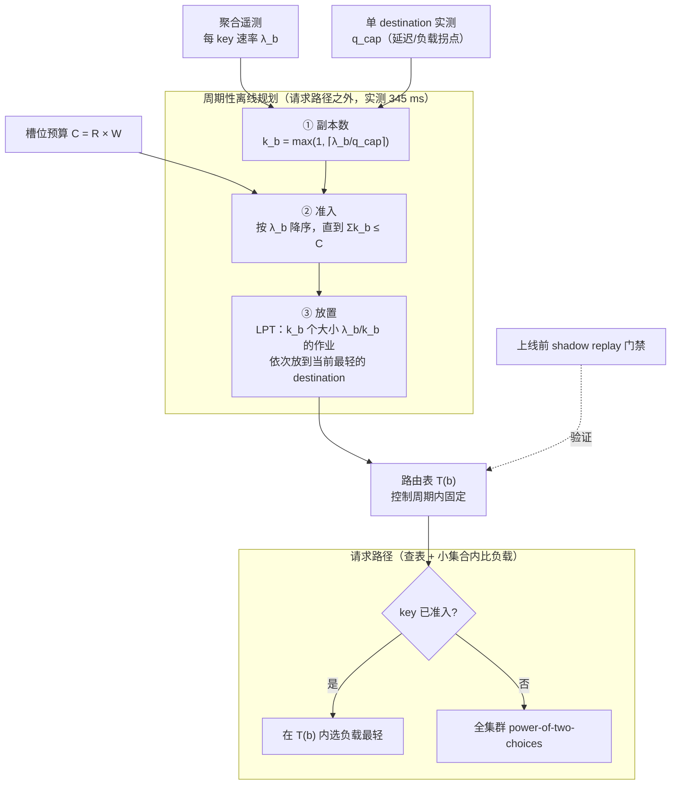

# CacheRoute: Planned Prefix-Affinity Routing for Large-Scale LLM Serving

> **一句话结论**：把「prefix 该落在哪台机器」从逐请求的反应式决策改成**每个控制周期算一次的全局路由表**——按 key 速率做准入、按预期负载做放置——在 60 张 H100 上把 3.5 秒 p99 SLO 下的容量提到最强基线的 2.3 倍；论文同时给出了这个方法**会输**的工作负载，并把「上线前必须 shadow replay」写成硬性流程。

---

## 1. 元信息

| 项目 | 内容 |
| --- | --- |
| 作者 / 机构 | Huang Cheng · Meta, Menlo Park |
| 发表 | arXiv:2608.19677v1 [cs.DC]，2026-08-20（单作者预印本，未见会议信息） |
| 原文 | [PDF](paper.pdf) · [HTML](paper.html) · [arXiv](https://arxiv.org/abs/2608.19677) |
| 代码 | 论文与附录均未给出公开链接 |
| 关键词 | LLM serving · prefix caching · request routing · request scheduling |
| 前置知识 | KV Cache 与 prefix caching、TTFT / p99 尾延迟、一致性哈希与 power-of-two-choices、LPT 列表调度 |
| 主实验条件 | Llama-3.3-70B fp8，30 个 TP2 destination（60× H100），半合成聚合负载，5 组配对种子 |

**记号约定**（沿用论文）：$b$ 业务 key，$\lambda_b$ 该 key 的估计到达率，$R$ destination 数量，$q_{\mathrm{cap}}$ 单 destination 的负载上限，$k_b$ 分配给该 key 的 destination 数，$T(b)$ 路由表中该 key 的 destination 集合，$C = RW$ 全局 warm prefix 槽位数，$W$ 单 destination 槽位数。

**一个术语澄清**：论文中 destination 指**一个可独立路由的 model-server 组**。在 70B 部署里，一个 destination 是一对张量并行度为 2 的 GPU（TP2），所以 30 个 destination = 60 张 H100。

---

## 2. 摘要速览（5 分钟版）

### 2.1 要解决的问题

prefix caching 只有在重复请求回到**仍持有该 prefix KV 的那台机器**上时才省得掉 prefill。缓存本身管不了请求落在哪里，而路由策略存在一组直接冲突的取舍：

- **cache-blind 负载均衡**把同一个 key 打散到 $R$ 台机器上。单台机器两次看到同一 key 的平均间隔按 $R/\lambda_b$ 放大——**扩容反而让 prefix 变冷**，尽管集群总缓存容量在增长。
- **固定亲和性**（一致性哈希）保住了局部性，同时把 key 的访问倾斜**原样映射成服务器队列倾斜**，尾延迟由最热的那台机器决定，而不是集群均值。
- **反应式 cache-aware 路由**（Preble、DualMap）按当前缓存与负载状态逐请求决策，但目标机器一旦被填满，溢出的那个请求同样丢掉了热 prefix。

### 2.2 核心方法

CacheRoute 用一张**周期性生成、周期内固定**的路由表替代逐请求决策，三步：

1. **算副本数**：$k_b = \max(1, \lceil \lambda_b / q_{\mathrm{cap}} \rceil)$，使每个 assignment 的预期负载不超过 $q_{\mathrm{cap}}$。
2. **准入 warm set**：把缓存抽象成 $C = RW$ 个等大 prefix 槽位，按 $\lambda_b$ 降序准入，直到 $\sum k_b \le C$。
3. **放置**：每个准入 key 贡献 $k_b$ 个大小为 $\lambda_b / k_b$ 的「作业」，按速率降序用 LPT 列表调度放到当前负载最轻的合法 destination 上。

分发时，准入流量在自己固定的 $T(b)$ 内选负载最轻的一个；未准入的尾部流量走全集群 power-of-two-choices。规划器复杂度 $O(|B|\log|B| + \sum_b k_b \log R)$，**跑在请求路径之外**，实测 $R=30$、128,824 个 key 时构表耗时 345 ms。

### 2.3 主要结果

**主实验**（Llama-3.3-70B fp8，30 TP2 destination / 60 H100，top-$K$128 活跃集，5 组配对种子，p99 指 TTFT）：

| Policy | KV hit | Cap.@3.5s | Cap.@5s | p99@100 QPS |
| --- | --- | --- | --- | --- |
| Flat-LB | $64.1 \pm 1.3\%$ | $42 \pm 20$ | 80 | 5.7 s |
| Sticky | $87.3 \pm 2.4\%$ | 30 | $42 \pm 20$ | 8.5 s |
| CHWBL | $75.6 \pm 0.8\%$ | $64 \pm 11$ | $128 \pm 14$ | 3.8 s |
| DualMap | $88.7 \pm 1.9\%$ | $58 \pm 22$ | $84 \pm 32$ | 5.3 s |
| Preble | $72.0 \pm 0.7\%$ | $76 \pm 11$ | 140 | 3.8 s |
| **CacheRoute** | $\mathbf{93.2 \pm 0.5\%}$ | $\mathbf{176 \pm 11}$ | **180** | **1.8 s** |

即 $2.3\times$ 最强基线 Preble、$4.2\times$ Flat-LB。100 QPS 时只有 CacheRoute 落在 3.5 秒 SLO 以内（1.8 s vs 基线的 3.8–8.5 s）。

**这张表最值得看的是两组反例**：Sticky 和 DualMap 的 KV 命中率（87.3% / 88.7%）都比 CHWBL 和 Preble（75.6% / 72.0%）高，容量却更低。命中率与容量在这里**不是单调关系**。

**第二组独立分布**：top-$K$128 时三个均衡的 cache-aware 策略并列 100 QPS；扩到 top-$K$256 后 CacheRoute 160 QPS vs 最强基线 100 QPS。优势只在**活跃集超出 warm 分配之后**才出现。

**负面结果**（Table 5，论文主动给出）：在 32B 聚合负载 A 上，亲和性把 KV 命中率从 1.1% 提到 11.8%，可回收的 prefill 太少，容量反而掉到 Flat-LB 的 $0.50$–$0.67\times$。

### 2.4 我的评价

值得精读，但**读法要调整**：它的方法部分（Algorithm 1）几乎没有新东西——top-rate 准入和 LPT 都是教科书级启发式，论文自己在 §1 结尾就写明「we do not claim a new scheduling primitive」。真正的价值在三处：

1. **问题的定式化**。把「prefix 亲和性 vs 负载均衡」这个人人都知道的矛盾，转成一个有明确输入（$\{\lambda_b\}$、$R$、$q_{\mathrm{cap}}$、$C$）、明确输出（路由表 $T(b)$）、明确周期的规划问题。
2. **测量的诚实度**。5 组配对种子 + Student-$t$ 置信区间、右删失（right-censored）明确标注、reimplementation 而非原系统的声明、以及一整节负面结果。这个规格在系统论文里高于平均线不少。
3. **它承认自己无法预测缓存驻留**。§5.4 明确报告解析式 occupancy 模型在中位数处误差 14.3 个百分点、p90 处 44.7 个百分点，因此上线流程必须依赖 shadow replay。这是一个很有信息量的负面结果。

对我关心的方向而言，最可迁移的一条是：**「更高的缓存命中率」不是目标，「SLO 下的容量」才是**。Table 1 和 Table 5 从两个方向都证明了这一点。

---

## 3. 细读

### 3.1 Introduction

论文用四句话把问题钉死：

- prefix caching 已是 serving 引擎的标配（vLLM、SGLang），但**缓存控制不了请求落到哪里**。
- cache-blind 均衡把重复出现的 prefix 打散到多个目的地，拉长了它回到每一份缓存的时间。
- 把 key 钉死在一个目的地恢复了局部性，同时把 key 的倾斜直接映射到服务器队列上。
- cache-aware 路由器改为按当前缓存和负载状态反应；一旦目标填满，把下一个请求溢出出去同样放弃了那份热 prefix。

**应用场景**：多租户对话助手（例如客服机器人），每个业务在多轮会话中携带一个稳定、可复用的上下文。业务之间的请求速率差异很大，因此简单的 stickiness 不成立。路由器需要在不制造「某台机器的队列决定全集群 p99」的前提下，把可复用 prefix 保持在本地。

**三项贡献**（论文原话的结构）：

1. 一个把缓存局部性与预期负载**放在一起规划**的 prefix-affinity 路由器；
2. 一次以 70B 模型和 60 张 H100 为中心的**六策略硬件评测**，含配对运行、第二组负载分布和 burst 实验；
3. 一个实测的**操作包络**（operating envelope），包含失败与打平的区间，以及「用 shadow replay 而非解析式驻留预测器」的证据。

**Figure 1** 的结构：周期性离线规划（聚合遥测 → 路由计划）与快速请求分发两条路径分离。图注里有一句关键的自我限定：主分布中每个 key 的 $k_b = 1$，所以 70B 的改进来自**准入、稳定的单副本亲和性、以及均衡放置**；多目的地只在合成 whale 的机制研究中被触发。另有一句：**cache residency is measured, not guaranteed by the plan**。

> **批注**：§1 最后一段的自我限定写得很克制——「Top-rate admission and LPT are established techniques」。这种把方法论新颖性主动降级、把贡献落在「路由设计 + 大规模测量 + 何时不该用」上的写法，在工业界论文里值得学。读的时候相应地要把注意力从 §3 移到 §5。

### 3.2 Workload and Failure Mode

#### 2.1 半合成聚合负载

**数据来源与脱敏**：合成的请求流，用来模拟从去标识化运营遥测导出的**聚合特征**——每个 key 的速率、到达间隔、流行度分布。不使用原始请求、会话内容、用户数据或业务标识。

主分布的统计量：

| 指标 | 取值 |
| --- | --- |
| 不透明业务 key 数 | 128,824 |
| Gini 系数 | 0.756 |
| 头部集中度 | 约 4% 的 key 占 47% 的请求 |
| 单 key 上限 | 没有任何 key 超过 0.3% |
| 每 key 到达间隔 CV 中位数 | 1.93 |
| 多轮会话占比 | 80.8% 的请求属于多轮 thread |

**prompt 的构成**（这段是理解全文的关键）：平均约 1.2K 输入 token，其中 90% 位于当前轮之前。但**这些 token 的大部分并不构成路由机会**：

- **全局模板**对所有业务通用，在每个 destination 上都是热的——路由与否都不影响它。
- **检索得到的 few-shot 块**变化频繁，在 67% 的相邻请求对之间打断了精确 prefix。
- 真正可复用、且与 key 绑定的部分是**每业务上下文，约 180 token，占 prompt 的 15%**。

论文按业务 key 路由，收益只在这一段在被驱逐之前回来时才兑现。

> **批注**：这 15% 是整篇论文的分母。所有「93.2% KV 命中率」这类数字都要放在「可路由收益上限只有 prompt 的 15%」这个背景下读。也正因为可回收的部分很小，§5.3 里那些亲和性输掉的负载才不是意外——它们只是可回收份额更小的版本。

论文另外说明：评测使用两组独立导出的半合成聚合分布，以及若干**明确标注为合成**的负载。合成流量保留给机制与边界测试，那里控制倾斜、突发性或 prefix 复用比匹配完整负载更重要。

#### 2.2 为什么均衡与粘滞都会失败

**均衡侧的量化论证**：速率为 $\lambda_b$ 的业务被均匀喷洒到 $R$ 个目的地时，两次访问同一目的地的平均间隔按

$$\frac{R}{\lambda_b}$$

放大。因此**扩大集群可以让一个 prefix 变得更冷**，尽管缓存总容量在增长。当这个重访时间超过有效驱逐时间，每个请求都要重做 prefill。

**亲和性侧**：一致性哈希保住局部性，最忙的哈希桶继承了负载倾斜。尾延迟随之跟随最热的目的地。Bounded hashing 与反应式的「复用 vs 负载」策略缓解了这个问题，但在容量上限触发后可能把请求溢出到冷目的地。

**论文对问题的收敛**：需要的是一个**在速率分布可见的前提下计算出来的、稳定的多 key 分配**。

而是否该部署，取决于一个可测量的取舍：**可回收的命中率增量是否压得过残留的负载倾斜**。模型规模、精度、prefix 长度、offered load、活跃集宽度、缓存大小都会移动这个平衡点。论文在这里就预告了 §5.3 的结论：更高的缓存命中率**可以**伴随更低的容量。

### 3.3 CacheRoute



#### 3.3.1 规划目标（§3.1）

**副本数（Load-based assignment count）**。$q_{\mathrm{cap}}$ 从**单个 destination 的延迟/负载拐点**标定。被选中的业务获得

$$k_b = \max\left(1, \left\lceil \lambda_b / q_{\mathrm{cap}} \right\rceil\right)$$

个目的地，使其每个 assignment 的预期负载至多为 $q_{\mathrm{cap}}$。论文特意加了一句限定：**这是一条负载控制规则，不是驱逐阈值，也不是缓存驻留保证**。

**Warm-set 准入**。稳定的每业务 prefix 尺寸相近，因此规划器把缓存分配表示成 $C = RW$ 个 prefix 槽位，每个 destination $W$ 个。按 $\lambda_b$ 降序考察 key，在 $\sum k_b \le C$ 的条件下持续准入。论文明确写出这个模型的适用边界：**等槽位模型不覆盖可复用 prefix 尺寸异质的负载**，那类负载需要按字节计量与准入。

**放置与分发**。每个准入 key 贡献 $k_b$ 个大小为 $\lambda_b / k_b$ 的作业。先用**预期的冷尾份额**初始化每个 destination 的负载 $L[r]$，然后按速率降序遍历准入 key，把每个作业分配给负载最轻的合法 destination。这是经典的 LPT 列表调度（Graham 1969），但论文指出：**由于作业被拆分且存在「同一 key 的副本必须落在不同 destination」的约束，标准近似界不适用**。

控制周期内，准入流量在自己固定的 $T(b)$ 中选负载最轻的成员；其余流量在全集群用 power-of-two choices。

**Algorithm 1（周期性路由表构建）**：

```text
输入: 速率 {λ_b}, destination 数 R, 负载上限 q_cap, 槽位预算 C
 1: for each key b do
 2:     k_b ← max(1, ⌈λ_b / q_cap⌉)
 3: end for
 4: 按 λ_b 降序排序; 在 Σ k_b ≤ C 的条件下准入
 5: 用预期冷尾负载初始化 L[r], r ∈ [1, R]
 6: for each admitted b in decreasing λ_b do
 7:     T(b) ← 具有最小 L 的 k_b 个不同 destination
 8:     for each r ∈ T(b) do
 9:         L[r] ← L[r] + λ_b / k_b
10:     end for
11: end for
12: 准入的 b 在 T(b) 内分发; 其余走 flat-LB
```

**开销**：规划器复杂度 $O(|B|\log|B| + \sum_b k_b \log R)$，运行在请求路径之外。实测在 $R = 30$、128,824 个业务时构表耗时 **345 ms**。服务路径只是一次查表加上在一个小集合内比较负载。

#### 3.3.2 运行语义（§3.2）

三条约束，每一条都是后面实验的伏笔：

1. **表在控制周期内固定**。稳定性避免了逐请求的 cap 抖动，但漂移会让分配过时；装载替换表也会让一部分 assignment 从冷启动开始。§5.4 对这两个效应都做了测量。
2. **不预留、不迁移 KV**。准入的 prefix 与冷尾 prefix 共享引擎原生的缓存与驱逐策略，CacheRoute **不提供任何解析式的驻留保证**。启用一张表之前，先做 shadow replay，测量 served token-weighted KV 命中率与延迟。
3. **主分布下 $k_b \equiv 1$**。因为 $\max_b \lambda_b < q_{\mathrm{cap}}$，Algorithm 1 退化为「top-rate 准入 + 均衡的单副本放置」。复制机制保留用于过载保护，**对 70B 的主结果没有贡献**。

> **批注**：第 3 条是这篇论文自我约束最强的一处。标题里的「prefix-affinity routing」在主实验中实际只用到了一半机制。作者把这件事在 §1、Figure 1 图注、§3.2 重复声明了三次，读者很难误读——这种做法值得学，但也说明主结果的机制解释只能靠 8B 上的合成 whale 实验来补。

### 3.4 Experimental Method

**实现**。客户端路由 harness 绕过服务部署自带的聚合负载均衡器，按单一策略发送每个请求。请求元数据中的实验标识把 served、token-weighted 的 KV 命中归因到正确的运行。所有策略共享同一套 serving stack、请求流、预热排除、offered-load 阶梯与健康判据。**路由层既不改变模型执行，也不预留缓存容量。**

**测试床**：

| 用途 | 配置 |
| --- | --- |
| 旗舰 | Llama-3.3-70B fp8，30 个 TP2 destination（60× H100），每 destination 实测 40,071 个 KV block（约 641K token） |
| 机制 | Llama-3.1-8B-Instruct bf16，30 个单 H100 destination |
| 辅助 | 70B fp16 仅作为缓存压力的佐证，不用于容量结论 |

**负载**：主 replay 从半合成的**峰值时段**聚合分布抽取不透明 key；第二组独立采集的半合成聚合分布用于测试分布漂移；Poisson、CV 匹配的 Gamma、moving-block bootstrap 三种到达过程用于测试突发敏感性。

**对比策略**（六个，含自己）：Flat-LB（power-of-two-choices）、Sticky 一致性哈希（Karger 1997）、CHWBL（consistent hashing with bounded loads，Mirrokni 2018，$\epsilon = 0.25$，由离线扫描选定）、DualMap 风格的双候选缓存/负载策略（Yuan 2026）、Preble 风格的 prefix 历史 + 实时负载策略（Srivatsa 2024，1.5 的 load-cap 因子）。

后三者是**在同一 harness 下按统一接口重实现的**，论文明确声明：绝对结果不应被解读为对原系统的复现。

**指标与统计**：

- **SLO capacity** = offered-QPS 阶梯上，p99 延迟不超过给定阈值**且失败率不超过 5%** 的最高一档。
- 阈值按每次运行独立计算并报告均值；取到阶梯最大值的点标注为**右删失（right-censored）**。
- 旗舰 top-$K$128 结果用 5 组配对种子 $\{2,3,4,5,6\}$，报告均值 $\pm$ 95% Student-$t$ 置信区间；top-$K$256 确认实验用 8 组种子；第二分布与 8B 研究用 3 组配对种子，论文提醒**其更宽的区间意味着小差异应当视为噪声**。
- KV 命中率是 served 且 token-weighted 的实测值，不是模拟器预测。

> **批注**：「SLO capacity 阶梯 + 右删失标注 + 配对种子 + 置信区间 + 重实现声明」这五件事同时出现，在 serving 论文里并不常见。缺点是阶梯粒度粗（30 / 60 / 80 / 100 / 120 / 140 / 160 / 180），所以 $176 \pm 11$ 这样的均值其实是若干个阶梯点的平均，容量的真实分辨率受限于阶梯本身。

### 3.5 Evaluation

#### 5.1 70B / 60 H100（主结果）

数字见 [§2.3](#23-主要结果)。论文对这张表的解释：

- CacheRoute 的 served KV 命中率 93.2%，**比 Flat-LB 高 29.1 个百分点**。
- Sticky 与 DualMap 也回收了大量复用，但它们在 100 offered QPS 下的 p99 分别是 8.5 s 和 5.3 s——**一旦队列主导尾部，局部性本身不起作用**。
- Preble 与 CHWBL 把队列压得更平，缓存命中率却降到 72.0% 与 75.6%。
- CacheRoute 占据「高复用且没有可比热点」的中间地带。

**top-$K$256 确认**（专门的 8 种子运行）：3.5 s 拐点 CacheRoute 80 QPS vs DualMap 60 QPS（$1.33\times$）；5 s 拐点为 120 vs 100。KV 命中率 82% vs 60%。通过点的失败率在 0.8%–1.4% 之间。论文补了一句：**早前观察到的高失败率在这次确认运行中没有复现**。

**第二组半合成分布**（Table 2，3 组配对种子，p99 $\le$ 3.5 s）：

| Policy | top-$K$128 | top-$K$256 |
| --- | --- | --- |
| Flat-LB | 30 | 30 |
| Sticky | 30 | 60 |
| CHWBL | **100** | 60 |
| DualMap | **100** | 100 |
| Preble | 60 | 60 |
| **CacheRoute** | **100** | **160** |

论文的解读值得原样记住：**这个对比之所以有用，恰恰是因为它没有复现 Table 1 的每一格**——优势只在活跃集超出 warm 分配之后才出现。

#### 5.2 改进从哪来？（机制拆解）

8B 测试床在更低负载下就饱和，因此能把局部性与均衡分开。

**Table 3（8B SLO capacity，3 组配对种子，500 为右删失）**：

| top-$K$ | Flat-LB | Sticky | CHWBL | DualMap | Preble | CacheRoute |
| --- | --- | --- | --- | --- | --- | --- |
| 16 | 500 | 100 | 500 | 100 | 500 | **500** |
| 32 | 500 | 100 | 360 | 100 | 360 | **500** |
| 64 | 500 | 160 | 360 | 160 | 360 | **500** |
| 128 | 240 | 240 | 360 | 360 | 360 | **500** |
| 256 | 160 | 240 | 240 | 360 | 360 | **500** |
| 2000 | 100 | **360** | 160 | **360** | 160 | **360** |

论文的自我约束：top-$K \in \{16,32,64\}$ 的若干结果撞上 500 QPS 的扫描天花板，**这些打平是右删失，不是容量相等的证据**。可分辨的最大六策略优势是 $1.39\times$（出现在 top-$K$128 与 256）。到 top-$K$2000 时 warm 分配覆盖的流量份额变小，CacheRoute 的拐点降到 360 QPS，仍并列最佳。

**Table 4（组件消融，合成 whale 负载，top-$K$128，3 种子）**：

| 配置 | KV hit | Imbalance | Capacity |
| --- | --- | --- | --- |
| Flat-LB | $56 \pm 1.9\%$ | $1.00\times$ | 240 |
| + affinity | $88 \pm 1.5\%$ | $3.46\times$ | 240 |
| + replication | $88 \pm 1.6\%$ | $2.60\times$ | 240 |
| + LPT（完整） | $90 \pm 1.0\%$ | $\mathbf{1.24\times}$ | **500** |

这张表是全文最有说服力的一张：

- 只加亲和性，KV 命中率从 56% 跳到 88%，**容量纹丝不动**（240），因为不均衡度被推到 $3.46\times$。
- 再加按负载比例的复制，不均衡度降到 $2.60\times$，**容量仍然不动**——随机放置没能把这份回收变成可用容量。
- 只有当 LPT 放置把不均衡度压到 $1.24\times$，容量才冲到 500 的天花板。

论文的总结句：**affinity 回收被缓存的工作，placement 让这份回收在饱和状态下变得可用**。并且再次限定：注入的 whale 是复制这一行在消融中出现的唯一原因，**这一行不解释主结果**。

#### 5.3 操作包络与负面结果

**Table 5（实测运行区间，容量倍数 = CacheRoute / Flat-LB）**：

| Regime | Flat hit | Aff. hit | Cap. mult. | Result |
| --- | --- | --- | --- | --- |
| 8B synthetic whales | 9.3% | 77.0% | $2$–$6\times$ | **win** |
| Aggregate A–32B | 1.1% | 11.8% | $0.50$–$0.67\times$ | **lose** |
| Aggregate B–32B | 0.8% | 8.5% | $1.0\times$ | **tie** |

论文的解释：8B 合成 whale 负载提供了大量**可回收的 miss**，因此偏向 CacheRoute。32B 聚合负载 A 上，亲和性只把 KV 命中率从 1.1% 挪到 11.8%，这个改进抵不过残留的倾斜，容量掉到 Flat-LB 的一半到三分之二。负载 B 达到 8.5% 的亲和命中率，在 5 s SLO 下与 Flat-LB 打平。

关键的一句：**「Model size by itself does not distinguish these outcomes.」** 决定胜负的是可回收 prefill 的绝对量，不是模型大小。

**部署门禁**：用一次短 shadow replay 作为闸门——保留候选分配但不把响应返回给用户，在「当前拐点以下一档」和「拐点附近」两个负载点上，对比 served KV 命中率、每 destination 负载、p99 与 Flat-LB。论文写得很硬：**缓存命中率提升不够，只有 p99 或容量改善时才启用该计划**。模型、精度、上下文长度、batching、缓存分配、活跃集分布中任何一项变化后，都要重跑这道门禁。

#### 5.4 突发性与重规划

**到达突发性**。在 70B fp8 / top-$K$128 上：

- 匹配负载边际 CV = 1.9 的 Gamma 到达过程使 CacheRoute 的 3.5 s 容量**下降一个阶梯**（180 → 160 QPS），KV 命中率从 94% 到 90%；Flat-LB 保持在 30 QPS。
- 另一次单次扫描的对比中，用聚合负载 A 的 22,639 个实测到达间隔做 moving-block bootstrap（块长 50，经验 CV = 2.73），CacheRoute 保持 180 QPS 与 93% 命中率，而 Flat-LB **左删失到 30 QPS 以下**。

论文限定：这是两策略、单活跃集的敏感性测试，不是对所有基线的断言。它证明的是主改进**不依赖被平滑过的到达过程**。

**速率漂移与重映射**（这一段的数字最有工程价值）。用对数正态随机游走（$\sigma = 0.3$）在六个周期上扰动主速率向量，在 160 QPS 下比较「新鲜计划」与「过时一个周期的计划」：

| 现象 | 数值 |
| --- | --- |
| 从头重算 LPT 改变的 key→destination 集合比例 | **94.5%** |
| 其中改变了 assignment 数量的 key 比例 | 仅 1.1% |
| 过时计划的平均代价 | $-1.0$ 个百分点 KV 命中率，$+192$ ms p99 |
| 最差一次切换的代价 | $-3.0$ 个百分点，$+858$ ms |
| 装载新计划期间的重新预热瞬态 | **$-13.6$ 个百分点 KV 命中率** |

结论：部署应当**保持既有放置，直到实测的过时代价超过预热代价**。论文直言 **churn-aware replanner 尚未实现**。

**为什么不做解析式驻留预测**。论文对 70B fp8 引擎测试了一个单特征时间（single-characteristic-time）的占用模型。组件级插桩通过了七项隔离检查，每个 TP2 destination 暴露 40,071 个实测 KV block。即便如此，预测在中位数处偏离 served 命中率 **14.3 个百分点**，在 p90 处偏离 **44.7 个百分点**。观测曲线呈现「先急剧下降后进入平台」的形状，**落在被测模型族之外**。论文拒绝用这个模型做容量规划，也拒绝在没有直接证据的情况下把这个形状归因于某个引擎机制。这次失败正是 shadow replay 留在部署流程里的原因。

> **批注**：94.5% 的 key 会被重映射、而只有 1.1% 的 key 改变了副本数——这个对比说明 LPT 的输出对输入速率的微小扰动极不稳定。这是贪心放置的固有性质：$L[r]$ 上的任何微小差异都会改变后续所有作业的落点。论文观察到了现象但没有给出解法（churn-aware replanner 未实现），这是一个明确可做的后续工作。

### 3.6 Discussion and Limitations

**可泛化的部分**：规划器需要三个条件——一个稳定的路由 key、一段可复用的 key 专属 prefix、以及在至少一个缓存预热周期内仍然有效的速率估计。这里用的业务 key 可以替换成租户、文档集合、agent 或应用。由于路由器改变的是放置而非模型执行，它不依赖特定的模型架构或缓存实现。

**尚不可泛化的部分**（论文自述）：

- 等槽位准入假设稳定 prefix 的尺寸大致均匀。论文**没有**测量面向异质长上下文的按字节价值函数，也**不主张**任何 byte-knapsack 或最优准入的结论。
- 冷尾流量与准入 prefix 共享原生缓存，**可以驱逐已准入的 prefix**。
- 聚合 replay 保留了 key 流行度，以及（对 burst 实验）短程的间隔相关性；**不保留精确的每 key 时间戳**。
- 两个分布无法代表所有市场或应用。
- Preble、DualMap、CHWBL 是共同 harness 下的重实现，不是原始代码库；它们在匹配硬件上比较路由行为，但不端到端复现已发表的系统。
- 若干 8B 拐点在 500 QPS 处右删失，因此只在扫描能分辨时报告比值。3 种子研究的 $t$ 区间较宽，5 种子旗舰与 8 种子确认提供更强的证据。

**部署检查清单**：从聚合 key 速率与单 destination 的 $q_{\mathrm{cap}}$ 测量开始 → 选择保守的 warm 槽位分配 → 在匹配负载下对计划与 Flat-LB 做 shadow replay，比较 served KV 命中率、不均衡度、p99 与失败率 → 只有计划获胜才放金丝雀流量 → 当活跃集或实测 p99 离开该包络时回退到 Flat-LB。论文强调：**这些步骤都不需要请求内容**。

### 3.7 Related Work

论文把相关工作按「在哪一层解决问题」组织：

| 层次 | 代表工作 | 与 CacheRoute 的关系 |
| --- | --- | --- |
| 引擎内 prefix 复用 | PagedAttention/vLLM、SGLang | 让复用高效；CacheRoute 决定请求去哪个 destination |
| 反应式 cache-aware 路由 | Preble、DualMap | 逐请求打分；CacheRoute 构建一个控制周期的全局速率表 |
| 稳定亲和 + 负载控制 | 一致性哈希、CHWBL | 同上，CacheRoute 用速率而非哈希决定放置 |
| KV 状态迁移/池化 | Mooncake、MemServe | 搬运或池化 KV，而非靠入口亲和性保住它 |
| 请求迁移 | Llumnix | 事后迁移请求修复不均衡 |
| PD 分离 | DistServe、Splitwise | 分离 prefill 与 decode 的放置 |

论文特别指出：后三类系统**仍然可以使用一个入口计划**，来避免路由本身造成的重复 prefill——即这些方案与 CacheRoute 是可组合的。

另有一段处理 GeoCover（路边单元选址）：论文明说**两个问题的算法与保证不能互相转移**，共同点只是「在倾斜需求下分配有限基础设施」。

> **批注**：主动声明一篇相关工作「不能迁移」，这是一个不常见但很好的做法。（同为 Cheng 姓氏的自引，作者选择明确划清界限而非模糊借势。）

### 3.8 Conclusion

CacheRoute 每个控制周期规划一次 prefix 亲和性与预期负载。在 60 张 H100 上的 70B fp8 模型上，达到 93.2% 的 served KV 命中率，以及在 3.5 s p99 SLO 下最强基线 $2.3\times$ 的容量。

结论段的后半句才是这篇论文真正想留下的东西：**负面负载设定了同等重要的边界——当可回收的 prefix 工作量很小时，亲和性会降低容量。因此任何真实部署都应当用 shadow replay 测出自己的边界。**

---

## 4. 关键问题解析

### Q1: 「计划式」路由相比「反应式」cache-aware 路由，本质优势是什么？代价是什么？

**A**:

**优势在于决策时可见的信息范围。** 反应式路由器（Preble、DualMap）在请求到达的那一刻，只能看到**当前**的缓存与负载状态。它必须为这一个请求做局部最优选择，而这个选择对后续请求的影响不在它的目标函数里。当目标机器填满，它只有两个选项——排队等待（吃延迟）或溢出到冷机器（丢 prefix），两者都是被动的。

计划式路由器在构表时看到的是**整个 key 的速率分布** $\{\lambda_b\}$。它可以在任何请求到达之前就知道：哪些 key 的总量会撑爆一台机器、槽位预算够放多少 key、把高速率 key 先放哪里能让后面的 key 有地方可去。LPT 之所以有效，正是因为它要求「按作业大小降序处理」——这个顺序只有在离线看到全部作业时才存在。

**Table 4 给出了这一点的直接证据**：亲和性把 KV 命中率从 56% 提到 88%（$+32$ 点），容量停在 240 不动；把不均衡度从 $3.46\times$ 压到 $1.24\times$ 之后，容量才跳到 500。**回收缓存的是亲和性，把回收变成容量的是全局放置。** 反应式策略拿不到做全局放置所需的信息。

**代价有三项，论文都测了**：

1. **过时（staleness）**。速率漂移后计划失效。实测：过时一个周期平均损失 1.0 个百分点命中率和 192 ms p99，最差一次是 3.0 点和 858 ms。
2. **切换瞬态**。装载新表会让部分 assignment 冷启动，实测造成 **13.6 个百分点**的 KV 命中率瞬时下跌——这个代价比过时的代价大一个量级。
3. **规划不稳定**。速率的微小扰动导致 94.5% 的 key 被重映射。这使得「频繁重规划」这条看似显然的解法反而有害。

三项合起来推出论文的运维规则：**保持既有放置，直到实测的过时代价超过预热代价**。

### Q2: warm set 的准入判据是什么？key 的速率如何估计？

**A**:

**判据本身很简单**：把缓存抽象成 $C = RW$ 个**等大**的 prefix 槽位，按 $\lambda_b$ 降序遍历 key，只要 $\sum k_b \le C$ 就继续准入。这是标准的 top-rate 准入，论文不主张新颖性。

**三个值得注意的细节**：

- **准入的成本单位是 $k_b$ 而非 1**。一个需要 3 个副本的 key 消耗 3 个槽位。这让准入与副本数在同一个预算里竞争，热 key 的「过载保护」是要用其他 key 的准入名额来买的。
- **等槽位假设是硬前提**。论文明确写明这个模型不覆盖可复用 prefix 尺寸异质的负载，并且**拒绝**声称任何 byte-knapsack 或最优准入的结果。在本文负载里这个假设成立，因为可复用段是「每业务上下文，约 180 token」，各业务之间尺寸相近。
- **准入不等于驻留**。准入的 prefix 和冷尾 prefix 共享引擎原生缓存与驱逐策略，CacheRoute 既不预留也不迁移 KV block。论文反复强调 cache residency is **measured**, not guaranteed。

**速率估计**：论文说的是「从聚合遥测得到的每 key 速率」，$\{\lambda_b\}$ 是 Algorithm 1 的输入，**估计方法本身没有展开**——没有说明窗口长度、是否做指数平滑、如何处理新出现的 key。这是方法描述中最薄弱的一环。相关的可推断线索只有：负载统计给出每 key 到达间隔的 CV 中位数为 1.93（相当突发），而 §5.4 用 $\sigma = 0.3$ 的对数正态随机游走来模拟周期间漂移。窗口长度与控制周期长度都**未给出具体值**。

**证据边界**：`<待确认>` 速率估计的窗口、平滑方式与控制周期时长在正文中均未披露；可能在附录（Supplementary Material / Appendix A Workload Detail）中，本次精读未覆盖附录。

### Q3: 放置阶段解决的是什么优化问题？开销多大？

**A**:

**问题类型**：这是**带约束的多处理机调度**（$P \| C_{\max}$ 的变体）。目标是最小化 makespan——在这里就是最大 destination 负载 $\max_r L[r]$，因为 p99 由最热的机器决定。

三处与教科书版本的差异：

1. **作业可拆分**：一个 key 被拆成 $k_b$ 个大小为 $\lambda_b / k_b$ 的作业。
2. **同 key 副本必须落在不同 destination**（distinct-destination 约束）。
3. **机器有非零初始负载**：$L[r]$ 用预期的冷尾份额初始化，而非从 0 开始。

论文因此明确指出：**Graham 的 $4/3 - 1/(3m)$ 近似界在这里不适用**。这是一处很克制的处理——引用了 LPT 的出处，同时拒绝借用它的理论保证。

**求解方式**：贪心。按 $\lambda_b$ 降序遍历准入 key，为每个 key 选出 $L$ 最小的 $k_b$ 个不同 destination，然后更新这些 destination 的负载。

**开销**：

$$O\left(|B|\log|B| + \sum_b k_b \log R\right)$$

第一项是排序，第二项是每个作业一次堆操作。实测 $R = 30$、$|B| = 128{,}824$ 时构表 **345 ms**，且**完全在请求路径之外**。请求路径上只剩一次查表 + 在 $k_b$ 个候选中比较负载——主分布下 $k_b = 1$，所以实际就是一次查表。

**效果**：Table 4 中 LPT 把不均衡度从 $2.60\times$（随机放置）压到 $1.24\times$，这是容量从 240 跳到 500 的唯一原因。

**没有解决的问题**：贪心对输入扰动极不稳定（Q1 中的 94.5% 重映射）。一个显然的改进方向是在目标函数里加入「与上一版计划的差异惩罚」，把它变成一个带切换代价的重优化问题——论文称之为 churn-aware replanner，明确表示未实现。

### Q4: 允许热 key 映射到多个 destination 时，如何避免 KV 复制带来的显存放大？

**A**: **论文没有处理这个问题，因为主实验里它不存在。**

三层回答：

**第一层：主实验中复制根本没有触发。** 主分布满足 $\max_b \lambda_b < q_{\mathrm{cap}}$，因此 $k_b \equiv 1$。论文在 §1、Figure 1 图注和 §3.2 三处声明了这一点。没有任何 key 的 KV 被复制到多台机器。

**第二层：复制确实带来放大，代价被算在槽位预算里。** 当 $k_b > 1$ 时，同一段 prefix 会在 $k_b$ 台机器上各占一份 KV。CacheRoute 对这个成本的记账方式是：准入时该 key 消耗 $k_b$ 个槽位而非 1 个。也就是说，**显存放大被转化成了对其他 key 准入名额的挤占**。这个记账在等槽位模型下是自洽的。

**第三层：这个记账没有被实验验证过。** 复制只在 8B 的合成 whale 消融（Table 4 第三行）中出现，而那一行报告的是 KV 命中率（88%）、不均衡度（$2.60\times$）和容量（240），**没有报告显存占用或槽位竞争的实际影响**。论文自己在 §5.2 结尾写明：注入的 whale 是复制出现的唯一原因，这一行不解释主结果。

**我的判断**：在主分布这种「4% 的 key 占 47% 请求、但没有任何单 key 超过 0.3%」的形态下，复制机制大概率长期不会触发。它更像是一条防御性的过载保护路径，而不是被验证过的主力机制。真正会触发复制的是存在少数超大租户的场景，而那正是论文没有真实负载数据的场景。

### Q5: 控制周期怎么定？突发流量时的降级路径是什么？

**A**:

**周期长度：论文没有给出具体值。** §3.2 只说「表在一个控制周期内保持固定」。§5.4 的漂移实验用「六个周期」作为时间轴，但没有把周期换算成秒或分钟。这是复现这套方法的主要障碍之一。

论文给出的是**判断何时该换表的规则**，而非固定周期：

> 部署应当保持既有放置，直到**实测的过时代价超过预热代价**。

配套的量化依据（160 QPS，$\sigma = 0.3$ 对数正态随机游走）：过时一个周期的平均代价是 $-1.0$ 个百分点命中率 / $+192$ ms p99，最差 $-3.0$ 点 / $+858$ ms；而换表的瞬态代价是 $-13.6$ 个百分点命中率。两者相差一个量级，**这条规则实际上强烈偏向「少换表」**。

**突发流量的表现**（§5.4）：

| 到达过程 | CacheRoute | Flat-LB |
| --- | --- | --- |
| 基准 | 180 QPS，94% hit | 30 QPS |
| Gamma，CV = 1.9 | 160 QPS（降一档），90% hit | 30 QPS |
| Moving-block bootstrap，CV = 2.73 | 180 QPS，93% hit | 左删失，< 30 QPS |

突发性对 CacheRoute 的影响是**降一个阶梯或不降**，而 Flat-LB 在最强突发下直接跌破扫描下限。论文对这组结果的限定同样明确：两策略、单活跃集的敏感性测试，不能推广到所有基线。

**降级路径**：两条，粒度不同。

1. **请求级**：未准入的 key 始终走全集群 power-of-two-choices。这条路径一直开着，冷尾流量本来就不依赖计划。
2. **策略级**：§6 的部署检查清单要求「当活跃集或实测 p99 离开包络时**回退到 Flat-LB**」。

值得注意的是**没有的东西**：没有周期内的自适应机制。计划在周期内完全固定，突发只能靠 $T(b)$ 内部选最轻成员这一个自由度来吸收——而在 $k_b = 1$ 的主分布下，这个自由度等于零。CacheRoute 在主实验配置下对突发的鲁棒性，完全来自「命中率高 → 每个请求的工作量小 → 队列本身消化得快」。

### Q6: 半合成负载对结论的外部效度有多大影响？

**A**: 分三个层次评估。

**保留了什么**。论文说明聚合 replay 保留了每 key 速率、到达间隔、流行度分布；burst 实验额外保留了短程的间隔相关性（moving-block bootstrap，块长 50，用了 22,639 个实测间隔）。主分布的形态统计相当完整：128,824 个 key、Gini 0.756、4% 的 key 占 47% 请求、单 key 上限 0.3%、每 key 到达间隔 CV 中位数 1.93、80.8% 的请求属于多轮 thread。

**丢掉了什么**（论文自述）：**不保留精确的每 key 时间戳**。这一条对本文的核心机制影响不小——prefix 是否命中取决于「同一 key 的两次请求之间，这台机器上发生了多少其他工作」，也就是取决于**跨 key 的时序耦合**。边际速率与边际间隔分布匹配，并不保证联合时序结构匹配。举例：真实负载中多个大租户的峰值可能同时发生，而独立采样的合成流会把这种同步性抹平，从而低估最坏情况下的驱逐压力。

**这个缺口有多大程度被别的证据补上**：

- 论文用了**两组独立采集**的聚合分布，第二组的结果确实与第一组不同（top-$K$128 打平、top-$K$256 才分开），说明结论对分布敏感且作者没有挑选性报告。
- §5.3 的三组运行区间中有两组是 32B 聚合负载，其中一组 CacheRoute **输**给 Flat-LB。主动报告失败案例大幅提高了整体可信度。
- KV 命中率是 served 且 token-weighted 的**实测值**，不是模拟。

**我的结论**：半合成对**机制性结论**（亲和性回收命中率、LPT 把命中率变成容量、命中率与容量非单调）的影响有限，因为这些结论在 8B 合成 whale、70B 半合成、32B 半合成三类负载上是一致的。它对**绝对数字**（$2.3\times$、176 QPS）的影响较大——这些数字应当读作「在这一类倾斜且 prefix 可复用份额约 15% 的负载上」。论文自己在 §6 写了「两个分布无法代表所有市场或应用」，并把 shadow replay 设成了强制门禁，等于承认了这一点。

### Q7: 为什么更高的 KV 命中率反而可能带来更低的容量？

**A**: 这是全文最重要的一条，两组数据从不同方向证明了它。

**方向一：同一负载下的横向对比**（Table 1）。

| Policy | KV hit | Cap.@3.5s |
| --- | --- | --- |
| Sticky | 87.3% | 30 |
| DualMap | 88.7% | 58 |
| CHWBL | 75.6% | 64 |
| Preble | 72.0% | 76 |

Sticky 和 DualMap 的命中率比 CHWBL、Preble 高 12–17 个百分点，容量却低。原因：Sticky 把 key 倾斜原样映射到队列上，最热的那台机器决定了全集群 p99。**命中率是集群平均量，p99 是极值量**——平均改善救不了极值。

**方向二：同一策略下的纵向消融**（Table 4）。

只加 affinity：命中率 $56\% \to 88\%$，容量 $240 \to 240$。不均衡度同时从 $1.00\times$ 涨到 $3.46\times$。这一步把每个请求的期望工作量降低了，却把工作量分配得更不均匀，两个效应互相抵消。

**方向三：可回收量太小时的净损失**（Table 5）。

32B 聚合负载 A：命中率 $1.1\% \to 11.8\%$，容量 $0.50$–$0.67\times$。这里连抵消都算不上——回收的 prefill 工作量太少，而亲和性引入的倾斜是实打实的，净效果是亏损。

**统一的解释**：路由策略同时改变两个量。

$$\text{容量} \sim \frac{\text{单机吞吐}}{\text{不均衡度}}, \qquad \text{单机吞吐} \propto \frac{1}{\text{每请求工作量}}$$

亲和性降低分子里的每请求工作量（提升命中率），同时抬高分母里的不均衡度。**只有当前者的相对改善大于后者的相对恶化时，容量才提升。** 可回收 prefill 的绝对量决定了前者的上限——本文负载中它是 prompt 的 15%，32B 负载 A 中它接近于零。

**工程结论**：把 KV 命中率当作优化目标是错的，它只是一个中间量。论文的部署门禁把这一点写成了硬规则——「A cache-hit increase is not enough; the plan is enabled only when p99 or capacity improves」。

### Q8: 解析式缓存驻留模型为什么失败？这对我意味着什么？

**A**:

**论文做了什么**：针对 70B fp8 引擎测试了一个**单特征时间（single-characteristic-time）占用模型**——即假设缓存驻留时间可以用一个特征时标来刻画，命中率是重访间隔与该时标之比的函数。这类模型在 CDN 与 CPU 缓存分析中很常见（Che 近似及其变体）。

**做得有多认真**：组件级插桩通过了**七项隔离检查**，每个 TP2 destination 暴露了 **40,071 个实测 KV block**（约 641K token）。也就是说，失败不能归因于测量不准。

**失败到什么程度**：

| 分位 | 预测偏差 |
| --- | --- |
| 中位数 | **14.3 个百分点** |
| p90 | **44.7 个百分点** |

在一个命中率取值范围本身就是 0–100% 的量上，p90 处偏 44.7 个点意味着预测**没有任何决策价值**。

**为什么失败**：论文的观察是——真实曲线「先急剧下降，然后进入平台」，这个形状**落在被测模型族之外**。论文在这里停住了，明确拒绝在没有直接证据的情况下把这个形状归因于某个引擎机制。

**我的推测**（标注为推断）：这个形状与本文负载的构成高度吻合。prompt 由三部分组成——全局模板（所有业务共享，在每台机器上永远是热的）、检索 few-shot 块（67% 的相邻请求对之间就变了，几乎永远不命中）、每业务上下文（约 15%，是唯一受路由影响的部分）。三者的驻留特征完全不同，**混合体的命中率曲线自然不是单特征时间模型能描述的**。平台区大概率对应「全局模板始终命中」这个下界。若这个推测成立，正确的建模方式是按 prefix 段分层，而不是给整体拟合一个特征时间。

**对我的意义**（这是这条最有价值的部分）：

1. **不要用解析式缓存模型做 LLM serving 的容量规划。** 这是一个带实测数据的反例，可以直接引用。
2. **shadow replay 应该成为标准工具**。它绕过了「预测缓存行为」这个难题，直接测量。代价是需要一份影子流量和一次额外的运行窗口。
3. **一个更一般的教训**：当模型误差的分布**右尾极长**（中位数 14.3 点、p90 44.7 点）时，问题通常出在模型族的选择上，而不是参数拟合。继续调参不会有帮助。

---

## 5. 可迁移的知识点

- [KV Cache](../../../concepts/kv-cache.md) —— 本文的全部优化对象。routing 决定请求落到哪台机器，从而决定能否复用那台机器上已有的 KV。
- [Prefix Caching](../../../concepts/prefix-caching.md) —— 本文指出它的隐含前提：只有请求回到**仍持有该 prefix 的那台机器**时才生效，而这一点由路由而非缓存决定。
- [缓存亲和性与负载均衡的取舍](../../../concepts/cache-affinity-vs-load-balance.md) —— 本文把这个取舍量化成「可回收命中率增量 vs 残留负载倾斜」，并给出了三个实测运行区间（win / lose / tie）。
- [SLO 容量与 p99 尾延迟](../../../concepts/slo-capacity.md) —— 本文的评价指标定义（含右删失、配对种子、失败率上限）是这类实验的一个好范本。

---

## 6. 批判与开放问题

### 6.1 局限性

**作者自己承认的**（§6 写得相当完整）：

- 等槽位准入假设 prefix 尺寸大致均匀，不适用于异质长上下文；未测量按字节的价值函数，不主张 byte-knapsack 或最优准入。
- 冷尾流量共享原生缓存，**可以驱逐已准入的 prefix**——计划对驻留没有任何保证。
- 聚合 replay 不保留精确的每 key 时间戳。
- 两个分布无法代表所有市场或应用。
- Preble / DualMap / CHWBL 是共同 harness 下的重实现，不复现原系统。
- 若干 8B 拐点在 500 QPS 处右删失；3 种子研究的置信区间偏宽。
- churn-aware replanner 未实现。
- 解析式驻留预测失败（§5.4）。

**论文没提但存在的**：

- **控制周期长度从未给出具体值**。§3.2 只说「fixed for a control interval」，§5.4 用「六个周期」作时间轴。这个参数直接决定过时代价与换表频率的平衡，缺失使方法难以复现。
- **速率估计方法未展开**。$\{\lambda_b\}$ 是 Algorithm 1 的输入，但估计窗口、平滑方式、新 key 的冷启动处理都没有描述。考虑到每 key 到达间隔的 CV 中位数是 1.93（相当突发），速率估计器的设计对结果的影响可能不小。
- **offered-load 阶梯粒度粗**。阶梯点是 30 / 60 / 80 / 100 / 120 / 140 / 160 / 180，因此「$176 \pm 11$ QPS」这个均值的真实分辨率受限于阶梯本身，而不是测量精度。$2.3\times$ 这个比值同样继承了这个粒度。
- **$q_{\mathrm{cap}}$ 的标定方法只有一句话**（「from a single destination's latency/load knee」）。这个参数直接决定 $k_b$，进而决定槽位消耗与准入数量，敏感性分析缺失。
- **只报告 p99，没有 p50 / p999**。TTFT 的 p99 是主指标，但对话场景的用户体验同时依赖 TPOT（time per output token），论文完全没有涉及 decode 阶段的延迟。

### 6.2 我的质疑

- **标题与主实验的机制不完全对应。** 标题是「Planned Prefix-Affinity Routing」，而主分布下 $k_b \equiv 1$，Algorithm 1 退化成「top-rate 准入 + 单副本 LPT 放置」。作者对此非常坦率（三处声明），但这意味着**论文最强的数字（$2.3\times$）验证的是一个比标题所述更简单的机制**，完整机制只在 8B 合成负载上被触发过一次。
- **基线的实现质量无法验证，而这决定了核心比值。** $2.3\times$ 是相对 Preble 的重实现算出来的。论文诚实地声明了这一点，但 Preble 在自己的论文中报告的效果与这里的 $76 \pm 11$ QPS 是否可比，读者无从判断。CHWBL 的 $\epsilon = 0.25$ 由离线扫描选定，Preble 的 load-cap 因子取 1.5——**后者没有说明是否也做过扫描**。若 1.5 是取自原论文的默认值而未针对本负载调优，比较就不完全公平。
- **「$4.2\times$ Flat-LB」这个数字的分母不稳定。** Flat-LB 的 Cap@3.5s 是 $42 \pm 20$，相对误差接近 50%。用它做分母得到的 $4.2\times$ 应当被理解为一个数量级指示，而不是一个可引用的精确倍数。论文在正文中并列使用了 $2.3\times$ 和 $4.2\times$，没有区分两者的证据强度。
- **规划器的不稳定性被观察到但没有被追究。** 「94.5% 的 key 被重映射，而只有 1.1% 改变了副本数」是一个很强的信号：LPT 的输出几乎完全由 $L[r]$ 上的微小差异决定。论文把它作为「不要频繁换表」的论据，但一个更自然的读法是**贪心放置本身选错了**——带切换代价的重优化（例如在目标里加入与上一版计划的差异惩罚）应当是这个问题的正解，而不是靠运维规则回避。
- **成功与失败的判别条件仍然是事后的。** §5.3 给了三个运行区间，也给出了「可回收命中率增量 vs 残留倾斜」这个定性判据，但没有给出**上线前可计算的**判据。最终的答案是「跑一次 shadow replay」。这对运维是诚实且可操作的，对方法本身则意味着它缺少一个预测模型——而 §5.4 恰好证明了作者尝试过并失败了。这是全文最大的开放问题。

### 6.3 后续可读

- **vLLM / PagedAttention** —— CacheRoute 依赖的引擎侧底座，理解 KV block 与驱逐策略。
- **SGLang / RadixAttention** —— 单机内 prefix 复用的代表实现，与本文的跨机路由互补。
- **Preble、DualMap** —— 本文最主要的两个对比对象，读原文以判断重实现的公平性。
- **CHWBL（Consistent Hashing with Bounded Loads）** —— 本文中表现最稳的经典基线，理论保证清晰。
- **Mooncake / MemServe** —— 把 KV 池化或迁移，与「靠入口亲和性保住 KV」是两条相反的技术路线，值得对照阅读。
- **DistServe / Splitwise** —— PD 分离；论文指出它们与入口计划可组合，这个组合点尚无人做过。
